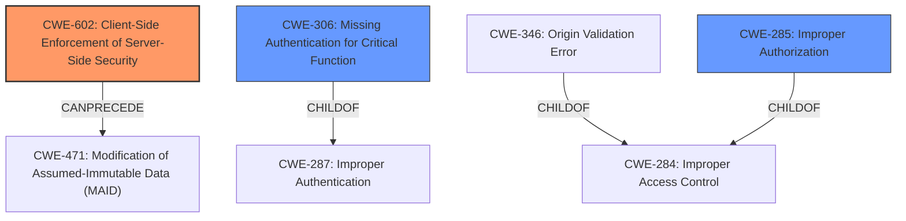

# Analysis Report for CVE-2025-25450

# Vulnerability Analysis Report: CVE-2025-25450

## Description

An issue in TAAGSOLUTIONS GmbH MyTaag v.2024-11-24 and before allows a remote attacker to escalate privileges via the deactivation of the activated second factor to the /session endpoint

## Vulnerability Description Key Phrases

- **Impact:** escalate privileges
- **Vector:** deactivation of the activated second factor
- **Attacker:** remote attacker
- **Product:** TAAGSOLUTIONS GmbH MyTaag
- **Version:** v.2024-11-24 and before
- **Component:** /session endpoint

## Analysis (with Relationship Data)

# Summary
| CWE ID | CWE Name | Confidence | CWE Abstraction Level | CWE Vulnerability Mapping Label | CWE-Vulnerability Mapping Notes |
|---|---|---|---|---|---|
| **CWE-602** | **Client-Side Enforcement of Server-Side Security** | 0.8 | Class | Primary CWE | Allowed-with-Review |
| CWE-306 | Missing Authentication for Critical Function | 0.6 | Base | Secondary Candidate | Allowed |
| CWE-285 | Improper Authorization | 0.5 | Class | Secondary Candidate | Discouraged |

## Evidence and Confidence

*   **Confidence Score:** 0.8
*   **Evidence Strength:** MEDIUM

## Relationship Analysis
The primary CWE selected is CWE-602, "Client-Side Enforcement of Server-Side Security," which is a Class-level CWE. There are potential child CWEs that could provide more specific details, but the provided information doesn't allow for a more granular selection. CWE-602 can precede CWE-471 ("Modification of Assumed-Immutable Data") in a vulnerability chain, but this relationship isn't directly applicable here. CWE-306 (Missing Authentication for Critical Function) and CWE-285 (Improper Authorization) were considered as potential secondary CWEs to capture the authentication and authorization aspects of the vulnerability, respectively.



## Vulnerability Chain
The vulnerability chain starts with the **WEAKNESS** in the MyTaag API, where it's possible to deactivate 2FA via API requests. This leads to privilege escalation, as attackers can bypass the second factor of authentication.

1.  **Root Cause:** **Insecure API Design:** The API allows deactivation of 2FA without proper server-side validation or authentication.
2.  **Weakness:** **CWE-602 Client-Side Enforcement of Server-Side Security:** The server relies on client-side information (e.g., session token) without proper validation, allowing the deactivation of 2FA.
3.  **Impact:** Privilege Escalation: Attackers can gain unauthorized access to user accounts.

## Summary of Analysis
The initial analysis focused on the fact that the attacker can deactivate the activated second factor leading to privilege escalation. The primary CWE selected, CWE-602, best describes the **ROOTCAUSE**, where the application relies on client-side enforcement of security, allowing the attacker to deactivate 2FA through the /session endpoint. The "CVE Reference Links Content Summary" confirms that the API allows for the deactivation of 2FA through API requests, pointing to **IMPROPER** server-side validation.

The selection of CWE-602 is based on the retriever results and the complete CWE specifications. While other CWEs like CWE-306 (Missing Authentication for Critical Function) and CWE-285 (Improper Authorization) were considered, CWE-602 more accurately reflects the **ROOTCAUSE** of the vulnerability, where the server relies on the client to enforce security measures.

CWE-285 was not used as the primary mapping because it is too high level (Class) according to the CWE specifications. Also CWE-285 is about an authorization check that does not work correctly. In this case, the deactivation of the second factor should not be allowed at all with the session token, so the authorization check is missing or the application relies on the client to make the authorization check.

The decision to use a Class-level CWE is due to the limited information available. More specific details about the authentication and authorization mechanisms would be needed to select a more granular Base or Variant CWE.

Relevant CWE Information:

# Enhanced Context (25 CWEs)
The following CWEs were identified as potentially relevant to this vulnerability:

## CWE-602: Client-Side Enforcement of Server-Side Security
**Abstraction Level**: Class
**Similarity Score**: 0.057
**Source**: sparse

**Description**:
CWE-602: Client-Side Enforcement of Server-Side Security

**Mapping Guidance**:
- Usage: Allowed-with-Review
- Rationale: This CWE entry is a Class and might have Base-level children that would be more appropriate

**Relationships**:
- PARENTOF -> CWE-603
- PARENTOF -> CWE-565
- PEEROF -> CWE-300
- PEEROF -> CWE-290
- CANPRECEDE -> CWE-471

## CWE-306: Missing Authentication for Critical Function
**Abstraction Level**: base
**Similarity Score**: 2.47
**Source**: graph

**Description**:
CWE-306: Missing Authentication for Critical Function

**Mapping Guidance**:
- Usage: Allowed
- Rationale: This CWE entry is at the Base level of abstraction, which is a preferred level of abstraction for mapping to the root causes of vulnerabilities.

**Relationships**:
- PARENTOF -> CWE-322
- PARENTOF -> CWE-288
- CHILDOF -> CWE-287
- CHILDOF -> CWE-287
- CHILDOF -> CWE-306

## CWE-285: Improper Authorization
**Abstraction Level**: Class
**Similarity Score**: 1641.16
**Source**: sparse

**Description**:
The product does not perform or incorrectly performs an authorization check when an actor attempts to access a resource or perform an action.

**Mapping Guidance**:
- Usage: Discouraged
- Rationale: CWE-285 is high-level and lower-level CWEs can frequently be used instead. It is a level-1 Class (i.e., a child of a Pillar).


## CWE Relationship Analysis

Current CWEs represent these abstraction levels: .


### Vulnerability Chain Analysis

**Chain starting from CWE-288:**
- 288 (Authentication Bypass Using an Alternate Path or Channel) - ROOT


**Chain starting from CWE-471:**
- 471 (Modification of Assumed-Immutable Data (MAID)) - ROOT


### CWE Relationship Diagram

```mermaid
graph TD
    classDef primary fill:#f96,stroke:#333,stroke-width:2px
    classDef secondary fill:#69f,stroke:#333
    classDef tertiary fill:#9e9,stroke:#333
```


*Report generated on 2025-07-14 13:26:28*
