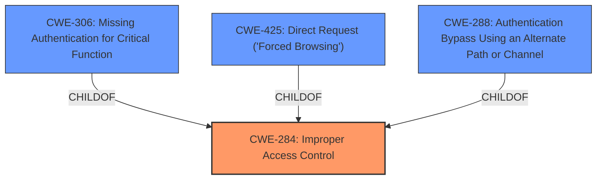

# Raw Analyzer Response for CVE-2025-2546

# Summary
| CWE ID | CWE Name | Confidence | CWE Abstraction Level | CWE Vulnerability Mapping Label | CWE-Vulnerability Mapping Notes |
|---|---|---|---|---|---|
| CWE-284 | Improper Access Control | 0.9 | Pillar | Primary | Allowed-with-Review |

## Evidence and Confidence

*   **Confidence Score:** 0.9
*   **Evidence Strength:** MEDIUM

## Relationship Analysis
The primary CWE selected is CWE-284 (Improper Access Control), which is a Pillar-level CWE. The retriever results included other CWEs like CWE-306 (Missing Authentication for Critical Function), CWE-425 (Direct Request ('Forced Browsing')), and CWE-288 (Authentication Bypass Using an Alternate Path or Channel) which are child CWEs of CWE-284 or related to access control issues. However, based on the limited information, the general **improper access controls** is the most accurate representation.

## Vulnerability Chain
The vulnerability chain is relatively simple:
1.  **ROOT CAUSE:** **Improper Access Control** (CWE-284) within the Firewall Service component.
2.  IMPACT: Unauthorized access or manipulation of the Firewall Service.

## Summary of Analysis
The vulnerability description indicates an **improper access control** issue within the Firewall Service component of D-Link DIR-618 and DIR-605L routers.

The primary CWE selected is CWE-284 (Improper Access Control) because the description explicitly states "The manipulation leads to **improper access controls**." The evidence is in the Vulnerability Description Key Phrases section.

CWE-284 is a Pillar-level CWE, and ideally, a more specific Base or Variant CWE would be preferred. However, the provided information lacks the necessary details to pinpoint the exact type of access control issue (e.g., missing authentication, incorrect authorization, etc.). Therefore, CWE-284 is the most appropriate choice given the available evidence.

Other CWEs were considered but not selected due to lack of specific evidence:

*   CWE-306 (Missing Authentication for Critical Function): This is a possible cause of the **improper access control**, but the description doesn't explicitly state that authentication is missing.
*   CWE-425 (Direct Request ('Forced Browsing')): Similar to CWE-306, this is a potential type of access control issue, but there's no direct evidence to support it.
*   CWE-288 (Authentication Bypass Using an Alternate Path or Channel): Again, a possible access control issue, but not directly stated.
*   CWE-79, CWE-89, CWE-78, CWE-184, CWE-113: These are all related to injection or input validation, but the vulnerability is explicitly about access control.
Relevant CWE Information: