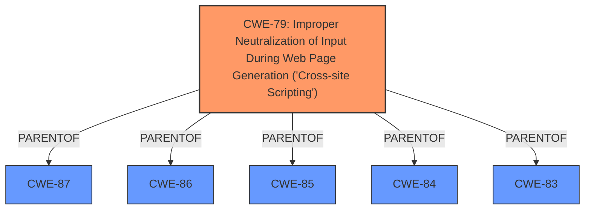

# Enhanced Analysis for CVE-2025-2560

# Summary
| CWE ID | CWE Name | Confidence | CWE Abstraction Level | CWE Vulnerability Mapping Label | CWE-Vulnerability Mapping Notes |
|---|---|---|---|---|---|
| CWE-79 | Improper Neutralization of Input During Web Page Generation ('Cross-site Scripting') | 1.0 | Base | Allowed | Primary CWE |

## Evidence and Confidence

*   **Confidence Score:** 1.0
*   **Evidence Strength:** HIGH

## Relationship Analysis
The primary relationship is that CWE-79 is a base class vulnerability related to improper neutralization of input, which directly aligns with the vulnerability description stating that the plugin **does not sanitise and escape some of its settings**. This leads to Stored Cross-Site Scripting. While there are parent CWEs, CWE-79 is the most specific and appropriate.



## Vulnerability Chain
The vulnerability chain is straightforward:
1.  **Root Cause:** **Improper sanitization and escaping** of settings (CWE-79)
2.  **Impact:** Stored Cross-Site Scripting attacks

## Summary of Analysis
The analysis is based on the vulnerability description, which clearly states that the Ninja Forms WordPress plugin **does not sanitise and escape some of its settings**. The CVE Reference Links Content Summary confirms that the root cause of the vulnerability is the lack of sanitization and escaping, leading to Stored Cross-Site Scripting (XSS).

The primary CWE is CWE-79 (Improper Neutralization of Input During Web Page Generation ('Cross-site Scripting')), which is a base-level CWE and directly addresses the root cause.

Other CWEs Considered:

*   CWE-116 (Improper Encoding or Escaping of Output): While related, CWE-79 is more specific to XSS.
*   CWE-862 (Missing Authorization), CWE-863 (Incorrect Authorization): These are not applicable as the issue is not related to authorization.
*   CWE-352 (Cross-Site Request Forgery (CSRF)): This is not applicable as the issue is not related to CSRF.
*   CWE-434 (Unrestricted Upload of File with Dangerous Type): This is not applicable as the issue is not related to file uploads.
*   CWE-89 (Improper Neutralization of Special Elements used in an SQL Command ('SQL Injection')): This is not applicable as the issue is not related to SQL injection.
*   CWE-73 (External Control of File Name or Path): This is not applicable as the issue is related to sanitizing settings, not file names or paths.

The selection of CWE-79 is based on direct evidence from the vulnerability description and the CVE reference content. The CWE is at the appropriate level of specificity, addressing the root cause of the vulnerability.


## CWE Relationship Analysis

Current CWEs represent these abstraction levels: .


### Vulnerability Chain Analysis

**Chain starting from CWE-87:**
- 87 (Improper Neutralization of Alternate XSS Syntax) - ROOT


**Chain starting from CWE-863:**
- 863 (Incorrect Authorization) - ROOT


### CWE Relationship Diagram

```mermaid
graph TD
    classDef primary fill:#f96,stroke:#333,stroke-width:2px
    classDef secondary fill:#69f,stroke:#333
    classDef tertiary fill:#9e9,stroke:#333
```