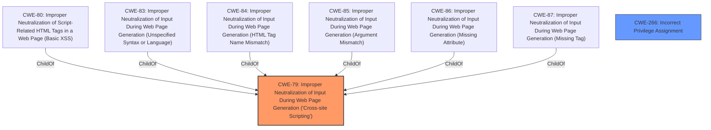

# Enhanced Analysis for CVE-2025-2561

# Summary
| CWE ID    | CWE Name                                                                               | Confidence | CWE Abstraction Level | CWE Vulnerability Mapping Label | CWE-Vulnerability Mapping Notes |
| :-------- | :------------------------------------------------------------------------------------- | :--------- | :-------------------- | :------------------------------ | :------------------------------ |
| CWE-79    | Improper Neutralization of Input During Web Page Generation ('Cross-site Scripting') | 1          | Base                  | Primary                         | Allowed                         |
| CWE-266   | Incorrect Privilege Assignment                                                         | 0.6        | Base                  | Secondary                       | Allowed                         |

## Evidence and Confidence

*   **Confidence Score:** 0.8
*   **Evidence Strength:** HIGH

## Relationship Analysis
The primary CWE is CWE-79, which is a Base level CWE describing Cross-site Scripting. It is related to several other CWEs through parent-child relationships. The vulnerability description clearly indicates that the plugin does not sanitize and escape some of its settings, leading to stored XSS, making CWE-79 a strong candidate.
CWE-266 is considered due to the high privilege access required to exploit the vulnerability. It is a base CWE.



## Vulnerability Chain
The vulnerability chain starts with the **failure to sanitize and escape settings** in the Ninja Forms WordPress plugin. This **weakness** allows an attacker with high privileges to inject malicious scripts into the settings. When these settings are rendered in a web page, the injected script is executed, leading to a Stored Cross-Site Scripting (XSS) attack.

Root Cause: **does not sanitise and escape some of its settings** (CWE-79)
Impact: Stored Cross-Site Scripting attacks

## Summary of Analysis
The primary weakness is the **lack of sanitization and escaping** of settings, which directly leads to Stored Cross-Site Scripting (XSS). The evidence from the vulnerability description and the CVE reference link summary support this. The retriever results also list CWE-79 as a potential match. The fact that this can be exploited by high privilege users (admin) suggests that the privilege assignment should be considered, however the **rootcause** remains the **lack of sanitization**.

CWE-79 is the most appropriate because it directly addresses the **root cause** of the vulnerability: the **improper neutralization of input during web page generation**. The description states the plugin **does not sanitise and escape some of its settings**, which aligns perfectly with CWE-79.

CWE-266 is considered because the exploit requires high privileges. This suggests that the plugin might have an issue with privilege assignment, where a high-privilege user (like an admin) has access to settings that they should not be able to modify in a way that leads to XSS.

Other CWEs Considered but Not Used:

*   CWE-862 (Missing Authorization) and CWE-863 (Incorrect Authorization): While authorization issues are possible, the primary issue is the **lack of sanitization**, not the authorization mechanism itself. If the input was properly sanitized, even with an authorization flaw, the XSS would be prevented.
*   CWE-352 (Cross-Site Request Forgery): CSRF is not directly related to this vulnerability, as it focuses on exploiting the trust between a user and a web site.
*   CWE-434 (Unrestricted Upload of File with Dangerous Type): This is not relevant because the vulnerability does not involve file uploads.
*   CWE-89 (SQL Injection): This is not relevant because the vulnerability does not involve SQL databases or queries.
*   CWE-73 (External Control of File Name or Path): This is not relevant because the vulnerability does not involve direct manipulation of file paths.
*   CWE-116 (Improper Encoding or Escaping of Output): CWE-116 is related to output encoding, but CWE-79 is more specific to Cross-site Scripting, which is the direct impact of this vulnerability. Therefore, CWE-79 is more appropriate.


## CWE Relationship Analysis

Current CWEs represent these abstraction levels: .


### Vulnerability Chain Analysis

**Chain starting from CWE-87:**
- 87 (Improper Neutralization of Alternate XSS Syntax) - ROOT


**Chain starting from CWE-863:**
- 863 (Incorrect Authorization) - ROOT


### CWE Relationship Diagram

```mermaid
graph TD
    classDef primary fill:#f96,stroke:#333,stroke-width:2px
    classDef secondary fill:#69f,stroke:#333
    classDef tertiary fill:#9e9,stroke:#333
```