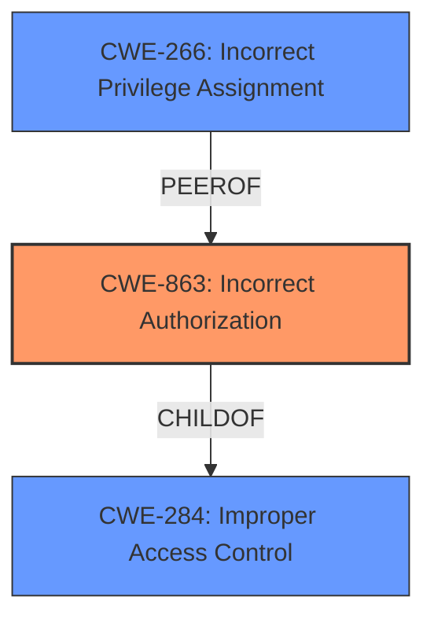

# Raw Analyzer Response for CVE-2025-25614

# Summary
| CWE ID    | CWE Name                                           | Confidence | CWE Abstraction Level | CWE Vulnerability Mapping Label | CWE-Vulnerability Mapping Notes |
| :-------- | :------------------------------------------------- | :--------- | :-------------------- | :------------------------------ | :------------------------------ |
| CWE-863   | Incorrect Authorization                            | 0.9        | Class                 | Primary                         | Allowed-with-Review             |
| CWE-266   | Incorrect Privilege Assignment                     | 0.7        | Base                  | Secondary                       | Allowed                         |
| CWE-284   | Improper Access Control                            | 0.6        | Pillar                | Secondary                       | Discouraged                    |

## Evidence and Confidence

*   **Confidence Score:** 0.8
*   **Evidence Strength:** HIGH

## Relationship Analysis
The primary CWE is CWE-863 (Incorrect Authorization) which is a Class-level CWE. CWE-863 has child CWEs that may be more specific, but based on the available information, CWE-863 is the most appropriate. CWE-266 (Incorrect Privilege Assignment) is a Base-level CWE and a possible contributing factor, and CWE-284 (Improper Access Control) is a high-level CWE that could apply but is less specific than CWE-863.

## Vulnerability Chain
The vulnerability chain starts with **Incorrect Access Control**, which leads to Privilege Escalation. Specifically, teachers are able to update the personal data of other teachers.

Incorrect Access Control -> Privilege Escalation

The **Primary CWE** is CWE-863 Incorrect Authorization, as the system performs an authorization check but does it incorrectly.

## Summary of Analysis
The initial assessment identified that the **root cause** of the vulnerability is **Incorrect Access Control**, leading to Privilege Escalation. The evidence provided in the CVE description and the "CVE Reference Links Content Summary" section supports this conclusion. The "Retriever Results" also suggest CWE-863 (Incorrect Authorization) as a potential candidate.

The choice of CWE-863 is based on the fact that the application performs an authorization check, but this check is flawed, allowing teachers to modify the data of other teachers, which they should not be able to do. This is a clear case of **incorrect authorization**, as the system's authorization logic **fails to properly restrict access**.

Other CWEs considered but not used:

*   CWE-284 (Improper Access Control): This is a high-level CWE and less specific than CWE-863.
*   CWE-266 (Incorrect Privilege Assignment): This could be a contributing factor, but the primary issue is with the **authorization logic**, not the initial assignment of privileges.
*   CWE-862 (Missing Authorization): This CWE would be applicable if there was no authorization check at all, but the description implies that a check exists, albeit a flawed one.
*   CWE-732 (Incorrect Permission Assignment for Critical Resource): While this relates to permission assignment, the core issue is that the **authorization check** is **incorrect**, not necessarily the permission assignment itself.

The selected CWEs are at the optimal level of specificity based on the available evidence. CWE-863 accurately reflects the **incorrect authorization** issue, while CWE-266 acknowledges the potential role of **incorrect privilege assignment** as a contributing factor.

Relevant CWE Information:

# Enhanced Context (25 CWEs)
The following CWEs were identified as potentially relevant to this vulnerability:

## CWE-266: Incorrect Privilege Assignment
**Abstraction Level**: Base
**Similarity Score**: 0.74
**Source**: dense

**Description**:
A product incorrectly assigns a privilege to a particular actor, creating an unintended sphere of control for that actor.

**Mapping Guidance**:
- Usage: Allowed
- Rationale: This CWE entry is at the Base level of abstraction, which is a preferred level of abstraction for mapping to the root causes of vulnerabilities.

## CWE-267: Privilege Defined With Unsafe Actions
**Abstraction Level**: Base
**Similarity Score**: 0.74
**Source**: dense

**Description**:
A particular privilege, role, capability, or right can be used to perform unsafe actions that were not intended, even when it is assigned to the correct entity.

**Mapping Guidance**:
- Usage: Allowed
- Rationale: This CWE entry is at the Base level of abstraction, which is a preferred level of abstraction for mapping to the root causes of vulnerabilities.

## CWE-668: Exposure of Resource to Wrong Sphere
**Abstraction Level**: Class
**Similarity Score**: 0.73
**Source**: dense

**Description**:
The product exposes a resource to the wrong control sphere, providing unintended actors with inappropriate access to the resource.

**Mapping Guidance**:
- Usage: Discouraged
- Rationale: CWE-668 is high-level and is often misused as a catch-all when lower-level CWE IDs might be applicable. It is sometimes used for low-information vulnerability reports [REF-1287]. It is a level-1 Class (i.e., a child of a Pillar). It is not useful for trend analysis.

## CWE-280: Improper Handling of Insufficient Permissions or Privileges 
**Abstraction Level**: Base
**Similarity Score**: 0.72
**Source**: dense

**Description**:
The product does not handle or incorrectly handles when it has insufficient privileges to access resources or functionality as specified by their permissions. This may cause it to follow unexpected code paths that may leave the product in an invalid state.

**Mapping Guidance**:
- Usage: Allowed
- Rationale: This CWE entry is at the Base level of abstraction, which is a preferred level of abstraction for mapping to the root causes of vulnerabilities.

## CWE-274: Improper Handling of Insufficient Privileges
**Abstraction Level**: Base
**Similarity Score**: 0.72
**Source**: dense

**Description**:
The product does not handle or incorrectly handles when it has insufficient privileges to perform an operation, leading to resultant weaknesses.

**Mapping Guidance**:
- Usage: Discouraged
- Rationale: This CWE entry could be deprecated in a future version of CWE.

## CWE-472: External Control of Assumed-Immutable Web Parameter
**Abstraction Level**: Base
**Similarity Score**: 0.72
**Source**: dense

**Description**:
The web application does not sufficiently verify inputs that are assumed to be immutable but are actually externally controllable, such as hidden form fields.

**Mapping Guidance**:
- Usage: Allowed
- Rationale: This CWE entry is at the Base level of abstraction, which is a preferred level of abstraction for mapping to the root causes of vulnerabilities.

## CWE-41: Improper Resolution of Path Equivalence
**Abstraction Level**: Base
**Similarity Score**: 0.72
**Source**: dense

**Description**:
The product is vulnerable to file system contents disclosure through path equivalence. Path equivalence involves the use of special characters in file and directory names. The associated manipulations are intended to generate multiple names for the same object.

**Mapping Guidance**:
- Usage: Allowed
- Rationale: This CWE entry is at the Base level of abstraction, which is a preferred level of abstraction for mapping to the root causes of vulnerabilities.

## CWE-639: Authorization Bypass Through User-Controlled Key
**Abstraction Level**: Base
**Similarity Score**: 0.71
**Source**: dense

**Description**:
The system's authorization functionality does not prevent one user from gaining access to another user's data or record by modifying the key value identifying the data.

**Mapping Guidance**:
- Usage: Allowed
- Rationale: This CWE entry is at the Base level of abstraction, which is a preferred level of abstraction for mapping to the root causes of vulnerabilities.

## CWE-59: Improper Link Resolution Before File Access ('Link Following')
**Abstraction Level**: Base
**Similarity Score**: 0.71
**Source**: dense

**Description**:
The product attempts to access a file based on the filename, but it does not properly prevent that filename from identifying a link or shortcut that resolves to an unintended resource.

**Mapping Guidance**:
- Usage: Allowed
- Rationale: This CWE entry is at the Base level of abstraction, which is a preferred level of abstraction for mapping to the root causes of vulnerabilities.

## CWE-664: Improper Control of a Resource Through its Lifetime
**Abstraction Level**: Pillar
**Similarity Score**: 0.71
**Source**: dense

**Description**:
The product does not maintain or incorrectly maintains control over a resource throughout its lifetime of creation, use, and release.