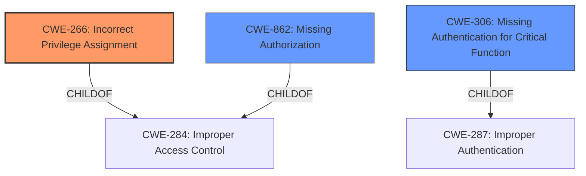

# Enhanced Analysis for CVE-2025-2563

# Summary
| CWE ID    | CWE Name                                                                        | Confidence | CWE Abstraction Level | CWE Vulnerability Mapping Label | CWE-Vulnerability Mapping Notes |
| :---------- | :------------------------------------------------------------------------------ | :--------- | :-------------------- | :------------------------------ | :-------------------------------- |
| CWE-266     | Incorrect Privilege Assignment                                                  | 0.9        | Base                  | Primary                         | Allowed                           |
| CWE-862     | Missing Authorization                                                           | 0.7        | Class                 | Secondary                       | Allowed-with-Review             |
| CWE-306     | Missing Authentication for Critical Function                                    | 0.6        | Base                  | Secondary                       | Allowed                           |

## Evidence and Confidence

*   **Confidence Score:** 0.8
*   **Evidence Strength:** HIGH

## Relationship Analysis
The primary relationship that influenced the CWE selection was the parent-child relationship between CWE-287 (Improper Authentication) and CWE-306 (Missing Authentication for Critical Function), and the relationship between CWE-284 (Improper Access Control) and CWE-266 (Incorrect Privilege Assignment), CWE-862 (Missing Authorization). Given that the vulnerability involves an **improper privilege assignment** leading to unauthenticated users gaining admin privileges, CWE-266 was chosen as the primary CWE, which is a child of CWE-284. CWE-862 and CWE-306 were considered because the attack involves a lack of authorization and authentication respectively in the context of setting account roles. The abstraction levels were also considered, with a preference for the Base level CWE-266 and CWE-306. The class level CWE-862 was used as a secondary CWE because it highlights the missing authorization check.



## Vulnerability Chain
The vulnerability chain starts with the **incorrect privilege assignment** (CWE-266), followed by the **missing authorization** (CWE-862) to prevent unauthenticated users from setting their account roles. The **missing authentication** (CWE-306) also contributes to the issue as it allows users to perform actions without proper identity verification, ultimately leading to privilege escalation.

## Summary of Analysis
The initial analysis focused on identifying the root cause of the vulnerability, which was determined to be the **incorrect privilege assignment** (CWE-266) due to the plugin not preventing users from setting their account role. This is compounded by **missing authorization** (CWE-862) checks, allowing unauthenticated users to gain admin privileges, and to some extent, **missing authentication** (CWE-306) because the role setting process lacks proper identity verification. The evidence from the "CVE Reference Links Content Summary" section supports this, stating that the plugins do not prevent users from setting their account role, leading to unauthenticated users gaining admin privileges.

The graph relationships influenced the final selection by highlighting the connection between access control issues and specific privilege/authorization flaws. CWE-266 was chosen because it directly addresses the **incorrect privilege assignment**, while CWE-862 and CWE-306 are secondary as they contribute to the exploitation of the vulnerability.

The selected CWEs are at the optimal level of specificity because they accurately represent the weakness based on the provided evidence. CWE-266 is a Base level CWE that directly addresses the root cause, while CWE-862 and CWE-306 provide additional context regarding the missing authorization and authentication checks.

Relevant CWE Information:

# Enhanced Context (25 CWEs)
The following CWEs were identified as potentially relevant to this vulnerability:

## CWE-266: Incorrect Privilege Assignment
**Abstraction Level**: Base
**Similarity Score**: 0.75
**Source**: dense

**Description**:
A product incorrectly assigns a privilege to a particular actor, creating an unintended sphere of control for that actor.

**Mapping Guidance**:
- Usage: Allowed
- Rationale: This CWE entry is at the Base level of abstraction, which is a preferred level of abstraction for mapping to the root causes of vulnerabilities.

**Relationships**:
- PARENTOF -> CWE-9
- PARENTOF -> CWE-556
- PARENTOF -> CWE-520
- PARENTOF -> CWE-1022
- CANALSOBE -> CWE-286

## CWE-472: External Control of Assumed-Immutable Web Parameter
**Abstraction Level**: Base
**Similarity Score**: 0.75
**Source**: dense

**Description**:
The web application does not sufficiently verify inputs that are assumed to be immutable but are actually externally controllable, such as hidden form fields.

**Mapping Guidance**:
- Usage: Allowed
- Rationale: This CWE entry is at the Base level of abstraction, which is a preferred level of abstraction for mapping to the root causes of vulnerabilities.

## CWE-267: Privilege Defined With Unsafe Actions
**Abstraction Level**: Base
**Similarity Score**: 0.75
**Source**: dense

**Description**:
A particular privilege, role, capability, or right can be used to perform unsafe actions that were not intended, even when it is assigned to the correct entity.

**Mapping Guidance**:
- Usage: Allowed
- Rationale: This CWE entry is at the Base level of abstraction, which is a preferred level of abstraction for mapping to the root causes of vulnerabilities.

## CWE-668: Exposure of Resource to Wrong Sphere
**Abstraction Level**: Class
**Similarity Score**: 0.73
**Source**: dense

**Description**:
The product exposes a resource to the wrong control sphere, providing unintended actors with inappropriate access to the resource.

**Mapping Guidance**:
- Usage: Discouraged
- Rationale: CWE-668 is high-level and is often misused as a catch-all when lower-level CWE IDs might be applicable. It is sometimes used for low-information vulnerability reports [REF-1287]. It is a level-1 Class (i.e., a child of a Pillar). It is not useful for trend analysis.

## CWE-41: Improper Resolution of Path Equivalence
**Abstraction Level**: Base
**Similarity Score**: 0.73
**Source**: dense

**Description**:
The product is vulnerable to file system contents disclosure through path equivalence. Path equivalence involves the use of special characters in file and directory names. The associated manipulations are intended to generate multiple names for the same object.

**Mapping Guidance**:
- Usage: Allowed
- Rationale: This CWE entry is at the Base level of abstraction, which is a preferred level of abstraction for mapping to the root causes of vulnerabilities.

## CWE-425: Direct Request ('Forced Browsing')
**Abstraction Level**: Base
**Similarity Score**: 0.73
**Source**: dense

**Description**:
The web application does not adequately enforce appropriate authorization on all restricted URLs, scripts, or files.

**Mapping Guidance**:
- Usage: Allowed
- Rationale: This CWE entry is at the Base level of abstraction, which is a preferred level of abstraction for mapping to the root causes of vulnerabilities.

## CWE-639: Authorization Bypass Through User-Controlled Key
**Abstraction Level**: Base
**Similarity Score**: 0.73
**Source**: dense

**Description**:
The system's authorization functionality does not prevent one user from gaining access to another user's data or record by modifying the key value identifying the data.

**Mapping Guidance**:
- Usage: Allowed
- Rationale: This CWE entry is at the Base level of abstraction, which is a preferred level of abstraction for mapping to the root causes of vulnerabilities.

## CWE-1390: Weak Authentication
**Abstraction Level**: Class
**Similarity Score**: 0.72
**Source**: dense

**Description**:
The product uses an authentication mechanism to restrict access to specific users or identities, but the mechanism does not sufficiently prove that the claimed identity is correct.

**Mapping Guidance**:
- Usage: Allowed-with-Review
- Rationale: This CWE entry is a Class and might have Base-level children that would be more appropriate

## CWE-274: Improper Handling of Insufficient Privileges
**Abstraction Level**: Base
**Similarity Score**: 0.72
**Source**: dense

**Description**:
The product does not handle or incorrectly handles when it has insufficient privileges to perform an operation, leading to resultant weaknesses.

**


## CWE Relationship Analysis

Current CWEs represent these abstraction levels: .


### Vulnerability Chain Analysis

**Chain starting from CWE-1390:**
- 1390 (Weak Authentication) - ROOT


**Chain starting from CWE-556:**
- 556 (ASP.NET Misconfiguration: Use of Identity Impersonation) - ROOT


### CWE Relationship Diagram

```mermaid
graph TD
    classDef primary fill:#f96,stroke:#333,stroke-width:2px
    classDef secondary fill:#69f,stroke:#333
    classDef tertiary fill:#9e9,stroke:#333
```