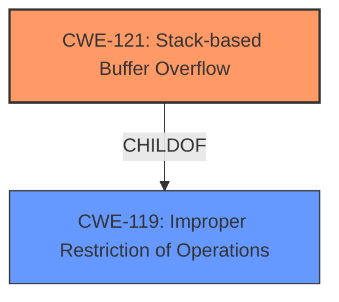

# Raw Analyzer Response for CVE-2025-25667

# Summary
| CWE ID | CWE Name | Confidence | CWE Abstraction Level | CWE Vulnerability Mapping Label | CWE-Vulnerability Mapping Notes |
|---|---|---|---|---|---|
| CWE-121 | Stack-based Buffer Overflow | 1.0 | Variant | Allowed | Primary CWE |

## Evidence and Confidence

*   **Confidence Score:** 1.0
*   **Evidence Strength:** HIGH

## Relationship Analysis
The primary relationship that influenced the decision was the direct match of "**stack overflow**" in the vulnerability description to CWE-121, Stack-based Buffer Overflow. The other CWEs, while potentially related to buffer overflows or integer handling, did not have a direct root cause match.

## Vulnerability Chain
The vulnerability chain starts with the **stack overflow** due to the `urls` parameter.

## Summary of Analysis
The vulnerability description clearly states a "**stack overflow** via the urls parameter in the function get_parentControl_list_Info". The retriever results list CWE-121, Stack-based Buffer Overflow, as the top match with a score of 1.0. Given this strong evidence, CWE-121 is the most appropriate mapping. The evidence is sufficient and the identification of the root cause is clear. The relationship graph shows that CWE-121 is a child of CWE-119, Improper Restriction of Operations within a software program, and helps further classify it as a software weakness.

Relevant CWE Information:

# Enhanced Context (25 CWEs)
The following CWEs were identified as potentially relevant to this vulnerability:

## CWE-121: Stack-based Buffer Overflow
**Abstraction Level**: Variant
**Similarity Score**: 0.73
**Source**: dense

**Description**:
A stack-based buffer overflow condition is a condition where the buffer being overwritten is allocated on the stack (i.e., is a local variable or, rarely, a parameter to a function).

**Mapping Guidance**:
- Usage: Allowed
- Rationale: This CWE entry is at the Variant level of abstraction, which is a preferred level of abstraction for mapping to the root causes of vulnerabilities.

CWE-121: Stack-based Buffer Overflow is the best match because the vulnerability description explicitly mentions a **stack overflow**. The description of CWE-121 directly aligns with this condition. The other CWEs were considered but discarded because they did not accurately describe the specific vulnerability.