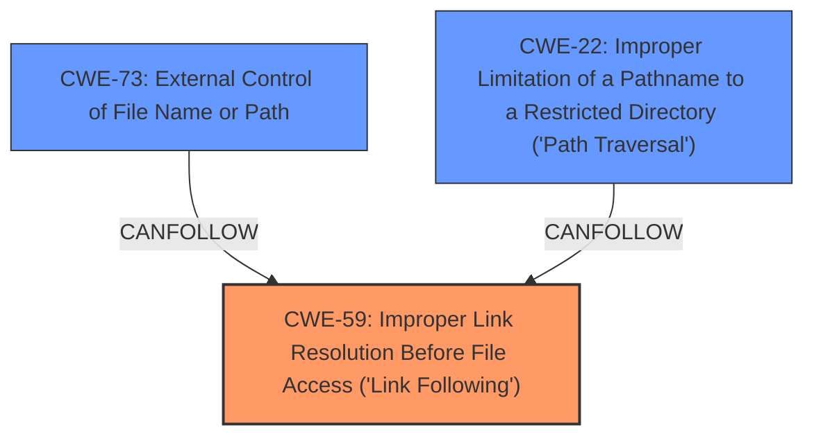

# Enhanced Analysis for CVE-2025-25685

# Summary

| CWE ID | CWE Name | Confidence | CWE Abstraction Level | CWE Vulnerability Mapping Label | CWE-Vulnerability Mapping Notes |
|---|---|---|---|---|---|
| CWE-59 | Improper Link Resolution Before File Access ('Link Following') | 0.9 | Base | Allowed | Primary CWE. The **improper link resolution** is the root cause.|
| CWE-73 | External Control of File Name or Path | 0.7 | Base | Allowed | Secondary CWE. The filename is influenced by the attacker. |
| CWE-22 | Improper Limitation of a Pathname to a Restricted Directory ('Path Traversal') | 0.6 | Base | Allowed | Secondary CWE. The symlink can resolve outside the restricted directory. |

## Evidence and Confidence

*   **Confidence Score:** 0.9
*   **Evidence Strength:** HIGH

## Relationship Analysis
The primary weakness is the **improper link resolution** which allows an attacker to access unintended resources. CWE-59 is the root cause. CWE-73 and CWE-22 are related as they involve external control of file paths and path traversal respectively. They are secondary issues contributing to the exploitability of the main weakness. The abstraction levels are all Base, providing good specificity.



## Vulnerability Chain
1.  Attacker controlled input (filename/path via symlink)
2.  **Improper Link Resolution** (CWE-59)
3.  Access to arbitrary files

The root cause is the **improper link resolution**.

## Summary of Analysis
The analysis is based on the CVE description and referenced content summary. The core issue is the lack of validation when handling symlinks, leading to arbitrary file access. The selection of CWE-59 as the primary weakness is based on the fact that the router does not properly prevent the filename from identifying a link that resolves to an unintended resource. This is directly supported by the "Weaknesses/vulnerabilities present" section in the CVE Reference Links Content Summary: "*Arbitrary File Read: The ability to read arbitrary files on the router by leveraging symlinks.*" and "*Unvalidated Input: The router doesn't properly sanitize or validate file paths when accessed via the Samba share.*"

CWE-73 is a secondary CWE because the attacker can control the filename or path by creating the symbolic link with a specific target. The `External Control of File Name or Path` allows the attacker to influence the file system operations.
CWE-22 is added as another secondary CWE, as the symbolic link can lead to accessing files outside of the intended restricted directory. The `Improper Limitation of a Pathname to a Restricted Directory ('Path Traversal')` occurs when the symlink resolves to a location outside the intended directory.

Other CWEs Considered:

*   CWE-61 (UNIX Symbolic Link (Symlink) Following): While related, CWE-61 is a compound weakness. CWE-59 is more specific to the **improper link resolution**.
*   CWE-23 (Relative Path Traversal): This is similar to CWE-22, but less specific as the vulnerability isn't necessarily about relative paths.
*   CWE-78 (Improper Neutralization of Special Elements used in an OS Command ('OS Command Injection')): This is not relevant as the vulnerability doesn't involve OS command injection.
*   CWE-425 (Direct Request ('Forced Browsing')): Not relevant as the vulnerability doesn't involve bypassing authorization to access restricted URLs.


## CWE Relationship Analysis

Current CWEs represent these abstraction levels: .


### Vulnerability Chain Analysis

**Chain starting from CWE-22:**
- 22 (Improper Limitation of a Pathname to a Restricted Directory ('Path Traversal')) - ROOT


**Chain starting from CWE-59:**
- 59 (Improper Link Resolution Before File Access ('Link Following')) - ROOT


### CWE Relationship Diagram

```mermaid
graph TD
    classDef primary fill:#f96,stroke:#333,stroke-width:2px
    classDef secondary fill:#69f,stroke:#333
    classDef tertiary fill:#9e9,stroke:#333
```