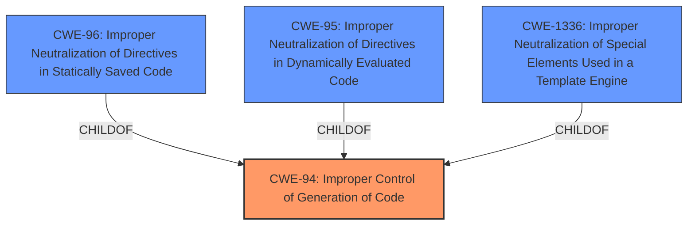

# Analysis Report for CVE-2025-25793

# Vulnerability Analysis Report: CVE-2025-25793

## Description

SeaCMS v13.3 was discovered to contain a remote code execution (RCE) vulnerability via the component admin_notify.php.

## Vulnerability Description Key Phrases

- **Impact:** remote code execution
- **Product:** SeaCMS
- **Version:** v13.3
- **Component:** admin_notify.php

## Analysis (with Relationship Data)

# Summary
| CWE ID | CWE Name | Confidence | CWE Abstraction Level | CWE Vulnerability Mapping Label | CWE-Vulnerability Mapping Notes |
|---|---|---|---|---|---|
| CWE-94 | Improper Control of Generation of Code ('Code Injection') | 0.6 | Base | Primary | Allowed-with-Review |

## Evidence and Confidence

*   **Confidence Score:** 0.6
*   **Evidence Strength:** LOW

## Relationship Analysis
The primary relationship considered was the parent-child relationship between CWE-94 and its children (CWE-96, CWE-95, CWE-1336). While those children offer more specificity, the provided information does not allow for selecting one over the other. Thus, I opted for the parent, CWE-94.



## Vulnerability Chain
The vulnerability chain starts with **improper control of code generation** which directly leads to remote code execution.

## Summary of Analysis
The vulnerability description indicates a remote code execution (RCE) vulnerability in SeaCMS v13.3 via the component admin_notify.php. The key phrase "remote code execution" suggests a weakness related to code injection. However, the provided information lacks specifics on the exact injection type.

The Retriever Results list several potential CWEs, including:
* CWE-96: Improper Neutralization of Directives in Statically Saved Code ('Static Code Injection')
* CWE-790: Improper Filtering of Special Elements
* CWE-95: Improper Neutralization of Directives in Dynamically Evaluated Code ('Eval Injection')
* CWE-78: Improper Neutralization of Special Elements used in an OS Command ('OS Command Injection')
* CWE-434: Unrestricted Upload of File with Dangerous Type
* CWE-1336: Improper Neutralization of Special Elements Used in a Template Engine
* CWE-77: Improper Neutralization of Special Elements used in a Command ('Command Injection')
* CWE-502: Deserialization of Untrusted Data
* CWE-89: Improper Neutralization of Special Elements used in an SQL Command ('SQL Injection')
* CWE-73: External Control of File Name or Path

Given the high-level description and the lack of specific details about the injection mechanism, I chose CWE-94 Improper Control of Generation of Code ('Code Injection') as the most appropriate primary CWE. It is a parent of other CWEs listed and it better fits the overall description. While the retriever results suggest more specific CWEs like CWE-96, CWE-95, and CWE-1336, there isn't enough evidence to select one of them.

The MITRE mapping guidance for CWE-94 suggests "Allowed-with-Review" and states that it is frequently misused for vulnerabilities with a technical impact of "code execution," which does not by itself indicate a root cause weakness. However, given the lack of detailed information, it serves as the best starting point.

Relevant CWE Information:

# Enhanced Context (25 CWEs)
The following CWEs were identified as potentially relevant to this vulnerability:

## CWE-96: Improper Neutralization of Directives in Statically Saved Code ('Static Code Injection')
**Abstraction Level**: Base
**Similarity Score**: 0.78
**Source**: dense

**Description**:
The product receives input from an upstream component, but it does not neutralize or incorrectly neutralizes code syntax before inserting the input into an executable resource, such as a library, configuration file, or template.

**Mapping Guidance**:
- Usage: Allowed
- Rationale: This CWE entry is at the Base level of abstraction, which is a preferred level of abstraction for mapping to the root causes of vulnerabilities.

## CWE-94: Improper Control of Generation of Code ('Code Injection')
**Abstraction Level**: base
**Similarity Score**: 2.28
**Source**: graph

**Description**:
CWE-94: Improper Control of Generation of Code ('Code Injection')

**Mapping Guidance**:
- Usage: Allowed-with-Review
- Rationale: This entry is frequently misused for vulnerabilities with a technical impact of "code execution," which does not by itself indicate a root cause weakness, since dozens of weaknesses can enable code execution.

**Relationships**:
- CANFOLLOW -> CWE-98
- PARENTOF -> CWE-96
- PARENTOF -> CWE-95
- PARENTOF -> CWE-1336
- CHILDOF -> CWE-913


## CWE Relationship Analysis

Current CWEs represent these abstraction levels: .


### Vulnerability Chain Analysis

**Chain starting from CWE-502:**
- 502 (Deserialization of Untrusted Data) - ROOT


**Chain starting from CWE-89:**
- 89 (Improper Neutralization of Special Elements used in an SQL Command ('SQL Injection')) - ROOT


### CWE Relationship Diagram

```mermaid
graph TD
    classDef primary fill:#f96,stroke:#333,stroke-width:2px
    classDef secondary fill:#69f,stroke:#333
    classDef tertiary fill:#9e9,stroke:#333
```


*Report generated on 2025-07-14 13:44:58*
