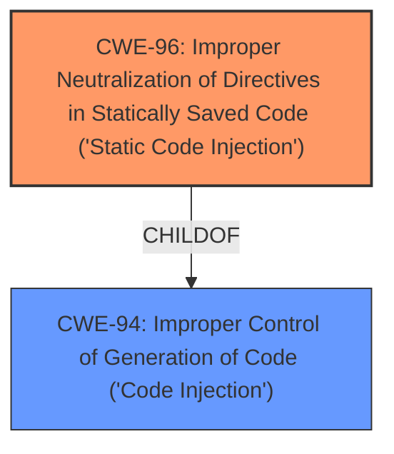

# Enhanced Analysis for CVE-2025-25796

# Summary
| CWE ID | CWE Name | Confidence | CWE Abstraction Level | CWE Vulnerability Mapping Label | CWE-Vulnerability Mapping Notes |
|---|---|---|---|---|---|
| CWE-96 | Improper Neutralization of Directives in Statically Saved Code ('Static Code Injection') | 0.7 | Base | Allowed | Primary CWE |

## Evidence and Confidence

*   **Confidence Score:** 0.7
*   **Evidence Strength:** LOW

## Relationship Analysis
The primary relationship considered was that CWE-96 is a Base level weakness related to code injection. While other forms of injection were considered, the static nature of the affected code pointed towards CWE-96 as the most suitable classification.



## Vulnerability Chain
The vulnerability chain is as follows:
1.  **ROOT CAUSE:** CWE-96 - Improper Neutralization of Directives in Statically Saved Code ('Static Code Injection')
2.  **IMPACT:** Remote Code Execution

## Summary of Analysis
The initial assessment identified several candidate CWEs based on the provided information, but the evidence is limited to the vulnerability description. The most relevant and specific CWE appears to be CWE-96.

The vulnerability description states "SeaCMS v13.3 was discovered to contain a remote code execution (RCE) vulnerability via the component admin_template.php." This suggests that the `admin_template.php` component is vulnerable to remote code execution.

The Retriever Results list CWE-96, Improper Neutralization of Directives in Statically Saved Code ('Static Code Injection'), as the top combined result. This CWE aligns well with the vulnerability description, as it indicates that the product does not properly neutralize code syntax before inserting the input into an executable resource.

Based on the evidence, CWE-96 is the most appropriate CWE for this vulnerability because it directly addresses the root cause of the remote code execution.

Other CWEs were considered but ultimately deemed less suitable. For example, CWE-95 (Improper Neutralization of Directives in Dynamically Evaluated Code ('Eval Injection')) was considered, but it is more relevant to dynamically evaluated code, whereas the vulnerability description points to a static code injection in `admin_template.php`. Similarly, CWE-78 (Improper Neutralization of Special Elements used in an OS Command ('OS Command Injection')) was considered, but it is more relevant to OS command injection vulnerabilities.

The selection of CWE-96 is at the optimal level of specificity, as it is a Base level CWE that directly addresses the root cause of the vulnerability.


## CWE Relationship Analysis

Current CWEs represent these abstraction levels: .


### Vulnerability Chain Analysis

**Chain starting from CWE-96:**
- 96 (Improper Neutralization of Directives in Statically Saved Code ('Static Code Injection')) - ROOT


**Chain starting from CWE-94:**
- 94 (Improper Control of Generation of Code ('Code Injection')) - ROOT


### CWE Relationship Diagram

```mermaid
graph TD
    classDef primary fill:#f96,stroke:#333,stroke-width:2px
    classDef secondary fill:#69f,stroke:#333
    classDef tertiary fill:#9e9,stroke:#333
```