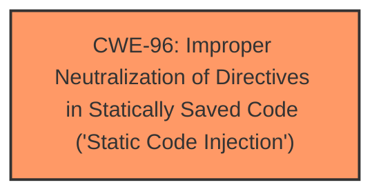

# Analysis Report for CVE-2025-25797

# Vulnerability Analysis Report: CVE-2025-25797

## Description

SeaCMS v13.3 was discovered to contain a remote code execution (RCE) vulnerability via the component admin_smtp.php.

## Vulnerability Description Key Phrases

- **Impact:** remote code execution
- **Product:** SeaCMS
- **Version:** v13.3
- **Component:** admin_smtp.php

## Analysis (with Relationship Data)

# Summary
| CWE ID | CWE Name | Confidence | CWE Abstraction Level | CWE Vulnerability Mapping Label | CWE-Vulnerability Mapping Notes |
|---|---|---|---|---|---|
| CWE-96 | Improper Neutralization of Directives in Statically Saved Code ('Static Code Injection') | 0.7 | Base | Primary | Allowed |

## Evidence and Confidence

*   **Confidence Score:** 0.7
*   **Evidence Strength:** LOW

## Relationship Analysis
The primary identified CWE is CWE-96, which deals with the improper neutralization of directives in statically saved code, leading to static code injection. While there are many potential related CWEs, without specific details on the injected code or the exact mechanism, it's difficult to form a comprehensive chain or consider alternative classifications. The selection is based on the limited information provided, favoring the base-level CWE-96.



## Vulnerability Chain
The vulnerability chain is relatively simple:
1.  **Root Cause:** Improper neutralization of directives in statically saved code (CWE-96).
2.  **Impact:** Remote code execution.

The provided information lacks detail to expand this chain further.

## Summary of Analysis
The analysis is based on the limited information provided in the vulnerability description, which indicates a remote code execution (RCE) vulnerability in SeaCMS v13.3 via the admin_smtp.php component. The key phrase "remote code execution" suggests code injection, and the retriever results point towards CWE-96 (Improper Neutralization of Directives in Statically Saved Code) as a potential candidate.

Given the limited evidence, the selection of CWE-96 is based on the following:
*   The vulnerability description specifies RCE, suggesting code injection.
*   The retriever results identify CWE-96 as a relevant CWE with a base abstraction level, which is preferred.

The confidence score is moderate (0.7) due to the lack of detailed information. Additional analysis would be needed to confirm this assessment.

Relevant CWE Information:

# Enhanced Context (25 CWEs)
The following CWEs were identified as potentially relevant to this vulnerability:

## CWE-96: Improper Neutralization of Directives in Statically Saved Code ('Static Code Injection')
**Abstraction Level**: Base
**Similarity Score**: 0.78
**Source**: dense

**Description**:
The product receives input from an upstream component, but it does not neutralize or incorrectly neutralizes code syntax before inserting the input into an executable resource, such as a library, configuration file, or template.

**Mapping Guidance**:
- Usage: Allowed
- Rationale: This CWE entry is at the Base level of abstraction, which is a preferred level of abstraction for mapping to the root causes of vulnerabilities.

### Other CWEs Considered But Not Used
*   **CWE-434: Unrestricted Upload of File with Dangerous Type**: While file uploads can lead to RCE, there's no explicit mention of file uploads in the description.
*   **CWE-95: Improper Neutralization of Directives in Dynamically Evaluated Code ('Eval Injection')**: This involves dynamic evaluation. The description doesn't provide enough information to distinguish between static and dynamic code injection, but CWE-96 seems slightly more applicable given that it involves a specific file.
*   **CWE-78: Improper Neutralization of Special Elements used in an OS Command ('OS Command Injection')**: This is specific to OS commands, which isn't explicitly indicated.
*   **CWE-89: Improper Neutralization of Special Elements used in an SQL Command ('SQL Injection')**: While SQL injection is a common vulnerability, the description does not suggest anything related to Databases or SQL.
*   **CWE-73: External Control of File Name or Path**: This is related to path manipulation, which is not directly indicated in the description.
*   **CWE-74: Improper Neutralization of Special Elements in Output Used by a Downstream Component ('Injection')**: This is a more general injection category and not as specific as CWE-96.
*   **CWE-77: Improper Neutralization of Special Elements used in a Command ('Command Injection')**: This is a more general command injection category, and not as specific as CWE-96.
*   **CWE-1336: Improper Neutralization of Special Elements Used in a Template Engine**: This requires the use of a template engine, which is not specified in the description.
*   **CWE-1236: Improper Neutralization of Formula Elements in a CSV File**: This is specific to CSV files, which aren't mentioned in the description.
*   **CWE-425: Direct Request ('Forced Browsing')**: This relates to authorization issues, not directly code injection.
*   **CWE-184: Incomplete List of Disallowed Inputs and CWE-183: Permissive List of Allowed Inputs**: These relate to input validation, which is not the primary issue.
*   **CWE-22: Improper Limitation of a Pathname to a Restricted Directory ('Path Traversal') and CWE-41: Improper Resolution of Path Equivalence**: These are related to path traversal, which is not directly indicated in the description.
*   **CWE-116: Improper Encoding or Escaping of Output**: This relates to encoding, which is not the primary issue.
*   **CWE-472: External Control of Assumed-Immutable Web Parameter**: This relates to web parameters, which is not directly code injection.
*   **CWE-93: Improper Neutralization of CRLF Sequences ('CRLF Injection')**: This relates to CRLF injection which is not apparent.
*   **CWE-178: Improper Handling of Case Sensitivity**: This relates to case sensitivity which is not apparent.
*   **CWE-790: Improper Filtering of Special Elements**: This is too generic to be useful.
*   **CWE-502: Deserialization of Untrusted Data**: This requires deserialization, which is not apparent.
*   **CWE-138: Improper Neutralization of Special Elements**: This is too generic to be useful.
*   **CWE-94: Improper Control of Generation of Code ('Code Injection')**: This is too generic to be useful.


## CWE Relationship Analysis

Current CWEs represent these abstraction levels: .


### Vulnerability Chain Analysis

**Chain starting from CWE-94:**
- 94 (Improper Control of Generation of Code ('Code Injection')) - ROOT


**Chain starting from CWE-93:**
- 93 (Improper Neutralization of CRLF Sequences ('CRLF Injection')) - ROOT


### CWE Relationship Diagram

```mermaid
graph TD
    classDef primary fill:#f96,stroke:#333,stroke-width:2px
    classDef secondary fill:#69f,stroke:#333
    classDef tertiary fill:#9e9,stroke:#333
```


*Report generated on 2025-07-14 13:45:54*
