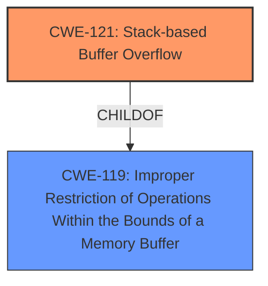

# Raw Analyzer Response for CVE-2025-26005

# Summary
| CWE ID | CWE Name | Confidence | CWE Abstraction Level | CWE Vulnerability Mapping Label | CWE-Vulnerability Mapping Notes |
|---|---|---|---|---|---|
| CWE-121 | Stack-based Buffer Overflow | 1.0 | Variant | Allowed | Primary CWE |

## Evidence and Confidence

*   **Confidence Score:** 1.0
*   **Evidence Strength:** HIGH

## Relationship Analysis
The primary CWE identified is CWE-121 (Stack-based Buffer Overflow), which is a variant of CWE-119 (Improper Restriction of Operations Within the Bounds of a Memory Buffer). The vulnerability description clearly indicates a **stack overflow** condition, which aligns directly with CWE-121. No other relationships significantly influenced the decision, as the evidence points directly to this specific type of buffer overflow.

## Vulnerability Chain
The vulnerability chain is straightforward:

1.  The root cause is a **stack overflow** (CWE-121) due to insufficient input validation.
2.  The impact is unauthorized access or control because of the overflow.

## Summary of Analysis
The vulnerability description explicitly mentions a **stack overflow** when requesting the admin.cgi parameter with setNtp. The Retriever Results also lists CWE-121 (Stack-based Buffer Overflow) as the top candidate with a score of 1.0. The description of CWE-121 aligns perfectly with the reported vulnerability.

The selection of CWE-121 is at the optimal level of specificity because it directly describes the type of buffer overflow occurring on the stack.

Relevant CWE Information:

# Enhanced Context (25 CWEs)
The following CWEs were identified as potentially relevant to this vulnerability:

## CWE-121: Stack-based Buffer Overflow
**Abstraction Level**: Variant
**Similarity Score**: 0.72
**Source**: dense

**Description**:
A stack-based buffer overflow condition is a condition where the buffer being overwritten is allocated on the stack (i.e., is a local variable or, rarely, a parameter to a function).

**Mapping Guidance**:
- Usage: Allowed
- Rationale: This CWE entry is at the Variant level of abstraction, which is a preferred level of abstraction for mapping to the root causes of vulnerabilities.

## Retriever Results

### Top Combined Results

| Rank | CWE ID | Name | Abstraction | Usage  | Retrievers | Individual Scores |
|------|--------|------|-------------|-------|------------|-------------------|
| 1 | 121 | Stack-based Buffer Overflow | Variant | Allowed | alternate_terms | 1.000 |

Based on the above information, provide your analysis.
Consider the following key aspects:

1. **Content Matching**
   - Match the vulnerability description against CWE descriptions
   - Identify technical indicators that align with specific CWE characteristics
   - Pay special attention to CWEs with high relevance scores

2. **Relationship Analysis**
   - Evaluate hierarchical relationships (ChildOf, ParentOf) to find the optimal level of specificity
   - Examine chain relationships (CanPrecede, CanFollow, RequiredBy, Requires) to identify potential vulnerability chains
   - Consider peer relationships (PeerOf, CanAlsoBe) that may offer alternative classifications
   - Assess abstraction levels (Pillar, Class, Base, Variant) to ensure appropriate granularity

3. **Mapping Guidance Analysis**
   - Consider the official MITRE mapping guidance when selecting CWEs
   - Pay attention to Usage recommendations (ALLOWED, DISCOURAGED, PROHIBITED)
   - Review the provided rationale for mapping decisions
   - Consider suggested alternative mappings where appropriate

4. **Mitigation Analysis**
   - Consider how the potential mitigations align with the vulnerability description
   - Use mitigation information to help understand the nature of the weakness
   - Evaluate whether the mitigations would address the specific vulnerability described

5. **Evidence-Based Decision Making**
   - Use specific evidence from the vulnerability description to justify your classification
   - Consider how relationship context enhances your understanding of the vulnerability
   - Evaluate confidence based on both direct evidence and relationship insights
   - Consider the retriever scores as supporting evidence for your decisions