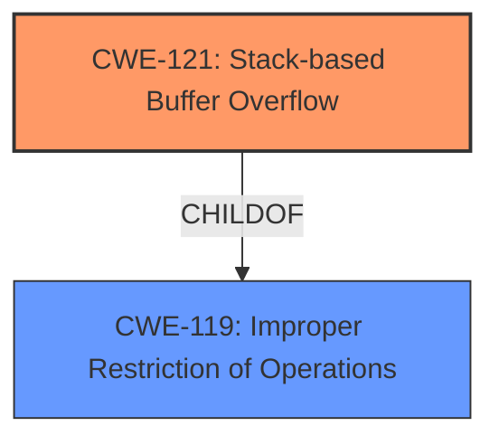

# Enhanced Analysis for CVE-2025-26008

# Summary
| CWE ID | CWE Name | Confidence | CWE Abstraction Level | CWE Vulnerability Mapping Label | CWE-Vulnerability Mapping Notes |
|---|---|---|---|---|---|
| CWE-121 | Stack-based Buffer Overflow | 1.0 | Variant | Allowed | Primary CWE. The vulnerability description explicitly states a stack overflow vulnerability. |

## Evidence and Confidence

*   **Confidence Score:** 1.0
*   **Evidence Strength:** HIGH

## Relationship Analysis
The primary CWE is CWE-121 (Stack-based Buffer Overflow), which is a variant of the more general CWE-119 (Improper Restriction of Operations within the Bounds of a Memory Buffer). There are no other relationships that would impact the decision. The vulnerability is a straightforward stack overflow.



## Vulnerability Chain
The vulnerability chain consists of a stack overflow due to improper handling of the `setSyncTimeHost` parameter in `admin.cgi`, leading to potential code execution.
  - Root Cause: Stack Overflow
  - Impact: Potential Code Execution

## Summary of Analysis
The analysis is based on the vulnerability description, which clearly states a stack overflow vulnerability. The retriever results also strongly suggest CWE-121. The evidence is sufficient to confidently assign CWE-121 as the primary CWE.

Relevant CWE Information:

# Enhanced Context (25 CWEs)
The following CWEs were identified as potentially relevant to this vulnerability:

## CWE-121: Stack-based Buffer Overflow
**Abstraction Level**: Variant
**Similarity Score**: 0.70
**Source**: dense

**Description**:
A stack-based buffer overflow condition is a condition where the buffer being overwritten is allocated on the stack (i.e., is a local variable or, rarely, a parameter to a function).

**Mapping Guidance**:
- Usage: Allowed
- Rationale: This CWE entry is at the Variant level of abstraction, which is a preferred level of abstraction for mapping to the root causes of vulnerabilities.

## Retriever Results

### Top Combined Results

| Rank | CWE ID | Name | Abstraction | Usage  | Retrievers | Individual Scores |
|------|--------|------|-------------|-------|------------|-------------------|
| 1 | 121 | Stack-based Buffer Overflow | Variant | Allowed | alternate_terms | 1.000 |

The vulnerability description states "an unauthorized **stack overflow** vulnerability exists when requesting admin.cgi parameter with setSyncTimeHost". This is direct evidence for CWE-121.

The description matches the CWE characteristics for CWE-121.
The security implication is potential code execution.

CWE-190, CWE-674, CWE-120, CWE-1284, CWE-125, CWE-770, CWE-131, CWE-790, and CWE-128 were considered but not used. None of these other CWEs accurately describe the vulnerability, which is a clear stack overflow.


## CWE Relationship Analysis

Current CWEs represent these abstraction levels: .


### Vulnerability Chain Analysis

**Chain starting from CWE-121:**
- 121 (Stack-based Buffer Overflow) - ROOT


**Chain starting from CWE-1284:**
- 1284 (Improper Validation of Specified Quantity in Input) - ROOT


### CWE Relationship Diagram

```mermaid
graph TD
    classDef primary fill:#f96,stroke:#333,stroke-width:2px
    classDef secondary fill:#69f,stroke:#333
    classDef tertiary fill:#9e9,stroke:#333
```