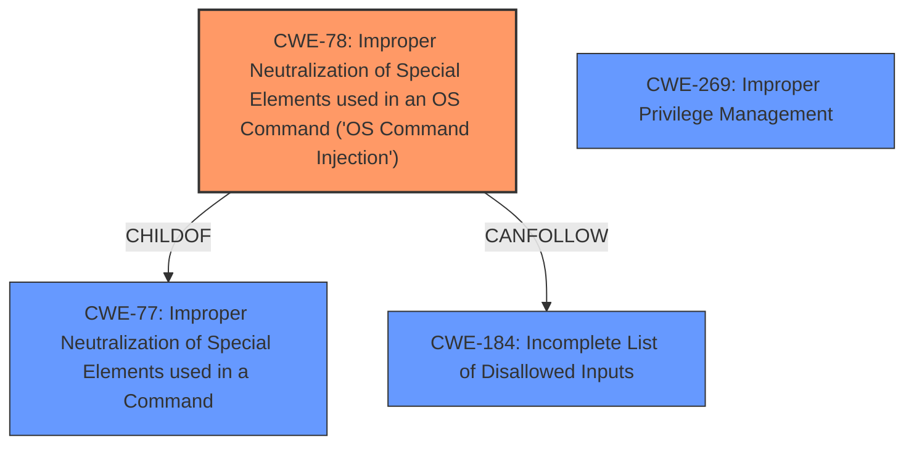

# Enhanced Analysis for CVE-2025-26262

# Summary
| CWE ID | CWE Name | Confidence | CWE Abstraction Level | CWE Vulnerability Mapping Label | CWE-Vulnerability Mapping Notes |
|---|---|---|---|---|---|
| CWE-78 | Improper Neutralization of Special Elements used in an OS Command ('OS Command Injection') | 0.8 | Base | Primary | Allowed |
| CWE-269 | Improper Privilege Management | 0.4 | Class | Secondary Candidate | Discouraged |

## Evidence and Confidence

*   **Confidence Score:** 0.6
*   **Evidence Strength:** MEDIUM

## Relationship Analysis
The primary relationship that influenced my decision was the hierarchical relationship between CWE-78 and its parent CWE-77. CWE-78 is a more specific case of command injection, which aligns with the vulnerability description of arbitrary code execution.
Additionally, I considered the "CanFollow" relationship from CWE-78 to CWE-184, suggesting a potential chain involving incomplete input validation, but I lack sufficient evidence to confirm this.
The abstraction level of CWE-78 (Base) is preferred over the higher-level CWE-77, as it directly describes the nature of the vulnerability.



## Vulnerability Chain
The vulnerability chain appears to start with the **improper neutralization** of special elements in a crafted filename, leading to OS command injection. This allows an attacker to escalate privileges and execute arbitrary code.
- **Root Cause:** CWE-78 (Improper Neutralization of Special Elements used in an OS Command ('OS Command Injection'))
- **Impact:** Privilege escalation and arbitrary code execution

## Summary of Analysis
My analysis is based on the provided vulnerability description, which highlights the use of a **crafted filename** to **escalate privileges and execute arbitrary code**.
The retriever results suggest CWE-78 as a strong candidate, and the relationship analysis confirms its suitability as a specific and relevant CWE.
The decision to map CWE-78 is further supported by its description, which aligns with the **improper neutralization** of special elements in an OS command.
The provided evidence is not very strong, but the description does provide a rootcause. The **crafted filename** is used to perform OS command injection which is the rootcause weakness.
I considered other CWEs, such as CWE-269 (Improper Privilege Management), but decided against it as the primary CWE because it is a higher-level class and discouraged. I included it as a secondary candidate because the impact does result in privilege escalation.

Relevant CWE Information:

# Enhanced Context (25 CWEs)
The following CWEs were identified as potentially relevant to this vulnerability:

## CWE-78: Improper Neutralization of Special Elements used in an OS Command ('OS Command Injection')
**Abstraction Level**: base

**Description**:
CWE-78: Improper Neutralization of Special Elements used in an OS Command ('OS Command Injection')

**Mapping Guidance**:
- Usage: Allowed

## CWE-269: Improper Privilege Management
**Abstraction Level**: Class

**Description**:
The product does not properly assign, modify, track, or check privileges for an actor, creating an unintended sphere of control for that actor.

**Mapping Guidance**:
- Usage: Discouraged

### Technical Explanation for CWE-78:
*   **How the vulnerability's details match the CWE's characteristics:** The vulnerability description mentions a "crafted filename" that allows attackers to execute arbitrary code. This aligns with CWE-78, which involves improper neutralization of special elements used in an OS command. The crafted filename likely contains special characters that, when not properly neutralized, allow the attacker to inject malicious commands into the system.
*   **The security implications and potential impact:** The security implications are severe, as successful exploitation of this vulnerability allows attackers to escalate privileges and execute arbitrary code. This can lead to complete system compromise, data theft, or denial of service.
*   **Any parent-child relationships or chain patterns that influenced your mapping:** CWE-78 is a child of CWE-77 (Improper Neutralization of Special Elements used in a Command), which is a more general case of command injection. The "CanFollow" relationship to CWE-184 suggests a potential chain involving incomplete input validation.
*   **Whether the weakness is primary or secondary in the vulnerability:** CWE-78 is the primary weakness in this vulnerability, as it directly describes the root cause of the issue.
*   **How the official MITRE mapping guidance influenced your decision:** The MITRE mapping guidance allows for the use of CWE-78, as it is at the Base level of abstraction.

### Technical Explanation for CWE-269:
*   **How the vulnerability's details match the CWE's characteristics:** The vulnerability description mentions that the attacker is able to escalate privileges. This aligns with CWE-269, which occurs when a product does not properly manage privileges for an actor.
*   **The security implications and potential impact:** The security implications are that the attacker is able to escalate privileges.
*   **Any parent-child relationships or chain patterns that influenced your mapping:** CWE-269 is a class level weakness.
*   **Whether the weakness is primary or secondary in the vulnerability:** CWE-269 is a secondary weakness in this vulnerability, as it is a result of the OS Command Injection.
*   **How the official MITRE mapping guidance influenced your decision:** The MITRE mapping guidance discourages the use of CWE-269, as it is high-level and commonly misused. I included it as a secondary candidate because the impact does result in privilege escalation.

### Other CWEs Considered:
*   CWE-732 (Incorrect Permission Assignment for Critical Resource): This CWE was considered but not selected because the vulnerability does not appear to be related to incorrect permission assignments. The issue is more about the improper handling of special elements in filenames.
*   CWE-23 (Relative Path Traversal): This CWE was considered because a crafted filename could potentially lead to path traversal. However, the primary issue seems to be command injection, so CWE-78 is a more appropriate choice.
*   CWE-284 (Improper Access Control): This CWE is too high-level and does not accurately reflect the specific nature of the vulnerability.
*   CWE-250 (Execution with Unnecessary Privileges): This CWE was considered because it deals with privilege-related issues. However, the root cause of the vulnerability is the command injection, not the unnecessary privileges.
*   CWE-434 (Unrestricted Upload of File with Dangerous Type): This CWE was considered, but the description does not explicitly mention a file upload.
*   CWE-94 (Improper Control of Generation of Code ('Code Injection')): While the vulnerability does result in code execution, the root cause is the command injection, making CWE-78 a more accurate choice.
*   CWE-121 (Stack-based Buffer Overflow): This CWE was considered based on the high-density score. The crafted filename could cause a buffer overflow. However, without more information this can't be determined.
*   CWE-184 (Incomplete List of Disallowed Inputs): This CWE was considered but not selected because there's no direct evidence of an incomplete list of disallowed inputs.


## CWE Relationship Analysis

Current CWEs represent these abstraction levels: .


### Vulnerability Chain Analysis

**Chain starting from CWE-121:**
- 121 (Stack-based Buffer Overflow) - ROOT


**Chain starting from CWE-94:**
- 94 (Improper Control of Generation of Code ('Code Injection')) - ROOT


### CWE Relationship Diagram

```mermaid
graph TD
    classDef primary fill:#f96,stroke:#333,stroke-width:2px
    classDef secondary fill:#69f,stroke:#333
    classDef tertiary fill:#9e9,stroke:#333
```