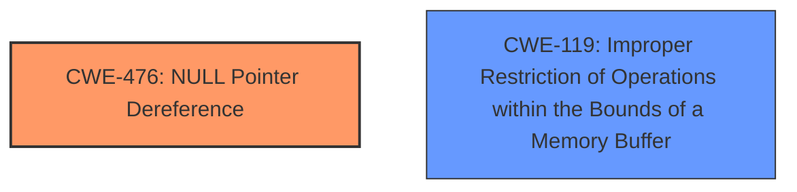

# Raw Analyzer Response for CVE-2025-26265

# Summary
| CWE ID | CWE Name | Confidence | CWE Abstraction Level | CWE Vulnerability Mapping Label | CWE-Vulnerability Mapping Notes |
|---|---|---|---|---|---|
| CWE-476 | NULL Pointer Dereference | 0.7 | Base |  Primary | Allowed |
| CWE-119 | Improper Restriction of Operations within the Bounds of a Memory Buffer | 0.4 | Class | Secondary | Discouraged |

## Evidence and Confidence

*   **Confidence Score:** 0.7
*   **Evidence Strength:** LOW

## Relationship Analysis
The primary candidate is CWE-476, a Base level CWE, which is preferable. CWE-119 is a Class level CWE and is too general, but could be a parent of the root cause. There is no direct relationship between CWE-476 and CWE-119.

## Vulnerability Chain
The chain of events appears to be: A crafted UE Context Modification response is sent, which leads to a **NULL Pointer Dereference**, and then a **segmentation fault**, ultimately causing a Denial of Service (DoS).

## Summary of Analysis
The vulnerability description indicates a **segmentation fault** caused by a crafted UE Context Modification response, leading to a Denial of Service. The retriever results suggest CWE-476 (NULL Pointer Dereference) and CWE-119 (Improper Restriction of Operations within the Bounds of a Memory Buffer) as potential matches.

Given the limited information, CWE-476 seems like the better fit, as a **segmentation fault** is a common consequence of dereferencing a NULL pointer. CWE-119 is a more general case of memory corruption, and while it could be involved, the description doesn't provide enough specifics to confirm that.

I am selecting CWE-476 as the primary CWE with moderate confidence. The evidence is weak, but the crash mechanism aligns with the CWE definition.

Relevant CWE Information:

# Enhanced Context (25 CWEs)
The following CWEs were identified as potentially relevant to this vulnerability:

## CWE-824: Access of Uninitialized Pointer
**Abstraction Level**: Base
**Similarity Score**: 0.72
**Source**: dense

**Description**:
The product accesses or uses a pointer that has not been initialized.

**Mapping Guidance**:
- Usage: Allowed
- Rationale: This CWE entry is at the Base level of abstraction, which is a preferred level of abstraction for mapping to the root causes of vulnerabilities.

## CWE-476: NULL Pointer Dereference
**Abstraction Level**: Base
**Similarity Score**: 429.50
**Source**: sparse

**Description**:
The product dereferences a pointer that it expects to be valid but is NULL.

**Mapping Guidance**:
- Usage: Allowed
- Rationale: This CWE entry is at the Base level of abstraction, which is a preferred level of abstraction for mapping to the root causes of vulnerabilities.

CWE-119 was considered but it is very general and is discouraged for use.

CWE-824 was considered but is less descriptive of the root cause than CWE-476.