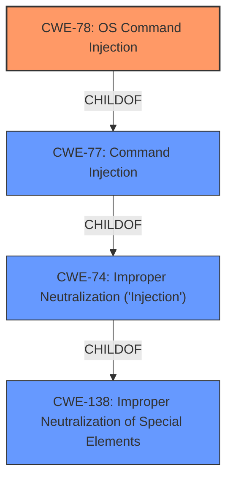

# Analysis for CVE-2025-26331

# Summary
| CWE ID | CWE Name | Confidence | CWE Abstraction Level | CWE Vulnerability Mapping Label | CWE-Vulnerability Mapping Notes |
|---|---|---|---|---|---|
| CWE-78 | Improper Neutralization of Special Elements used in an OS Command ('OS Command Injection') | 1.0 | Base | Allowed | Primary CWE. The vulnerability description explicitly mentions "Command Injection," and the retriever results point to CWE-78 as the most specific and relevant CWE for OS command injection. |
| CWE-77 | Improper Neutralization of Special Elements used in a Command ('Command Injection') | 0.7 | Class | Allowed-with-Review | Secondary Candidate. While the description uses the term "Command Injection," CWE-77 is a broader class. CWE-78 is a more specific base variant. |
| CWE-74 | Improper Neutralization of Special Elements in Output Used by a Downstream Component ('Injection') | 0.5 | Class | Discouraged | Secondary Candidate. CWE-74 is a high-level class for injection vulnerabilities, but it's less specific than CWE-78. |
| CWE-138 | Improper Neutralization of Special Elements | 0.3 | Class | Discouraged | Secondary Candidate. CWE-138 is a general class for improper neutralization, even less specific than CWE-74. |

## Evidence and Confidence

*   **Confidence Score:** 1.0
*   **Evidence Strength:** HIGH

## Relationship Analysis
The most relevant relationship is the hierarchical one: CWE-78 (OS Command Injection) is a child of CWE-77 (Command Injection), which in turn is a child of CWE-74 (Improper Neutralization of Special Elements in Output Used by a Downstream Component ('Injection')). The description explicitly states "Command Injection," but because the attack is local and leads to arbitrary code execution, OS Command Injection (CWE-78) is the more accurate classification.

## Vulnerability Chain
The vulnerability chain starts with **Improper Neutralization of Special Elements** (the root cause), leading to **Command Injection** (the weakness), which results in arbitrary code execution (the impact).

## Summary of Analysis
The primary weakness is CWE-78, "Improper Neutralization of Special Elements used in an OS Command ('OS Command Injection')." This is supported by the vulnerability description mentioning "Command Injection" and the fact that the attack leads to arbitrary code execution, which is a typical outcome of successful OS command injection. The description explicitly mentions **Improper Neutralization of Special Elements** used in a Command. The high retriever score for CWE-78 supports this choice. The relationship analysis confirms that CWE-78 is the most specific and accurate classification within the broader injection category.

The other CWEs were considered but not chosen as primary:
*   CWE-77: Although the description mentions "Command Injection," CWE-77 is a more general class, and CWE-78 provides a more specific classification as an OS command injection.
*   CWE-74: This is a very broad class for injection vulnerabilities and is less specific than CWE-78. The mapping guidance discourages its use when more specific weaknesses are available.
*   CWE-138: This is a high-level class for improper neutralization, even less specific than CWE-74.