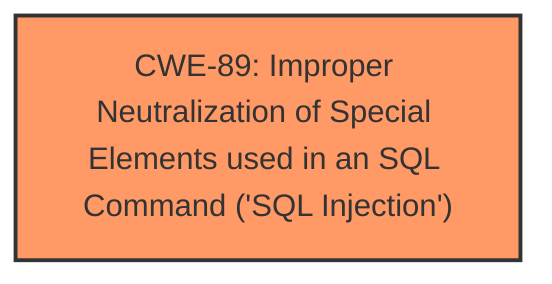

# Raw Analyzer Response for CVE-2025-2640

# Summary

| CWE ID  | CWE Name                                                                    | Confidence | CWE Abstraction Level | CWE Vulnerability Mapping Label | CWE-Vulnerability Mapping Notes |
| :-------- | :-------------------------------------------------------------------------- | :--------- | :---------------------- | :------------------------------ | :------------------------------ |
| CWE-89  | Improper Neutralization of Special Elements used in an SQL Command ('SQL Injection') | 1.0        | Base                    | Primary CWE                   | Allowed                       |

## Evidence and Confidence

*   **Confidence Score:** 1.0
*   **Evidence Strength:** HIGH

## Relationship Analysis

The primary relationship that influenced the decision was the direct match of the vulnerability description to the definition and examples of CWE-89. While other CWEs were considered, they were deemed less specific or representative of the root cause. CWE-89 is a Base level CWE, which is the preferred level of abstraction.

## Vulnerability Chain

The vulnerability chain consists of a single step:

1.  **Root Cause:** **Improper neutralization** of special elements in SQL commands (CWE-89) leading directly to the impact.

## Summary of Analysis

The analysis is based on the provided evidence, specifically the "Vulnerability Description Key Phrases" indicating "**sql injection**" and the "CVE Reference Links Content Summary" explicitly stating that the **root cause** is a **SQL injection** vulnerability due to **attackers injecting malicious code from the parameter 'fromdate' and use it directly in SQL queries without the need for appropriate cleaning or validation.**

The retriever results strongly support CWE-89 as the primary candidate. The graph relationships, while present for other CWEs, do not offer a more specific or accurate classification.

CWE-89 is selected as the optimal level of specificity because it directly addresses the **root cause** of the vulnerability.

Relevant CWE Information:

# Enhanced Context (25 CWEs)

## CWE-89: Improper Neutralization of Special Elements used in an SQL Command ('SQL Injection')

**Technical Explanation:**

The vulnerability lies in the **improper neutralization** of special elements used in an SQL command. The application fails to properly sanitize or escape user-supplied input before incorporating it into an SQL query. As a result, an attacker can inject malicious SQL code, altering the query's logic and potentially gaining unauthorized access to the database.

**Security Implications:**

Successful exploitation of this vulnerability can lead to:

*   Data breach: Sensitive information can be accessed and stolen.
*   Data manipulation: Data can be modified or deleted.
*   Privilege escalation: An attacker can gain administrative privileges.
*   Denial of service: The database server can be crashed or made unavailable.

**Relationship Analysis:**

CWE-89 is a base-level CWE, providing a specific description of the **SQL injection** vulnerability. There are no relevant parent-child relationships that would suggest a more specific CWE.

**Mapping Guidance Analysis:**

The MITRE mapping guidance allows the use of CWE-89, as it is at the Base level of abstraction, which is a preferred level of abstraction for mapping to the **root causes** of vulnerabilities.

**Mitigation Analysis:**

The suggested mitigations, such as prepared statements, input validation, and minimizing database user permissions, align directly with preventing SQL injection vulnerabilities.

**Evidence-Based Decision Making:**

The decision to select CWE-89 is based on the explicit mention of **SQL injection** in the vulnerability description and the CVE reference. The retriever results further support this classification.

Confidence: 1.0