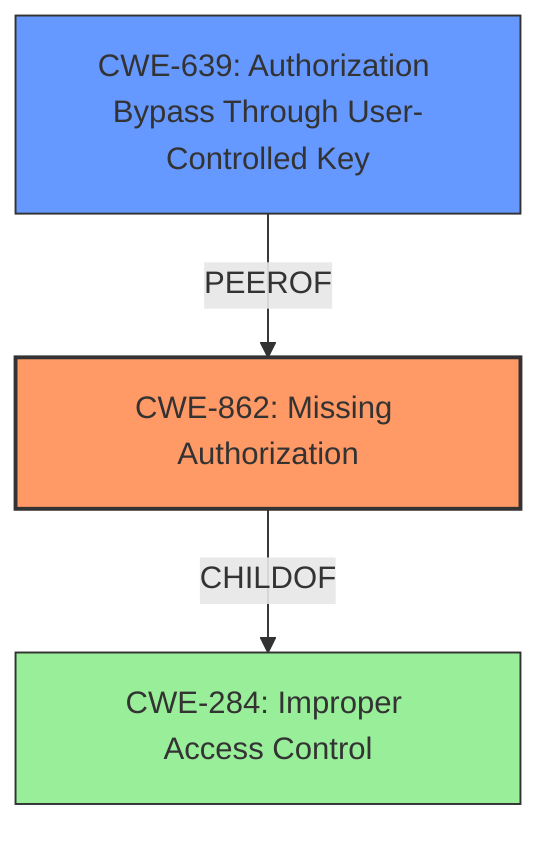

# Analysis for CVE-2025-26523

# Summary
| CWE ID | CWE Name | Confidence | CWE Abstraction Level | CWE Vulnerability Mapping Label | CWE-Vulnerability Mapping Notes |
|---|---|---|---|---|---|
| CWE-862 | Missing Authorization | 1.0 | Class | Primary | Allowed-with-Review |
| CWE-639 | Authorization Bypass Through User-Controlled Key | 0.7 | Base | Secondary Candidate | Allowed |

## Evidence and Confidence

*   **Confidence Score:** 0.9
*   **Evidence Strength:** HIGH

## Relationship Analysis
The primary relationship influencing my decision is the parent-child relationship between CWE-862 (Missing Authorization), a Class, and its potential Base-level children. While I considered more specific Base-level CWEs, CWE-639 (Authorization Bypass Through User-Controlled Key) seems like a good secondary candidate, the evidence is stronger for CWE-862. The guidance directs us to consider the most specific CWE that is supported by the evidence.

## Vulnerability Chain
The vulnerability chain starts with **insufficient authorization controls** (CWE-862) on API endpoints, leading to the impact of an authenticated remote attacker being able to modify information belonging to other user accounts.

## Summary of Analysis
The vulnerability description clearly states **insufficient authorization controls** on API endpoints, allowing an authenticated attacker to modify other user accounts' information. This aligns directly with CWE-862 (Missing Authorization), where the application doesn't check whether the user is authorized to perform the requested action.

The "Authentication vs Authorization vs Access Control Guidance" provides helpful distinctions. The key phrase "**insufficient authorization controls**" clearly indicates an authorization issue rather than an authentication one, ruling out CWE-306. The guidance also notes that CWE-285 is a general category and CWE-862 is more specific.

I also considered CWE-639 (Authorization Bypass Through User-Controlled Key) since an attacker could potentially modify a key value to access another user's data. However, the description focuses more on a general lack of authorization checks, making CWE-862 the stronger fit.

The final decision is based on the direct evidence of **insufficient authorization controls** and the guidance to choose the most specific CWE available. CWE-862 is at the Class level, and the guidance recommends considering Base-level children, but none fit the description as accurately.

Relevant CWE Information:
- CWE-862: Missing Authorization: The product does not perform an authorization check when an actor attempts to access a resource or perform an action.
- CWE-639: Authorization Bypass Through User-Controlled Key: The system's authorization functionality does not prevent one user from gaining access to another user's data or record by modifying the key value identifying the data.