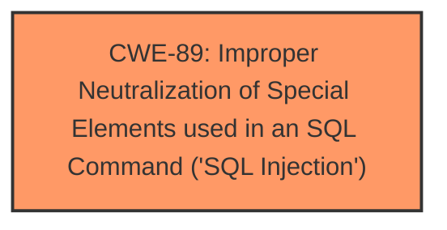

# Raw Analyzer Response for CVE-2025-2655

# Summary
| CWE ID | CWE Name | Confidence | CWE Abstraction Level | CWE Vulnerability Mapping Label | CWE-Vulnerability Mapping Notes |
|---|---|---|---|---|---|
| **CWE-89** | **Improper Neutralization of Special Elements used in an SQL Command ('SQL Injection')** | 1.0 | Base | Allowed | Primary CWE |

## Evidence and Confidence

*   **Confidence Score:** 1.0
*   **Evidence Strength:** HIGH

## Relationship Analysis
The primary relationship that influenced the decision was the direct match of the vulnerability description to the definition of CWE-89. There are no parent-child or chain relationships that are relevant in this case. The abstraction level is Base, which is the preferred level.

## Vulnerability Chain
The vulnerability chain consists of a single step: **improper neutralization** leading directly to **SQL injection**.
  - The root cause is the **improper neutralization** of special elements used in an SQL command.
  - The impact is **SQL injection**.

## Summary of Analysis
The vulnerability description clearly indicates that the **manipulation of the argument ID leads to SQL injection**. The Retriever Results list CWE-89 as the top candidate, with a score of 1.0. The vulnerability description key phrases identify "**sql injection**" as the weakness. This aligns directly with the definition of CWE-89: "The product constructs all or part of an SQL command using externally-influenced input from an upstream component, but it does not neutralize or incorrectly neutralizes special elements that could modify the intended SQL command."

Other CWEs like CWE-79 (Cross-site Scripting), CWE-434 (Unrestricted Upload of File with Dangerous Type), and CWE-1336 (Improper Neutralization of Special Elements Used in a Template Engine) were considered but not selected because the vulnerability is specifically related to SQL injection, and those CWEs describe different types of vulnerabilities.
The selected CWE is at the optimal level of specificity, as it directly describes the root cause of the SQL injection vulnerability.