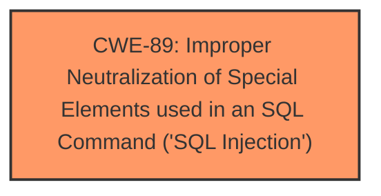

# Raw Analyzer Response for CVE-2025-2658

# Summary
| CWE ID | CWE Name | Confidence | CWE Abstraction Level | CWE Vulnerability Mapping Label | CWE-Vulnerability Mapping Notes |
|---|---|---|---|---|---|
| CWE-89 | Improper Neutralization of Special Elements used in an SQL Command ('SQL Injection') | 1.0 | Base | Allowed | Primary CWE. The manipulation of the argument searchdata leads to **sql injection**. |

## Evidence and Confidence

*   **Confidence Score:** 1.0
*   **Evidence Strength:** HIGH

## Relationship Analysis
The primary identified weakness is CWE-89, which stands as a base-level weakness. There is no need to look for parent or child relationships since it is a base level.

## Vulnerability Chain
The vulnerability chain is as follows:
1.  The application fails to properly neutralize special elements in the `searchdata` argument. (**ROOT CAUSE: CWE-89**)
2.  This leads to SQL Injection.

## Summary of Analysis
The analysis is based on the provided vulnerability description, which clearly states that the manipulation of the `searchdata` argument leads to SQL injection in the `/search-request.php` file.

The vulnerability description states: "The manipulation of the argument searchdata leads to **sql injection**."

CWE-89 is the most appropriate because it directly addresses the root cause of the vulnerability, which is the improper neutralization of special elements used in an SQL command. The retriever results also strongly suggest CWE-89 as the primary candidate.

The selection of CWE-89 is at the optimal level of specificity because it is a Base level CWE that accurately describes the weakness. Other CWEs considered, such as CWE-74, are at a higher level of abstraction and are not as specific to the root cause of the vulnerability.

Relevant CWE Information:

# Enhanced Context (25 CWEs)
The following CWEs were identified as potentially relevant to this vulnerability:

## CWE-89: Improper Neutralization of Special Elements used in an SQL Command ('SQL Injection')
**Abstraction Level**: Base
**Similarity Score**: 0.77
**Source**: dense

**Description**:
The product constructs all or part of an SQL command using externally-influenced input from an upstream component, but it does not neutralize or incorrectly neutralizes special elements that could modify the intended SQL command when it is sent to a downstream component. Without sufficient removal or quoting of SQL syntax in user-controllable inputs, the generated SQL query can cause those inputs to be interpreted as SQL instead of ordinary user data.

**Mapping Guidance**:
- Usage: Allowed
- Rationale: This CWE entry is at the Base level of abstraction, which is a preferred level of abstraction for mapping to the root causes of vulnerabilities.