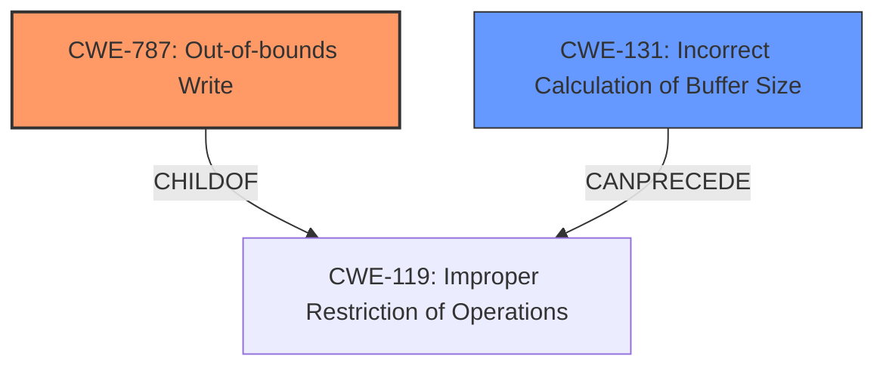

# Enhanced Analysis for CVE-2025-26597

# Summary
| CWE ID | CWE Name | Confidence | CWE Abstraction Level | CWE Vulnerability Mapping Label | CWE-Vulnerability Mapping Notes |
|---|---|---|---|---|---|
| CWE-787 | Out-of-bounds Write | 0.9 | Base | Primary | Allowed |
| CWE-131 | Incorrect Calculation of Buffer Size | 0.7 | Base | Secondary | Allowed |

## Evidence and Confidence

*   **Confidence Score:** 0.8
*   **Evidence Strength:** MEDIUM

## Relationship Analysis
The primary CWE is CWE-787 which is a child of CWE-119. CWE-131 can precede CWE-119 and is related to incorrect buffer size calculations.



## Vulnerability Chain
1.  **Incorrect Calculation of Buffer Size (CWE-131):** The `XkbChangeTypesOfKey()` function initially resizes the key symbols table to 0 when called with a 0 group, but leaves the key actions unchanged. This is the root cause, as the subsequent buffer size calculation is incorrect.
2.  **Out-of-bounds Write (CWE-787):** When the same function is later called with a non-zero value of groups, it causes a **buffer overflow** because the key actions are of the wrong size, leading to writing beyond the allocated memory.

## Summary of Analysis
The vulnerability is a **buffer overflow** in X.Org and Xwayland within the `XkbChangeTypesOfKey()` function. The root cause is an **incorrect** buffer size calculation when resizing the key symbols table. When the function is called later with a non-zero value, it leads to writing beyond the intended memory bounds.

The primary CWE is CWE-787 (Out-of-bounds Write), as this is the direct result of the incorrect buffer size calculation. The secondary CWE is CWE-131 (Incorrect Calculation of Buffer Size), which identifies the root cause.

The evidence supporting this is:
*   "If XkbChangeTypesOfKey() is called with a 0 group, it will resize the key symbols table to 0 but leave the key actions unchanged."
*   "If the same function is later called with a non-zero value of groups, this will cause a **buffer overflow** because the key actions are of the wrong size."
*   "xorg: xwayland: Buffer overflow in XkbChangeTypesOfKey()" from CVE Reference Links Content Summary.

CWE-119 (Improper Restriction of Operations within the Bounds of a Memory Buffer) was considered but is too high-level.

CWE-120 (Buffer Copy without Checking Size of Input ('Classic Buffer Overflow')) was considered. While there's a **buffer overflow**, the root cause isn't just copying without checking size; the initial resizing with a zero group leads to the incorrect size later.

CWE-122 (Heap-based Buffer Overflow) and CWE-121 (Stack-based Buffer Overflow) were considered, but the information provided does not give enough information about where the buffer is allocated.

CWE-190 (Integer Overflow or Wraparound) was considered but the description does not have any information about an integer overflow occurring.

# Relevant CWE Information:

## CWE-787: Out-of-bounds Write
**Abstraction Level**: Base
**Description**: The product writes data outside of the intended buffer.
**Mapping Guidance**: Usage: Allowed

## CWE-131: Incorrect Calculation of Buffer Size
**Abstraction Level**: Base
**Description**: The product does not correctly calculate the size to be used when allocating a buffer, which could lead to a buffer overflow.
**Mapping Guidance**: Usage: Allowed


## CWE Relationship Analysis

Current CWEs represent these abstraction levels: .


### Vulnerability Chain Analysis

**Chain starting from CWE-121:**
- 121 (Stack-based Buffer Overflow) - ROOT


**Chain starting from CWE-131:**
- 131 (Incorrect Calculation of Buffer Size) - ROOT


### CWE Relationship Diagram

```mermaid
graph TD
    classDef primary fill:#f96,stroke:#333,stroke-width:2px
    classDef secondary fill:#69f,stroke:#333
    classDef tertiary fill:#9e9,stroke:#333
```