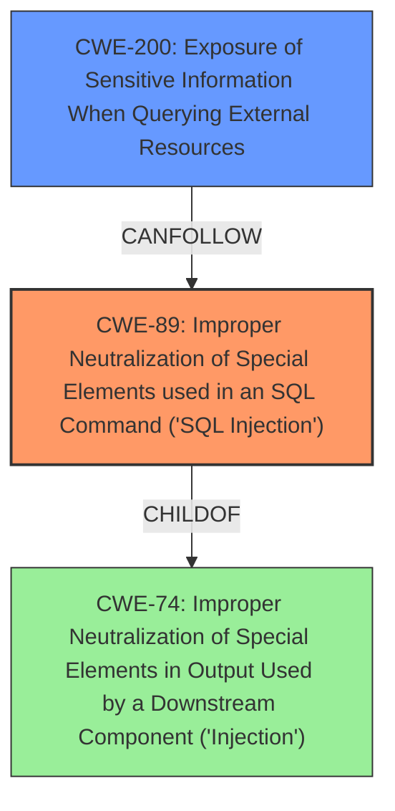

# Analysis Report for CVE-2025-26609

# Vulnerability Analysis Report: CVE-2025-26609

## Description

WeGIA is an open source Web Manager for Institutions with a focus on Portuguese language users. A **SQL Injection** vulnerability was discovered in the WeGIA application, `familiar_docfamiliar.php` endpoint. This vulnerability could allow an attacker to execute arbitrary SQL queries, allowing unauthorized access to sensitive information. This issue has been addressed in version 3.2.14 and all users are advised to upgrade. There are no known workarounds for this vulnerability.

## Vulnerability Description Key Phrases

- **Weakness:** SQL Injection
- **Impact:** execute arbitrary SQL queries
- **Attacker:** attacker
- **Product:** WeGIA
- **Version:** before 3.2.14
- **Component:** familiar_docfamiliar.php endpoint

## Analysis (with Relationship Data)

# Summary
| CWE ID | CWE Name | Confidence | CWE Abstraction Level | CWE Vulnerability Mapping Label | CWE-Vulnerability Mapping Notes |
|---|---|---|---|---|---|
| CWE-89 | Improper Neutralization of Special Elements used in an SQL Command ('SQL Injection') | 1.0 | Base | Allowed | Primary CWE: The vulnerability is due to the **lack of neutralization** of special elements in SQL commands. |
| CWE-200 | Exposure of Sensitive Information When Querying External Resources | 0.6 | Base | Allowed | Secondary Candidate: The impact allows unauthorized access to sensitive information. |

## Evidence and Confidence

*   **Confidence Score:** 0.8
*   **Evidence Strength:** HIGH

## Relationship Analysis
The primary weakness is CWE-89, which is a base-level CWE and directly reflects the **SQL Injection** vulnerability. CWE-200 is a potential secondary weakness, representing the information disclosure impact, and is at the Base level.



## Vulnerability Chain
1.  **Root Cause:** **Lack of validation** of user input in the `familiar_docfamiliar.php` endpoint, leading to **improper neutralization** of special elements used in an SQL command (**SQL Injection**).
2.  **Impact:** Execution of arbitrary SQL queries, unauthorized access to sensitive information.

## Summary of Analysis
The vulnerability is primarily due to **SQL Injection** (CWE-89) in the `familiar_docfamiliar.php` endpoint. The CVE Reference Links Content Summary explicitly states "**Weaknesses/vulnerabilities present:** SQL Injection (CWE-89, CWE-284)". The supplied data provides the root cause and impacts, making CWE-89 the most appropriate primary CWE. CWE-200 is added to map the impact of sensitive information exposure. The primary CWE is at the optimal level of specificity, as it directly describes the **SQL Injection** vulnerability.

Relevant CWE Information:

# Enhanced Context (25 CWEs)
The following CWEs were identified as potentially relevant to this vulnerability:

## CWE-89: Improper Neutralization of Special Elements used in an SQL Command ('SQL Injection')
**Abstraction Level**: Base
**Similarity Score**: 0.74
**Source**: dense

**Description**:
The product constructs all or part of an SQL command using externally-influenced input from an upstream component, but it does not neutralize or incorrectly neutralizes special elements that could modify the intended SQL command when it is sent to a downstream component. Without sufficient removal or quoting of SQL syntax in user-controllable inputs, the generated SQL query can cause those inputs to be interpreted as SQL instead of ordinary user data.

**Mapping Guidance**:
- Usage: Allowed
- Rationale: This CWE entry is at the Base level of abstraction, which is a preferred level of abstraction for mapping to the root causes of vulnerabilities.

## Technical Explanation for CWE-89
The vulnerability allows an attacker to inject malicious SQL code into database queries due to **improper neutralization** of user-supplied input. This can lead to unauthorized data access, modification, or deletion. The security implication is a complete compromise of the database. CWE-89 is a base-level CWE that accurately represents the **SQL Injection** vulnerability.

## Technical Explanation for CWE-200
The successful exploitation of the **SQL Injection** vulnerability allows the attacker to retrieve sensitive information from the database.

## Other CWEs Considered and Rejected
-   CWE-74: Improper Neutralization of Special Elements in Output Used by a Downstream Component ('Injection') - This is a class-level CWE and is too general. CWE-89 is a more specific base-level CWE for **SQL Injection**.
-   CWE-79: Improper Neutralization of Input During Web Page Generation ('Cross-site Scripting') - This is related to XSS, which is not the vulnerability described.
-   CWE-434: Unrestricted Upload of File with Dangerous Type - This is related to file upload vulnerabilities, which is not the vulnerability described.
-   CWE-94: Improper Control of Generation of Code ('Code Injection') - While **SQL Injection** can lead to code execution in some cases, the primary weakness is the **improper neutralization** of SQL commands, not arbitrary code execution.
-   CWE-22: Improper Limitation of a Pathname to a Restricted Directory ('Path Traversal') - This is related to path traversal vulnerabilities, which is not the vulnerability described.


## CWE Relationship Analysis

Current CWEs represent these abstraction levels: .


### Vulnerability Chain Analysis

**Chain starting from CWE-89:**
- 89 (Improper Neutralization of Special Elements used in an SQL Command ('SQL Injection')) - ROOT


**Chain starting from CWE-94:**
- 94 (Improper Control of Generation of Code ('Code Injection')) - ROOT


### CWE Relationship Diagram

```mermaid
graph TD
    classDef primary fill:#f96,stroke:#333,stroke-width:2px
    classDef secondary fill:#69f,stroke:#333
    classDef tertiary fill:#9e9,stroke:#333
```


*Report generated on 2025-07-14 14:29:04*
