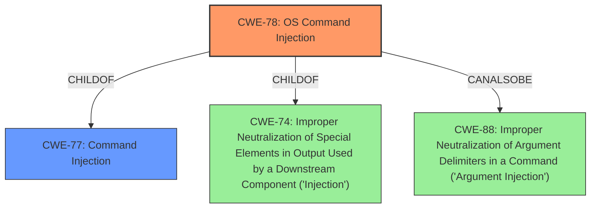

# Analysis for CVE-2025-26613

# Summary
| CWE ID | CWE Name | Confidence | CWE Abstraction Level | CWE Vulnerability Mapping Label | CWE-Vulnerability Mapping Notes |
|---|---|---|---|---|---|
| CWE-78 | Improper Neutralization of Special Elements used in an OS Command ('OS Command Injection') | 1.0 | Base | Allowed | Primary CWE. The root cause is the application's failure to neutralize special elements, leading to OS command injection.|
| CWE-77 | Improper Neutralization of Special Elements used in a Command ('Command Injection') | 0.7 | Class | Allowed-with-Review | Secondary candidate. CWE-77 is a more general form of command injection, and since this is specifically an OS command injection, CWE-78 is more appropriate. |

## Evidence and Confidence

*   **Confidence Score:** 1.0
*   **Evidence Strength:** HIGH

## Relationship Analysis
The primary relationship is that CWE-78 is a child of CWE-77. This means CWE-78 is a more specific case of command injection, dealing specifically with OS commands. There are also relationships between CWE-78 and CWE-74 (Improper Neutralization of Special Elements in Output Used by a Downstream Component ('Injection')), as well as CWE-88 (Improper Neutralization of Argument Delimiters in a Command ('Argument Injection')). These relationships indicate that the root cause involves improper handling of input that leads to command execution.

## Vulnerability Chain
The vulnerability chain starts with the **lack of input validation** in the `gerenciar_backup.php` endpoint. This leads to **improper neutralization of special elements**, which then results in **OS command injection**. The final impact is the ability to **execute arbitrary code remotely**.

## Summary of Analysis
The analysis strongly points to CWE-78 as the primary weakness. The vulnerability description mentions "OS Command Injection" directly, and the CVE reference links content summary confirms the **lack of input validation** in the `gerenciar_backup.php` endpoint. This aligns perfectly with the definition of CWE-78, which involves **improper neutralization of special elements** used in an OS command. The retriever results also list CWE-78 as the top match based on alternate terms.

CWE-77 was considered, but it is a more general class. Since the vulnerability specifically involves OS commands, CWE-78 is more appropriate. Other CWEs like CWE-89 (SQL Injection), CWE-79 (Cross-site Scripting), and CWE-434 (Unrestricted Upload of File with Dangerous Type) were also considered but deemed irrelevant because the vulnerability does not involve SQL commands, web page generation, or file uploads.

The selection of CWE-78 is based on direct evidence from the vulnerability description, the CVE reference links content summary, and the retriever results. The relationship analysis confirms that CWE-78 is a specific case of command injection, making it the most accurate choice.