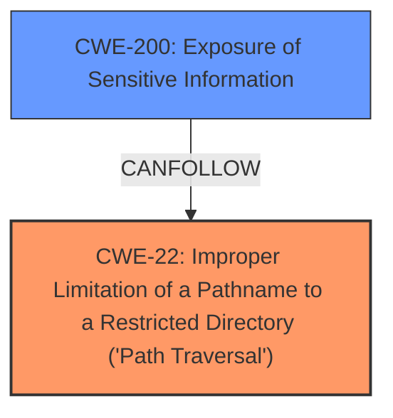

# Raw Analyzer Response for CVE-2025-26616

# Summary
| CWE ID | CWE Name | Confidence | CWE Abstraction Level | CWE Vulnerability Mapping Label | CWE-Vulnerability Mapping Notes |
|---|---|---|---|---|---|
| CWE-22 | Improper Limitation of a Pathname to a Restricted Directory ('Path Traversal') | 1.0 | Base | Allowed | Primary CWE: This is the root cause, a path traversal vulnerability |
| CWE-200 | Exposure of Sensitive Information | 0.8 | Class | Allowed-with-Review | Secondary: Resulting from the path traversal is the exposure of sensitive data |

## Evidence and Confidence

*   **Confidence Score:** 0.9
*   **Evidence Strength:** HIGH

## Relationship Analysis
The primary CWE is CWE-22, which represents the **improper limitation of a pathname to a restricted directory**, leading to a **path traversal vulnerability**. The impact of this vulnerability is the exposure of sensitive information, making CWE-200 a relevant secondary CWE. CWE-22 is a Base level CWE, while CWE-200 is a Class level CWE. We choose the base level for the root cause, and a class level for the impact.

## Vulnerability Chain
The vulnerability chain starts with:
1.  **Root Cause:** CWE-22 - Improper Limitation of a Pathname to a Restricted Directory ('Path Traversal') due to **improper validation of the `file` parameter**.
2.  **Impact:** CWE-200 - Exposure of Sensitive Information, specifically the `config.php` file containing database credentials.

## Summary of Analysis
The initial analysis identified a **path traversal vulnerability** in the WeGIA application. The CVE Reference Links Content Summary confirms that the **root cause** is the **improper validation** of the `file` parameter in the `exportar_dump.php` endpoint, leading to CWE-22. The impact is unauthorized access to sensitive information, specifically the `config.php` file, which aligns with CWE-200.

The retriever results also highlight CWE-22 as the top match, further supporting this classification. The relationship analysis shows how CWE-22 can lead to information exposure (CWE-200), confirming the vulnerability chain.

The selection of CWE-22 is based on the evidence of a path traversal vulnerability due to **improper input validation**. The selection of CWE-200 is based on the impact of the vulnerability, which is the exposure of sensitive information.

Relevant CWE Information:
*   **CWE-22:** Improper Limitation of a Pathname to a Restricted Directory ('Path Traversal'). The product uses external input to construct a pathname, but it does not properly neutralize special elements within the pathname that can cause the pathname to resolve to a location that is outside of the restricted directory.

*   **CWE-200:** Exposure of Sensitive Information. The software exposes sensitive information to an actor that is not explicitly authorized to have that information.

Here's why other CWEs were not selected or were considered less suitable:

*   CWE-23 (Relative Path Traversal): While related to path traversal, CWE-22 is a broader category that includes relative path traversal, making it a more suitable primary classification.
*   CWE-639 (Authorization Bypass Through User-Controlled Key): The vulnerability doesn't primarily involve bypassing authorization through a user-controlled key.
*   CWE-209 (Generation of Error Message Containing Sensitive Information): The primary issue is not the generation of error messages with sensitive information, but the exposure of sensitive information due to path traversal.
*   CWE-434 (Unrestricted Upload of File with Dangerous Type): This CWE is not relevant as the vulnerability does not involve unrestricted file uploads.
*   CWE-306 (Missing Authentication for Critical Function): While the attacker doesn't need to be authenticated, the primary weakness is the path traversal, not the missing authentication.
*   CWE-94 (Improper Control of Generation of Code ('Code Injection')): This is not code injection.