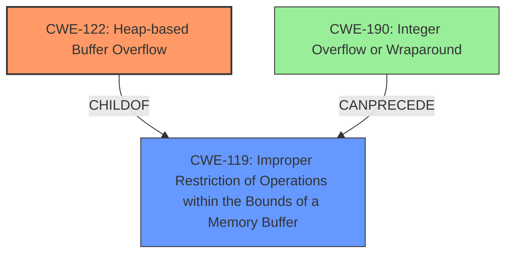

# Raw Analyzer Response for CVE-2025-26623

# Summary
| CWE ID | CWE Name | Confidence | CWE Abstraction Level | CWE Vulnerability Mapping Label | CWE-Vulnerability Mapping Notes |
|---|---|---|---|---|---|
| CWE-122 | Heap-based Buffer Overflow | 0.9 | Variant | Allowed | Primary CWE |
| CWE-119 | Improper Restriction of Operations within the Bounds of a Memory Buffer | 0.6 | Class | Discouraged | Secondary Candidate |
| CWE-190 | Integer Overflow or Wraparound | 0.5 | Base | Allowed | Secondary Candidate |

## Evidence and Confidence

*   **Confidence Score:** 0.8
*   **Evidence Strength:** MEDIUM

## Relationship Analysis
The primary relationship influencing the decision is the parent-child relationship between CWE-119 and CWE-122. CWE-122 is a variant of CWE-119, representing a more specific type of buffer overflow that occurs on the heap. Since the vulnerability description explicitly mentions "**heap buffer overflow**", CWE-122 is the more appropriate choice. CWE-190 is a peer with regards to causing buffer overflows.

## Vulnerability Chain
The vulnerability chain starts with a crafted image file leading to a **heap buffer overflow** due to **improper** handling when writing metadata. This can lead to code execution.

## Summary of Analysis
The primary CWE is CWE-122 (Heap-based Buffer Overflow) because the vulnerability description clearly states that a "**heap buffer overflow**" occurs in Exiv2 when writing metadata to a crafted image file. The retriever results also list CWE-122 as a potential match. The evidence is explicit, but further details from the CVE reference links would improve it.

CWE-119 (Improper Restriction of Operations within the Bounds of a Memory Buffer) was considered but deemed less specific. While CWE-119 is a parent of CWE-122, the description explicitly mentions a heap overflow, making CWE-122 a more precise classification.

CWE-190 (Integer Overflow or Wraparound) was considered because integer overflows can lead to buffer overflows. However, there's no explicit mention of integer overflow in the description, so it is less likely.

The selected CWEs are at the optimal level of specificity because CWE-122 directly reflects the type of buffer overflow described in the vulnerability, while CWE-119 is a broader category and CWE-190 lacks direct evidence.