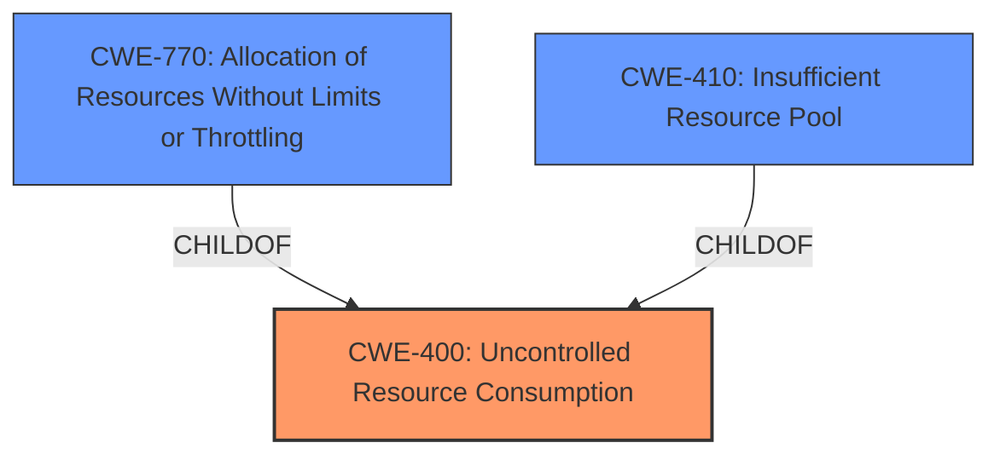

# Analysis Report for CVE-2025-26677

# Vulnerability Analysis Report: CVE-2025-26677

## Description

Uncontrolled resource consumption in Remote Desktop Gateway Service allows an unauthorized attacker to deny service over a network.

## Vulnerability Description Key Phrases

- **Rootcause:** uncontrolled resource consumption
- **Impact:** deny service
- **Attacker:** unauthorized attacker
- **Product:** Remote Desktop Gateway Service

## Analysis (with Relationship Data)

# Summary
| CWE ID  | CWE Name                                   | Confidence | CWE Abstraction Level | CWE Vulnerability Mapping Label | CWE-Vulnerability Mapping Notes |
| :-------- | :----------------------------------------- | :--------- | :-------------------- | :------------------------------ | :------------------------------ |
| CWE-400 | Uncontrolled Resource Consumption          | 0.9        | Class               | Primary                         | Discouraged                     |
| CWE-770 | Allocation of Resources Without Limits or Throttling | 0.7        | Base                | Secondary                       | Allowed                         |
| CWE-410 | Insufficient Resource Pool               | 0.6        | Base                | Secondary                       | Allowed                         |

## Evidence and Confidence

*   **Confidence Score:** 0.8
*   **Evidence Strength:** MEDIUM

## Relationship Analysis
The primary CWE is CWE-400, which is a high-level class. CWE-770 and CWE-410 are both children of CWE-400, providing more specific details about resource allocation issues. CWE-770 describes the lack of limits on resource allocation, while CWE-410 indicates that the resource pool is too small to handle demand. These relationships helped narrow down the potential causes of the uncontrolled resource consumption.



## Vulnerability Chain
The vulnerability chain starts with **uncontrolled resource consumption** (CWE-400) in the Remote Desktop Gateway Service. This leads to a denial-of-service (DoS) condition because the service becomes unavailable due to resource exhaustion. The root cause is the lack of proper resource management, and the impact is the DoS.

## Summary of Analysis
The initial assessment identified CWE-400 as the primary weakness, based on the "**uncontrolled resource consumption**" key phrase in the vulnerability description. While CWE-400 is a class-level CWE and is discouraged, it directly reflects the stated **rootcause**. The retriever results also listed CWE-400 with a high score. Further analysis considered related CWEs like CWE-770 and CWE-410, which provide more specific details about resource allocation issues. However, given the limited information in the vulnerability description, it's difficult to pinpoint the exact mechanism of resource consumption. Therefore, CWE-400 remains the most appropriate primary CWE at the class level, with CWE-770 and CWE-410 considered as secondary candidates. The selection is primarily based on the provided evidence, focusing on the key phrase.

Relevant CWE Information:

# Enhanced Context (25 CWEs)
The following CWEs were identified as potentially relevant to this vulnerability:

## CWE-400: Uncontrolled Resource Consumption
**Abstraction Level**: Class
**Similarity Score**: 0.72
**Source**: dense

**Description**:
The product does not properly control the allocation and maintenance of a limited resource, thereby enabling an actor to influence the amount of resources consumed, eventually leading to the exhaustion of available resources.

**Mapping Guidance**:
- Usage: Discouraged
- Rationale: CWE-400 is intended for incorrect behaviors in which the product is expected to track and restrict how many resources it consumes, but CWE-400 is often misused because it is conflated with the "technical impact" of vulnerabilities in which resource consumption occurs. It is sometimes used for low-information vulnerability reports. It is a level-1 Class (i.e., a child of a Pillar).

**Technical Explanation for CWE-400:**
The vulnerability description explicitly mentions **uncontrolled resource consumption**, aligning directly with the definition of CWE-400. This allows an attacker to exhaust available resources and cause a denial of service.
**Security Implications:**
Denial of service, where legitimate users cannot access the Remote Desktop Gateway Service.
**Relationship to other CWEs:**
CWE-400 is a class-level CWE. More specific child CWEs may exist, depending on the exact mechanism of resource consumption.

## CWE-770: Allocation of Resources Without Limits or Throttling
**Abstraction Level**: Base
**Similarity Score**: 319.57
**Source**: sparse

**Description**:
The product allocates a reusable resource or group of resources on behalf of an actor without imposing any restrictions on the size or number of resources that can be allocated, in violation of the intended security policy for that actor.

**Mapping Guidance**:
- Usage: Allowed
- Rationale: This CWE entry is at the Base level of abstraction, which is a preferred level of abstraction for mapping to the root causes of vulnerabilities.

**Technical Explanation for CWE-770:**
The service **rootcause** may be allocating resources without proper limits or throttling. This aligns with CWE-770 because the lack of restrictions allows an attacker to consume excessive resources.
**Security Implications:**
Denial of service due to resource exhaustion.
**Relationship to other CWEs:**
CWE-770 is a base-level CWE and is a child of CWE-400.

## CWE-410: Insufficient Resource Pool
**Abstraction Level**: Base
**Similarity Score**: 0.70
**Source**: dense

**Description**:
The product's resource pool is not large enough to handle peak demand, which allows an attacker to prevent others from accessing the resource by using a (relatively) large number of requests for resources.

**Mapping Guidance**:
- Usage: Allowed
- Rationale: This CWE entry is at the Base level of abstraction, which is a preferred level of abstraction for mapping to the root causes of vulnerabilities.

**Technical Explanation for CWE-410:**
An **insufficient resource pool** could contribute to the uncontrolled resource consumption. If the service cannot handle the demand, an attacker can easily exhaust the limited resources.
**Security Implications:**
Denial of service, as legitimate users are unable to access the service.
**Relationship to other CWEs:**
CWE-410 is a base-level CWE and is a child of CWE-664.

**CWEs Considered but Not Used:**
- CWE-772: Missing Release of Resource after Effective Lifetime. This CWE was considered, but there is no specific information in the vulnerability description about resources not being released.
- CWE-789: Memory Allocation with Excessive Size Value. This CWE was considered, but the description doesn't specify that memory allocation with excessive size is the issue.
- CWE-1325: Improperly Controlled Sequential Memory Allocation. This was considered, but the description does not specify an issue in sequential memory allocation.
- CWE-1176: Inefficient CPU Computation. This was considered, but the description does not point to inefficient computation as the issue.


## CWE Relationship Analysis

Current CWEs represent these abstraction levels: .


### Vulnerability Chain Analysis

**Chain starting from CWE-1176:**
- 1176 (Inefficient CPU Computation) - ROOT


**Chain starting from CWE-400:**
- 400 (Uncontrolled Resource Consumption) - ROOT


### CWE Relationship Diagram

```mermaid
graph TD
    classDef primary fill:#f96,stroke:#333,stroke-width:2px
    classDef secondary fill:#69f,stroke:#333
    classDef tertiary fill:#9e9,stroke:#333
```


*Report generated on 2025-07-14 14:37:11*
