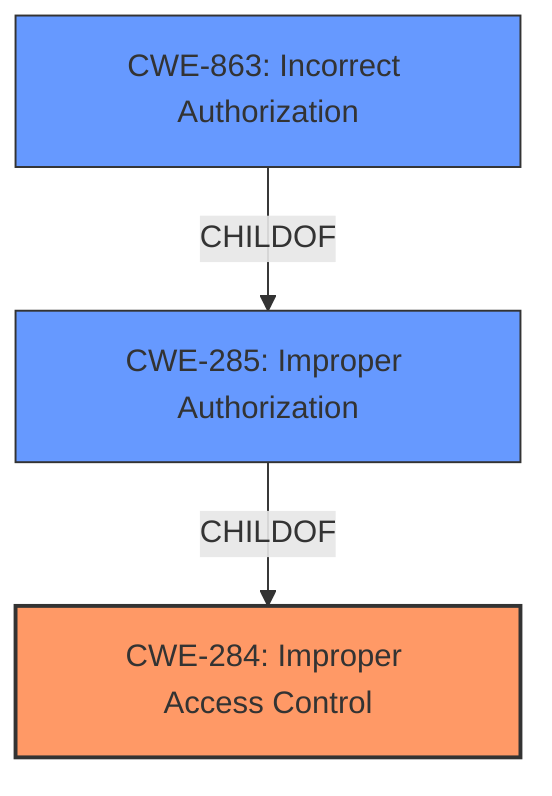

# Enhanced Analysis for CVE-2025-26678

# Summary
| CWE ID    | CWE Name                     | Confidence | CWE Abstraction Level | CWE Vulnerability Mapping Label | CWE-Vulnerability Mapping Notes |
| :-------- | :--------------------------- | :--------- | :-------------------- | :------------------------------ | :------------------------------ |
| CWE-284   | Improper Access Control      | 0.75       | Pillar                | Allowed                        | Primary CWE                     |
| CWE-863   | Incorrect Authorization      | 0.6        | Class                 | Allowed-with-Review            | Secondary Candidate             |
| CWE-285   | Improper Authorization      | 0.5        | Class                 | Discouraged             | Secondary Candidate             |

## Evidence and Confidence

*   **Confidence Score:** 0.75
*   **Evidence Strength:** LOW

## Relationship Analysis
The primary CWE is CWE-284, which is a high-level category. Given the limited information, it's difficult to pinpoint the exact cause of the **improper access control**. CWE-863 is a child of CWE-285, both are more specific, relating to authorization. The relationships between these CWEs guided the selection to start with the more general CWE-284 due to lack of specific information.



## Vulnerability Chain
The chain starts with **improper access control** (CWE-284) leading to the ability to **bypass a security feature**.
- Root Cause: CWE-284 **Improper Access Control**
- Impact: Bypass of security feature

## Summary of Analysis
The initial analysis identified CWE-284 as the primary weakness due to the high-level description of **improper access control**. The evidence is limited, relying heavily on the phrase "**improper access control**". The graph relationships show that more specific authorization issues (CWE-863, CWE-285) are children of the general access control issue (CWE-284). The selection of CWE-284 is at a higher level of abstraction due to the lack of detailed information about the specific flaw in access control. Further investigation might reveal a more specific CWE related to authentication or authorization, but based on the given information, CWE-284 is the most appropriate.

Relevant CWE Information:

# Enhanced Context (25 CWEs)
The following CWEs were identified as potentially relevant to this vulnerability:

## CWE Classification Guidance

The following guidance has been automatically included because relevant keywords were detected in the vulnerability description:

### Authentication vs Authorization vs Access Control Guidance

## ===Guidance===

### Level Set – Authentication vs Authorization vs Access Control

**Authentication**:
Determines *who* the actor is (identity validation). This is typically the *first step* in access control.

* Example phrases: "user must log in", "lack of login check", "bypasses login"
* CWE relevance: authentication is usually mapped to CWE-306 or its children.

  * **CWE-306**: *Missing Authentication for Critical Function* – used when no identity validation is enforced for sensitive functionality (e.g., password reset, user deletion).

**Authorization**:
Determines *what* an authenticated actor is allowed to do. It decides access *after* identity is verified.

* Example phrases: "unauthorized access", "regular user can access admin panel", "role checks are missing"
* CWE relevance: use CWEs like 862, 863, 285 for authorization errors:

  * **CWE-862**: *Missing Authorization* – the application doesn't check whether the user is authorized at all.
  * **CWE-863**: *Incorrect Authorization* – the application checks authorization, but does it incorrectly (e.g., flawed logic).
  * **CWE-285**: *Improper Authorization* – general category for any flawed authorization logic or design.

**Access Control**:
A broader term that includes both authentication and authorization. Governs how resources are protected and who can access them under what conditions.

* CWE relevance:

  * **CWE-284**: *Improper Access Control* – top-level category used when access control failure exists but root cause is unclear.
  * This should be avoided **if** a more specific child CWE like 285, 862, 863, or 306 is appropriate.


## CWE Relationship Analysis

Current CWEs represent these abstraction levels: .


### Vulnerability Chain Analysis

**Chain starting from CWE-863:**
- 863 (Incorrect Authorization) - ROOT


**Chain starting from CWE-862:**
- 862 (Missing Authorization) - ROOT


### CWE Relationship Diagram

```mermaid
graph TD
    classDef primary fill:#f96,stroke:#333,stroke-width:2px
    classDef secondary fill:#69f,stroke:#333
    classDef tertiary fill:#9e9,stroke:#333
```