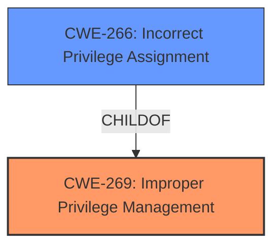

# Raw Analyzer Response for CVE-2025-26703

# Summary
| CWE ID | CWE Name | Confidence | CWE Abstraction Level | CWE Vulnerability Mapping Label | CWE-Vulnerability Mapping Notes |
|---|---|---|---|---|---|
| CWE-269 | Improper Privilege Management | 0.75 | Class | Primary | Discouraged |
| CWE-266 | Incorrect Privilege Assignment | 0.60 | Base | Secondary Candidate | Allowed |

## Evidence and Confidence

*   **Confidence Score:** 0.70
*   **Evidence Strength:** MEDIUM

## Relationship Analysis
The primary identified weakness is CWE-269, **Improper Privilege Management**, which is a class-level CWE. While CWE-269 is discouraged for direct mapping due to its generality, it captures the high-level nature of the vulnerability as described. The more specific CWE-266, **Incorrect Privilege Assignment**, is a child of CWE-269 and provides more detail but the evidence is not strong enough to confirm this. The relationship informs the decision to consider CWE-266 but not make it the primary.

## Vulnerability Chain
The vulnerability chain starts with **Improper Privilege Management** (CWE-269), which could lead to Privilege Escalation. The vulnerability description indicates a **rootcause** of **Improper Privilege Management**, directly leading to the impact of Privilege Escalation.

## Summary of Analysis
The initial assessment identified CWE-269 as the primary weakness due to the explicit mention of "**Improper Privilege Management**" in the vulnerability description. While the description is vague, it aligns with the general concept of CWE-269. However, CWE-269 is discouraged for direct mapping due to its generality.

The retriever results suggested more specific CWEs such as CWE-266 "**Incorrect Privilege Assignment**". The child-parent relationship between CWE-269 and CWE-266 and the privileges guidance suggest that CWE-266 could be a better fit. However, without more information on how the privileges are incorrectly managed/assigned, it is safer to stay with CWE-269 as the primary weakness.

Relevant CWE Information:

# Enhanced Context (25 CWEs)
The following CWEs were identified as potentially relevant to this vulnerability:

## CWE-266: Incorrect Privilege Assignment
**Abstraction Level**: Base
**Similarity Score**: 0.80
**Source**: dense

**Description**:
A product incorrectly assigns a privilege to a particular actor, creating an unintended sphere of control for that actor.

**Mapping Guidance**:
- Usage: Allowed
- Rationale: This CWE entry is at the Base level of abstraction, which is a preferred level of abstraction for mapping to the root causes of vulnerabilities.