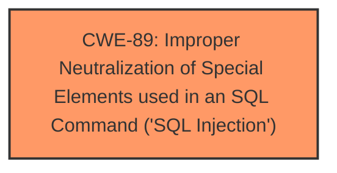

# Analysis Report for CVE-2025-2679

# Vulnerability Analysis Report: CVE-2025-2679

## Description

A vulnerability was found in PHPGurukul Bank Locker Management System 1.0. It has been classified as critical. Affected is an unknown function of the file /contact-us.php. The manipulation of the argument pagetitle leads to **sql injection**. It is possible to launch the attack remotely. The exploit has been disclosed to the public and may be used.

## Vulnerability Description Key Phrases

- **Weakness:** sql injection
- **Product:** PHPGurukul Bank Locker Management System
- **Version:** 1
- **Component:** /contact-us.php

## Analysis (with Relationship Data)

# Summary
| CWE ID | CWE Name | Confidence | CWE Abstraction Level | CWE Vulnerability Mapping Label | CWE-Vulnerability Mapping Notes |
|---|---|---|---|---|---|
| CWE-89 | Improper Neutralization of Special Elements used in an SQL Command ('SQL Injection') | 1.0 | Base | Primary | Allowed |

## Evidence and Confidence

*   **Confidence Score:** 1.0
*   **Evidence Strength:** HIGH

## Relationship Analysis
The primary relationship is that CWE-89 is a base level weakness. The retriever results listed several potential matches, including CWE-79, CWE-434, and CWE-1336. However, based on the vulnerability description and the provided content summary, the root cause of the vulnerability is clearly **SQL injection**, making CWE-89 the most accurate and specific choice. The other CWEs are not directly relevant to the described vulnerability.



## Vulnerability Chain
The vulnerability chain starts with the **improper neutralization** of special elements used in an SQL command (CWE-89). The attacker can then inject malicious SQL queries through the 'pagetitle' parameter, potentially leading to unauthorized database access, data leakage, data tampering, system control, and service interruption.

## Summary of Analysis
The initial assessment, based on the vulnerability description and content summary, strongly points to CWE-89 as the primary weakness. The vulnerability description explicitly mentions **SQL injection** due to the manipulation of the 'pagetitle' argument in the `/contact-us.php` file. The CVE Reference Links Content Summary confirms that the root cause is insufficient user input validation, allowing attackers to inject malicious SQL queries.

The retriever results also support this assessment, with CWE-89 having a perfect score of 1.0.

The final decision is based on the clear evidence of **SQL injection** and the support from both the vulnerability description and the retriever results. CWE-89 is at the optimal level of specificity (Base) and accurately represents the root cause of the vulnerability.

Relevant CWE Information:

# Enhanced Context (25 CWEs)
The following CWEs were identified as potentially relevant to this vulnerability:

## CWE-89: Improper Neutralization of Special Elements used in an SQL Command ('SQL Injection')
**Abstraction Level**: Base
**Similarity Score**: 0.79
**Source**: dense

**Description**:
The product constructs all or part of an SQL command using externally-influenced input from an upstream component, but it does not neutralize or incorrectly neutralizes special elements that could modify the intended SQL command when it is sent to a downstream component. Without sufficient removal or quoting of SQL syntax in user-controllable inputs, the generated SQL query can cause those inputs to be interpreted as SQL instead of ordinary user data.

**Mapping Guidance**:
- Usage: Allowed
- Rationale: This CWE entry is at the Base level of abstraction, which is a preferred level of abstraction for mapping to the root causes of vulnerabilities.

## CWE-89: Improper Neutralization of Special Elements used in an SQL Command ('SQL Injection')
**Abstraction Level**: Base
**Similarity Score**: 959.39
**Source**: sparse

**Description**:
The product constructs all or part of an SQL command using externally-influenced input from an upstream component, but it does not neutralize or incorrectly neutralizes special elements that could modify the intended SQL command when it is sent to a downstream component. Without sufficient removal or quoting of SQL syntax in user-controllable inputs, the generated SQL query can cause those inputs to be interpreted as SQL instead of ordinary user data.

**Mapping Guidance**:
- Usage: Allowed
- Rationale: This CWE entry is at the Base level of abstraction, which is a preferred level of abstraction for mapping to the root causes of vulnerabilities.


## CWE Relationship Analysis

Current CWEs represent these abstraction levels: .


### Vulnerability Chain Analysis

**Chain starting from CWE-89:**
- 89 (Improper Neutralization of Special Elements used in an SQL Command ('SQL Injection')) - ROOT


**Chain starting from CWE-79:**
- 79 (Improper Neutralization of Input During Web Page Generation ('Cross-site Scripting')) - ROOT


### CWE Relationship Diagram

```mermaid
graph TD
    classDef primary fill:#f96,stroke:#333,stroke-width:2px
    classDef secondary fill:#69f,stroke:#333
    classDef tertiary fill:#9e9,stroke:#333
```


*Report generated on 2025-07-14 14:45:05*
