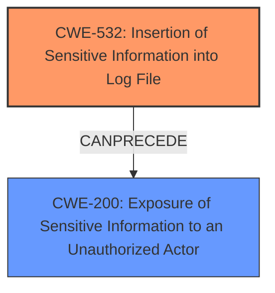

# Analysis Report for CVE-2025-26795

# Vulnerability Analysis Report: CVE-2025-26795

## Description

Exposure of Sensitive Information to an Unauthorized Actor, **Insertion of Sensitive Information into Log File** vulnerability in Apache IoTDB JDBC driver. This issue affects iotdb-jdbc from 0.10.0 through 1.3.3, from 2.0.1-beta before 2.0.2. Users are recommended to upgrade to version 2.0.2 and 1.3.4, which fix the issue.

## Vulnerability Description Key Phrases

- **Weakness:** Insertion of Sensitive Information into Log File
- **Impact:** Exposure of Sensitive Information to an Unauthorized Actor
- **Product:** Apache IoTDB JDBC driver
- **Version:** iotdb-jdbc from 0.10.0 through 1.3.3, from 2.0.1-beta before 2.0.2

## Analysis (with Relationship Data)

# Summary
| CWE ID | CWE Name | Confidence | CWE Abstraction Level | CWE Vulnerability Mapping Label | CWE-Vulnerability Mapping Notes |
|---|---|---|---|---|---|
| CWE-532 | Insertion of Sensitive Information into Log File | 1.0 | Base | Primary | Allowed |
| CWE-200 | Exposure of Sensitive Information to an Unauthorized Actor | 0.7 | Class | Secondary | Discouraged |

## Evidence and Confidence

*   **Confidence Score:** 0.9
*   **Evidence Strength:** HIGH

## Relationship Analysis
The primary relationship that influenced the decision was the direct match of the vulnerability description to CWE-532. CWE-200 was considered as a potential impact, but given its discouraged usage for representing confidentiality loss, it was only considered as a secondary classification. There are no direct parent-child or chain relationships that strongly influenced the primary selection.



## Vulnerability Chain
The vulnerability chain starts with the **insertion of sensitive information into a log file** (CWE-532), which then leads to the exposure of this information to unauthorized actors (CWE-200). The root cause is the logging of sensitive data, and the impact is the potential exposure of this data.

## Summary of Analysis
The initial analysis focused on identifying the root cause of the vulnerability. The vulnerability description and the CVE reference summary clearly indicate that the vulnerability involves the **insertion of sensitive information into log files**, which is a direct match for CWE-532. While the vulnerability also results in the exposure of sensitive information, this is more of an impact than the root cause. Therefore, CWE-532 was chosen as the primary CWE.

The graph relationships and retriever results further support this decision. CWE-532 has a high similarity score and is at the Base level of abstraction, which is preferred for mapping root causes.

The evidence supporting this decision is:
- Vulnerability Description: "Exposure of Sensitive Information to an Unauthorized Actor, **Insertion of Sensitive Information into Log File** vulnerability"
- Vulnerability Description Key Phrases: "**weakness:** **Insertion of Sensitive Information into Log File**"
- CVE Reference Links Content Summary: "**Root cause of vulnerability:** ... **Insertion of Sensitive Information into Log File**"

The selected CWEs are at the optimal level of specificity. CWE-532 is a Base-level CWE that accurately describes the root cause of the vulnerability.

Relevant CWE Information:

# Enhanced Context (25 CWEs)
The following CWEs were identified as potentially relevant to this vulnerability:

## CWE-532: Insertion of Sensitive Information into Log File
**Abstraction Level**: Base
**Similarity Score**: 0.75
**Source**: dense

**Description**:
The product writes sensitive information to a log file.

**Mapping Guidance**:
- Usage: Allowed
- Rationale: This CWE entry is at the Base level of abstraction, which is a preferred level of abstraction for mapping to the root causes of vulnerabilities.

## CWE-200: Exposure of Sensitive Information to an Unauthorized Actor
**Abstraction Level**: Class
**Similarity Score**: 0.73
**Source**: dense

**Description**:
The product exposes sensitive information to an actor that is not explicitly authorized to have access to that information.

**Mapping Guidance**:
- Usage: Discouraged
- Rationale: CWE-200 is commonly misused to represent the loss of confidentiality in a vulnerability, but confidentiality loss is a technical impact - not a root cause error. As of CWE 4.9, over 400 CWE entries can lead to a loss of confidentiality. Other options are often available. [REF-1287].

## CWE-532: Insertion of Sensitive Information into Log File
**Abstraction Level**: Base
**Similarity Score**: 857.23
**Source**: sparse

**Description**:
The product writes sensitive information to a log file.

**Mapping Guidance**:
- Usage: Allowed
- Rationale: This CWE entry is at the Base level of abstraction, which is a preferred level of abstraction for mapping to the root causes of vulnerabilities.

## CWE-200: Exposure of Sensitive Information to an Unauthorized Actor
**Abstraction Level**: Class
**Similarity Score**: 807.82
**Source**: sparse

**Description**:
The product exposes sensitive information to an actor that is not explicitly authorized to have access to that information.

**Mapping Guidance**:
- Usage: Discouraged
- Rationale: CWE-200 is commonly misused to represent the loss of confidentiality in a vulnerability, but confidentiality loss is a technical impact - not a root cause error. As of CWE 4.9, over 400 CWE entries can lead to a loss of confidentiality. Other options are often available. [REF-1287].

**CWE-532: Insertion of Sensitive Information into Log File**
Technical Explanation:
- The vulnerability involves the product writing sensitive information to a log file.
- This can lead to unauthorized access to sensitive data if the log file is not properly protected.
- This is a Base-level CWE, representing a specific type of weakness.
- The official MITRE mapping guidance allows for the use of this CWE.
- The vulnerability description directly matches the CWE description.
- Confidence: 1.0

**CWE-200: Exposure of Sensitive Information to an Unauthorized Actor**
Technical Explanation:
- The vulnerability results in the exposure of sensitive information to unauthorized actors.
- While this is a consequence of the vulnerability, it is not the root cause. The root cause is the **insertion of sensitive information into the log file**.
- This is a Class-level CWE, representing a more general type of weakness.
- The official MITRE mapping guidance discourages the use of this CWE as it is a technical impact and not a root cause error.
- The vulnerability description mentions the exposure of sensitive information, but the root cause lies in the insertion of sensitive information into the log file.
- Confidence: 0.7

Other CWEs Considered but Not Used:
- CWE-201: Insertion of Sensitive Information Into Sent Data: This was considered but not chosen because the sensitive information is being written to a log file, not directly sent to another actor.
- CWE-538: Insertion of Sensitive Information into Externally-Accessible File or Directory: While similar to CWE-532, CWE-532 is more specific to log files, making it a better fit.
- CWE-22, CWE-79, CWE-863, CWE-285, CWE-306, CWE-73, CWE-23, CWE-1272, CWE-226, CWE-494, CWE-434, CWE-59, CWE-41: These were considered but deemed irrelevant as they do not align with the specifics of the vulnerability description, which centers around logging sensitive information.


## CWE Relationship Analysis

Current CWEs represent these abstraction levels: .


### Vulnerability Chain Analysis

**Chain starting from CWE-863:**
- 863 (Incorrect Authorization) - ROOT


**Chain starting from CWE-226:**
- 226 (Sensitive Information in Resource Not Removed Before Reuse) - ROOT


### CWE Relationship Diagram

```mermaid
graph TD
    classDef primary fill:#f96,stroke:#333,stroke-width:2px
    classDef secondary fill:#69f,stroke:#333
    classDef tertiary fill:#9e9,stroke:#333
```


*Report generated on 2025-07-14 14:46:11*
