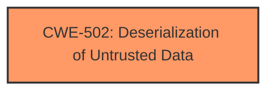

# Enhanced Analysis for CVE-2025-2690

# Summary
| CWE ID | CWE Name | Confidence | CWE Abstraction Level | CWE Vulnerability Mapping Label | CWE-Vulnerability Mapping Notes |
|---|---|---|---|---|---|
| CWE-502 | Deserialization of Untrusted Data | 1.0 | Base | Allowed | Primary CWE |

## Evidence and Confidence

*   **Confidence Score:** 1.0
*   **Evidence Strength:** HIGH

## Relationship Analysis
The primary CWE, CWE-502, stands alone as the root cause. No hierarchical, chain, or peer relationships significantly influence the selection, as the vulnerability description focuses solely on the deserialization aspect.



## Vulnerability Chain
The vulnerability chain consists of a single point: **deserialization** of untrusted data (CWE-502), which leads directly to potential remote code execution.

## Summary of Analysis
The analysis is based on the vulnerability description, which clearly states that the vulnerability is related to **deserialization**. The phrase "manipulation leads to **deserialization**" directly points to CWE-502 (Deserialization of Untrusted Data). The retriever results also list CWE-502 as a potential candidate.

The confidence score is high (1.0) because the provided description explicitly mentions **deserialization** as the root cause.

The selected CWE is at the optimal level of specificity, as it directly addresses the weakness described in the vulnerability.

Relevant CWE Information:

# Enhanced Context (25 CWEs)
The following CWEs were identified as potentially relevant to this vulnerability:

## CWE-502: Deserialization of Untrusted Data
**Abstraction Level**: Base
**Similarity Score**: 0.72
**Source**: dense

**Description**:
The product deserializes untrusted data without sufficiently ensuring that the resulting data will be valid.

**Mapping Guidance**:
- Usage: Allowed
- Rationale: This CWE entry is at the Base level of abstraction, which is a preferred level of abstraction for mapping to the root causes of vulnerabilities.


## CWE Relationship Analysis

Current CWEs represent these abstraction levels: .


### Vulnerability Chain Analysis

**Chain starting from CWE-502:**
- 502 (Deserialization of Untrusted Data) - ROOT


### CWE Relationship Diagram

```mermaid
graph TD
    classDef primary fill:#f96,stroke:#333,stroke-width:2px
    classDef secondary fill:#69f,stroke:#333
    classDef tertiary fill:#9e9,stroke:#333
```