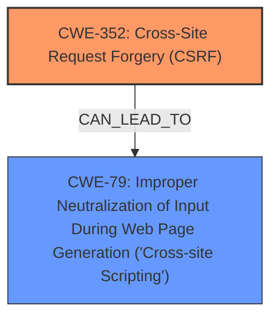

# Enhanced Analysis for CVE-2025-26931

# Summary
| CWE ID | CWE Name | Confidence | CWE Abstraction Level | CWE Vulnerability Mapping Label | CWE-Vulnerability Mapping Notes |
|---|---|---|---|---|---|
| CWE-352 | Cross-Site Request Forgery (CSRF) | 0.9 | Compound | Allowed | Primary CWE. The vulnerability is triggered due to a **Cross-Site Request Forgery (CSRF)** **weakness** in the Tribulant Gallery Voting WordPress plugin.|
| CWE-79 | Improper Neutralization of Input During Web Page Generation ('Cross-site Scripting') | 0.8 | Base | Allowed | Secondary CWE. The CSRF leads to **Stored XSS**, indicating **improper neutralization** of input.|

## Evidence and Confidence

*   **Confidence Score:** 0.85
*   **Evidence Strength:** MEDIUM

## Relationship Analysis
The primary weakness is CWE-352 (Cross-Site Request Forgery). The exploitation of this CSRF vulnerability leads to CWE-79 (Improper Neutralization of Input During Web Page Generation ('Cross-site Scripting')). The relationship here is that the successful exploitation of CWE-352 can lead to CWE-79, indicating a vulnerability chain. While CWE-352 is a Compound CWE, it accurately represents the initial **weakness**. CWE-79 is a Base CWE, providing a good level of specificity for the resulting XSS.



## Vulnerability Chain
The vulnerability chain starts with the **Cross-Site Request Forgery (CSRF) vulnerability** (CWE-352), which allows an attacker to force a user to perform actions they did not intend. This, in turn, leads to Stored XSS (CWE-79) due to the **improper neutralization** of input.

CWE-352 (Root Cause) -> CWE-79 (Impact)

## Summary of Analysis
The primary vulnerability is a Cross-Site Request Forgery (CSRF) vulnerability (CWE-352) in the Tribulant Gallery Voting WordPress plugin, as evidenced by the "CVE Reference Links Content Summary" section that specifies a "Cross-Site Request Forgery (CSRF)" as the vulnerability. This allows a malicious actor to force higher privileged users to execute unwanted actions. The successful exploitation of this CSRF vulnerability results in Stored XSS (CWE-79) because user-supplied input is not properly neutralized before being rendered in a web page. The "Vulnerability Description Key Phrases" section also mentions "Stored XSS" indicating the impact.

The retriever results and graph-based relationships were considered. While several CWEs were suggested, the focus was on identifying the root cause and the immediate impact. CWE-352 and CWE-79 accurately capture this.

Other CWEs Considered:
*   CWE-89 (Improper Neutralization of Special Elements used in an SQL Command ('SQL Injection')): While SQL injection is a common web vulnerability, there is no evidence in the description or extracted content that suggests SQL injection is involved in this vulnerability. Therefore, CWE-89 was not selected.
*   CWE-434 (Unrestricted Upload of File with Dangerous Type): This CWE is related to file uploads, but the provided information does not indicate any file upload functionality is involved. Therefore, CWE-434 was not selected.
*   CWE-918 (Server-Side Request Forgery (SSRF)): There is no evidence in the description or extracted content that suggests Server-Side Request Forgery is involved in this vulnerability. Therefore, CWE-918 was not selected.


## CWE Relationship Analysis

Current CWEs represent these abstraction levels: .


### Vulnerability Chain Analysis

**Chain starting from CWE-89:**
- 89 (Improper Neutralization of Special Elements used in an SQL Command ('SQL Injection')) - ROOT


**Chain starting from CWE-79:**
- 79 (Improper Neutralization of Input During Web Page Generation ('Cross-site Scripting')) - ROOT


### CWE Relationship Diagram

```mermaid
graph TD
    classDef primary fill:#f96,stroke:#333,stroke-width:2px
    classDef secondary fill:#69f,stroke:#333
    classDef tertiary fill:#9e9,stroke:#333
```