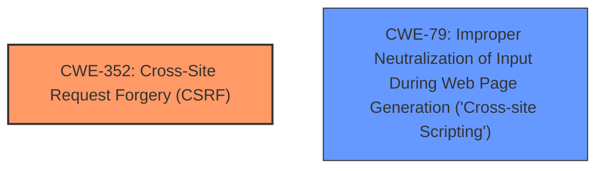

# Raw Analyzer Response for CVE-2025-27009

# Summary
| CWE ID | CWE Name | Confidence | CWE Abstraction Level | CWE Vulnerability Mapping Label | CWE-Vulnerability Mapping Notes |
|---|---|---|---|---|---|
| CWE-352 | Cross-Site Request Forgery (CSRF) | 0.9 | Compound | Primary CWE | Allowed |
| CWE-79 | Improper Neutralization of Input During Web Page Generation ('Cross-site Scripting') | 0.9 | Base | Secondary | Allowed |

## Evidence and Confidence

*   **Confidence Score:** 0.9
*   **Evidence Strength:** HIGH

## Relationship Analysis
The vulnerability is a combination of CSRF (CWE-352) and XSS (CWE-79). CWE-352 is a compound weakness, which means it represents a combination of multiple weaknesses. While XSS can be a consequence of CSRF, in this case, the description explicitly mentions Stored XSS, suggesting that the XSS vulnerability exists independently. Therefore, both CWEs are relevant and should be mapped. The relationship between them is not strictly hierarchical, as one does not directly cause the other in this specific context. They are more like co-occurring vulnerabilities within the same product.

## Vulnerability Chain
The vulnerability chain starts with the **lack of CSRF protection** (CWE-352) which allows an attacker to trick a user into performing actions they didn't intend. The presence of Stored **XSS** (CWE-79) suggests a separate vulnerability where user input is not properly neutralized, leading to the execution of malicious scripts in the context of other users.

## Summary of Analysis
The initial analysis focused on identifying the root cause and related weaknesses. The vulnerability description and CVE reference summary clearly point to both a **lack of CSRF protection** and a Stored **XSS** vulnerability. The Retriever results also highlight CWE-352 and CWE-79 as highly relevant.

The final decision is to map both CWE-352 and CWE-79. CWE-352 is the primary vulnerability because the description identifies it as the main issue, and the CVE summary focuses on the implications of a **missing CSRF protection**. CWE-79 is a secondary vulnerability due to the presence of Stored XSS. Both CWEs are at the Base or Compound level of abstraction, representing specific weaknesses.

Relevant CWE Information:

# Enhanced Context (25 CWEs)
The following CWEs were identified as potentially relevant to this vulnerability:

## CWE-352: Cross-Site Request Forgery (CSRF)
**Abstraction Level**: Compound
**Similarity Score**: 0.72
**Source**: dense

**Description**:
The web application does not, or can not, sufficiently verify whether a well-formed, valid, consistent request was intentionally provided by the user who submitted the request.

**Mapping Guidance**:
- Usage: Allowed
- Rationale: This is a well-known Composite of multiple weaknesses that must all occur simultaneously, although it is attack-oriented in nature.

## CWE-79: Improper Neutralization of Input During Web Page Generation ('Cross-site Scripting')
**Abstraction Level**: Base
**Similarity Score**: 0.71
**Source**: dense

**Description**:
The product does not neutralize or incorrectly neutralizes user-controllable input before it is placed in output that is used as a web page that is served to other users.

**Mapping Guidance**:
- Usage: Allowed
- Rationale: This CWE entry is at the Base level of abstraction, which is a preferred level of abstraction for mapping to the root causes of vulnerabilities.