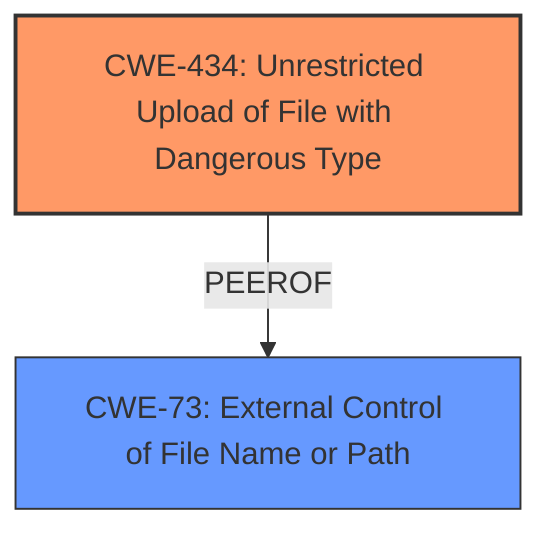

# Enhanced Analysis for CVE-2025-2705

# Summary
| CWE ID | CWE Name | Confidence | CWE Abstraction Level | CWE Vulnerability Mapping Label | CWE-Vulnerability Mapping Notes |
|---|---|---|---|---|---|
| CWE-434 | Unrestricted Upload of File with Dangerous Type | 1.0 | Base | Allowed | Primary CWE |
| CWE-73 | External Control of File Name or Path | 0.7 | Base | Allowed | Secondary Candidate |

## Evidence and Confidence

*   **Confidence Score:** 0.9
*   **Evidence Strength:** HIGH

## Relationship Analysis
The primary CWE is CWE-434, which represents the **unrestricted upload** of dangerous files. CWE-73 is considered as a secondary candidate because the vulnerability description mentions the manipulation of the "File" argument, suggesting external control over the file name or path. CWE-434 stands out as the primary issue due to the **unrestricted upload**, which directly aligns with its description.



## Vulnerability Chain
The vulnerability chain starts with the **unrestricted upload** of a file, represented by CWE-434. The attacker manipulates the "File" argument, which could potentially lead to the external control of the file name or path (CWE-73). The primary root cause is CWE-434, leading directly to the vulnerability, while CWE-73 could be a contributing factor.

## Summary of Analysis
The initial analysis strongly points towards CWE-434 as the primary vulnerability, supported by the **weakness** being **unrestricted upload**. This is corroborated by the vulnerability description's emphasis on the ability to manipulate the "File" argument, leading to the direct upload of dangerous file types. The retriever results also listed CWE-434 as a top candidate. Therefore, the final assessment is based on the provided evidence, with CWE-434 selected as the most specific and accurate representation of the vulnerability. CWE-73 is also considered a secondary candidate because the vulnerability description mentions the manipulation of the "File" argument, suggesting external control over the file name or path.

Relevant CWE Information:

# Enhanced Context (25 CWEs)
The following CWEs were identified as potentially relevant to this vulnerability:

## CWE-434: Unrestricted Upload of File with Dangerous Type
**Abstraction Level**: Base
**Similarity Score**: 0.82
**Source**: dense

**Description**:
The product allows the upload or transfer of dangerous file types that are automatically processed within its environment.

**Mapping Guidance**:
- Usage: Allowed
- Rationale: This CWE entry is at the Base level of abstraction, which is a preferred level of abstraction for mapping to the root causes of vulnerabilities.

## CWE-434: Unrestricted Upload of File with Dangerous Type
**Abstraction Level**: Base
**Similarity Score**: 2.66
**Source**: graph

**Description**:
The product allows the upload or transfer of dangerous file types that are automatically processed within its environment.

**Mapping Guidance**:
- Usage: Allowed
- Rationale: This CWE entry is at the Base level of abstraction, which is a preferred level of abstraction for mapping to the root causes of vulnerabilities.

## CWE-73: External Control of File Name or Path
**Abstraction Level**: Base
**Similarity Score**: 0.74
**Source**: dense

**Description**:
The product allows user input to control or influence paths or file names that are used in filesystem operations.

**Mapping Guidance**:
- Usage: Allowed
- Rationale: This CWE entry is at the Base level of abstraction, which is a preferred level of abstraction for mapping to the root causes of vulnerabilities.

### CWE Considerations:

*   **CWE-434: Unrestricted Upload of File with Dangerous Type**

    *   **Rationale:** This CWE directly addresses the **unrestricted upload** aspect of the vulnerability. The vulnerability description clearly states that the manipulation of the "File" argument leads to this **unrestricted upload**, aligning perfectly with the characteristics of CWE-434.
    *   **Security Implications:** This allows attackers to upload malicious files that can be executed on the server, potentially leading to code execution, data compromise, or system takeover.
    *   **Relationships:** The "PeerOf" relationship to CWE-430 (Upload of Web Script Without Server-Side Validation) is relevant, as the uploaded file could contain a web script.
    *   **Usage:** The mapping guidance specifies "Allowed" for this CWE, further supporting its applicability.
*   **CWE-73: External Control of File Name or Path**

    *   **Rationale:** The manipulation of the "File" argument suggests that the attacker has control over the file name or path used in the upload process.
    *   **Security Implications:** This can lead to path traversal vulnerabilities, where attackers can upload files to arbitrary locations on the server.
    *   **Relationships:** "CanFollow" relationship from CWE-22 and "CanPrecede" relationships to other CWEs are relevant.
    *   **Usage:** The mapping guidance specifies "Allowed" for this CWE.
*   **CWE-79: Improper Neutralization of Input During Web Page Generation ('Cross-site Scripting')** and **CWE-89: Improper Neutralization of Special Elements used in an SQL Command ('SQL Injection')**: These were considered due to their high retriever scores, but they are not directly applicable as the vulnerability's core issue is related to file handling rather than input sanitization for web page generation or SQL queries.
*   **CWE-306: Missing Authentication for Critical Function**: While the vulnerability involves a critical function, the primary issue is the **unrestricted upload** rather than the absence of authentication.
*   **CWE-22: Improper Limitation of a Pathname to a Restricted Directory ('Path Traversal')**: This is related to CWE-73. If the file path is not correctly validated, then the **unrestricted upload** could allow traversal issues.
*   **CWE-425: Direct Request ('Forced Browsing')**: This is not directly applicable, because the **unrestricted upload** is the primary issue.

Based on the retriever results, relationship analysis, and the detailed descriptions of the CWEs, CWE-434 best represents the primary vulnerability. CWE-73 is a secondary concern.


## CWE Relationship Analysis

Current CWEs represent these abstraction levels: .


### Vulnerability Chain Analysis

**Chain starting from CWE-89:**
- 89 (Improper Neutralization of Special Elements used in an SQL Command ('SQL Injection')) - ROOT


**Chain starting from CWE-22:**
- 22 (Improper Limitation of a Pathname to a Restricted Directory ('Path Traversal')) - ROOT


### CWE Relationship Diagram

```mermaid
graph TD
    classDef primary fill:#f96,stroke:#333,stroke-width:2px
    classDef secondary fill:#69f,stroke:#333
    classDef tertiary fill:#9e9,stroke:#333
```