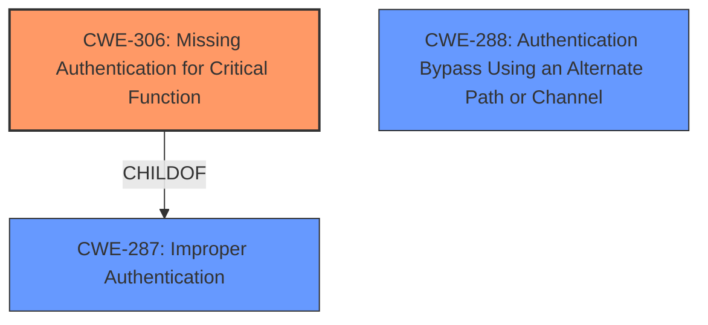

# Analysis Report for CVE-2025-27086

# Vulnerability Analysis Report: CVE-2025-27086

## Description

A vulnerability in the HPE Performance Cluster Manager (HPCM) GUI could allow an attacker to bypass authentication.

## Vulnerability Description Key Phrases

- **Impact:** bypass authentication
- **Attacker:** attacker
- **Product:** HPE Performance Cluster Manager (HPCM) GUI

## Analysis (with Relationship Data)

# Summary
| CWE ID | CWE Name | Confidence | CWE Abstraction Level | CWE Vulnerability Mapping Label | CWE-Vulnerability Mapping Notes |
|---|---|---|---|---|---|
| CWE-306 | Missing Authentication for Critical Function | 0.9 | Base | Allowed | Primary CWE |
| CWE-288 | Authentication Bypass Using an Alternate Path or Channel | 0.6 | Base | Allowed | Secondary Candidate |

## Evidence and Confidence

*   **Confidence Score:** 0.8
*   **Evidence Strength:** MEDIUM

## Relationship Analysis
The primary relationship considered was the parent-child relationship between CWE-287 (Improper Authentication) and CWE-306 (Missing Authentication for Critical Function). Since the description explicitly mentions authentication bypass, it suggests a complete lack of authentication for a critical function, making CWE-306 a more precise fit than the broader CWE-287.
The alternate path bypass by CWE-288 is less likely as the description does not suggest a path bypass, but rather a missing authentication.



## Vulnerability Chain
The vulnerability chain starts with the **missing authentication** (**ROOT CAUSE**) for a critical function in the HPE Performance Cluster Manager GUI. This leads directly to the impact of an attacker being able to **bypass authentication**.

## Summary of Analysis
The initial assessment focused on identifying the root cause of the authentication bypass. The vulnerability description explicitly states that an attacker can bypass authentication in the HPE Performance Cluster Manager (HPCM) GUI. The key phrase "bypass authentication" strongly suggests that a critical function lacks proper authentication mechanisms.
The selection of CWE-306 is based on its specific focus on missing authentication for critical functions, aligning perfectly with the vulnerability description. The guidance provided reinforces this choice, emphasizing that CWE-306 is appropriate when no identity validation is enforced for sensitive functionality.
CWE-288 was considered as a secondary candidate because it represents an authentication bypass, but it was less likely as the description did not suggest a path bypass, but rather a **missing authentication**.

Relevant CWE Information:

# Enhanced Context (25 CWEs)

## CWE-306: Missing Authentication for Critical Function
**Abstraction Level**: Base
**Similarity Score**: 0.035
**Source**: sparse

**Description**:
The product does not perform any authentication for functionality that requires a provable user identity or consumes a significant amount of resources.

**Mapping Guidance**:
- Usage: Allowed
- Rationale: This CWE entry is at the Base level of abstraction, which is a preferred level of abstraction for mapping to the root causes of vulnerabilities.

**Relationships**:
- PARENTOF -> CWE-322
- PARENTOF -> CWE-288
- CHILDOF -> CWE-287

## CWE-288: Authentication Bypass Using an Alternate Path or Channel
**Abstraction Level**: Base
**Similarity Score**: 0.560
**Source**: dense

**Description**:
The product requires authentication, but the product has an alternate path or channel that does not require authentication.

**Mapping Guidance**:
- Usage: Allowed
- Rationale: This CWE entry is at the Base level of abstraction, which is a preferred level of abstraction for mapping to the root causes of vulnerabilities.


## CWE Relationship Analysis

Current CWEs represent these abstraction levels: .


### Vulnerability Chain Analysis

**Chain starting from CWE-288:**
- 288 (Authentication Bypass Using an Alternate Path or Channel) - ROOT


**Chain starting from CWE-306:**
- 306 (Missing Authentication for Critical Function) - ROOT


### CWE Relationship Diagram

```mermaid
graph TD
    classDef primary fill:#f96,stroke:#333,stroke-width:2px
    classDef secondary fill:#69f,stroke:#333
    classDef tertiary fill:#9e9,stroke:#333
```


*Report generated on 2025-07-14 14:54:36*
