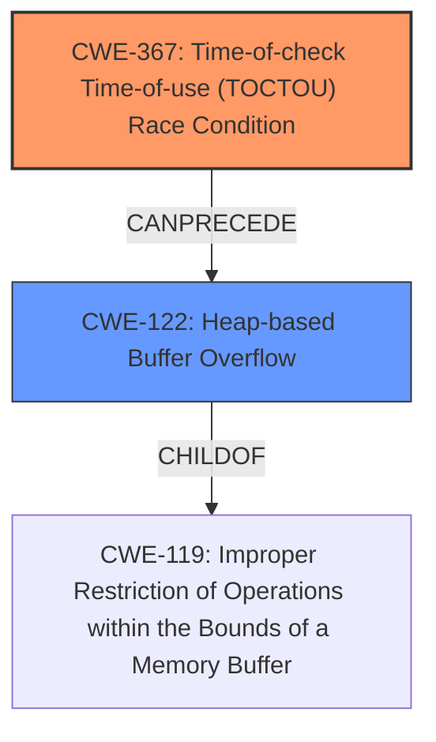

# Raw Analyzer Response for CVE-2025-27091

# Summary
| CWE ID | CWE Name | Confidence | CWE Abstraction Level | CWE Vulnerability Mapping Label | CWE-Vulnerability Mapping Notes |
|---|---|---|---|---|---|
| CWE-367 | Time-of-check Time-of-use (TOCTOU) Race Condition | 0.8 | Base | Allowed | Primary CWE |
| CWE-122 | Heap-based Buffer Overflow | 0.7 | Variant | Allowed | Secondary Candidate |

## Evidence and Confidence

*   **Confidence Score:** 0.75
*   **Evidence Strength:** MEDIUM

## Relationship Analysis
The primary weakness is a Time-of-check Time-of-use (TOCTOU) Race Condition (CWE-367), which can lead to a Heap-based Buffer Overflow (CWE-122). CWE-367 is a base CWE and can precede CWE-787 (Out-of-bounds Write), which is a parent of CWE-122. CWE-119 (Improper Restriction of Operations within the Bounds of a Memory Buffer) is a class-level CWE that is a parent of both CWE-122 and other buffer overflow/out-of-bounds write CWEs.

## Vulnerability Chain
The vulnerability chain starts with a **race condition** (CWE-367) during memory allocation, specifically between a Sequence Parameter Set (SPS) memory allocation and a subsequent non Instantaneous Decoder Refresh (non-IDR) Network Abstraction Layer (NAL) unit memory usage. This **race condition** leads to a **heap overflow** (CWE-122). The **heap overflow** can then cause an unexpected crash or potentially allow arbitrary command execution.

CWE-367 (Race Condition) -> CWE-122 (Heap-based Buffer Overflow) -> Impact (Crash/Arbitrary Command Execution)

## Summary of Analysis
The primary weakness is a **race condition** (CWE-367) that results in a **heap overflow** (CWE-122). The description clearly states that the vulnerability is due to a **race condition** during memory allocation, which then allows an attacker to cause an unexpected crash or potentially perform arbitrary commands by abusing the **heap overflow**.

The evidence for CWE-367 is: "This vulnerability is due to a **race condition** between a Sequence Parameter Set (SPS) memory allocation and a subsequent non Instantaneous Decoder Refresh (non-IDR) Network Abstraction Layer (NAL) unit memory usage."

The evidence for CWE-122 is: "A vulnerability in the decoding functions of OpenH264 codec library could allow a remote, unauthenticated attacker to trigger a **heap overflow**." and "An attacker could exploit this vulnerability by crafting a malicious bitstream and tricking a victim user into processing an arbitrary video containing the malicious bistream...by abusing the **heap overflow**."

CWE-119 (Improper Restriction of Operations within the Bounds of a Memory Buffer) was considered but not selected as the primary CWE because it is a more general class and the description provides enough detail to identify the specific **race condition** leading to a **heap overflow**. CWE-122 is selected because the **heap overflow** is a direct consequence of the **race condition**, and the description explicitly mentions it.

The selection of CWE-367 and CWE-122 is at the optimal level of specificity as they accurately represent the root cause and immediate consequence of the vulnerability, respectively.

Relevant CWE Information:

# Enhanced Context (25 CWEs)
The following CWEs were identified as potentially relevant to this vulnerability:

## CWE-125: Out-of-bounds Read
**Abstraction Level**: Base
**Similarity Score**: 0.75
**Source**: dense

**Description**:
The product reads data past the end, or before the beginning, of the intended buffer.

**Mapping Guidance**:
- Usage: Allowed
- Rationale: This CWE entry is at the Base level of abstraction, which is a preferred level of abstraction for mapping to the root causes of vulnerabilities.

## CWE-131: Incorrect Calculation of Buffer Size
**Abstraction Level**: Base
**Similarity Score**: 0.74
**Source**: dense

**Description**:
The product does not correctly calculate the size to be used when allocating a buffer, which could lead to a buffer overflow.

**Mapping Guidance**:
- Usage: Allowed
- Rationale: This CWE entry is at the Base level of abstraction, which is a preferred level of abstraction for mapping to the root causes of vulnerabilities.

## CWE-129: Improper Validation of Array Index
**Abstraction Level**: Variant
**Similarity Score**: 0.74
**Source**: dense

**Description**:
The product uses untrusted input when calculating or using an array index, but the product does not validate or incorrectly validates the index to ensure the index references a valid position within the array.

**Mapping Guidance**:
- Usage: Allowed
- Rationale: This CWE entry is at the Variant level of abstraction, which is a preferred level of abstraction for mapping to the root causes of vulnerabilities.

## CWE-190: Integer Overflow or Wraparound
**Abstraction Level**: Base
**Similarity Score**: 0.74
**Source**: dense

**Description**:
The product performs a calculation that can
         produce an integer overflow or wraparound when the logic
         assumes that the resulting value will always be larger than
         the original value. This occurs when an integer value is
         incremented to a value that is too large to store in the
         associated representation. When this occurs, the value may
         become a very small or negative number.

**Mapping Guidance**:
- Usage: Allowed
- Rationale: This CWE entry is at the Base level of abstraction, which is a preferred level of abstraction for mapping to the root causes of vulnerabilities.

## CWE-119: Improper Restriction of Operations within the Bounds of a Memory Buffer
**Abstraction Level**: Class
**Similarity Score**: 0.73
**Source**: dense

**Description**:
The product performs operations on a memory buffer, but it reads from or writes to a memory location outside the buffer's intended boundary. This may result in read or write operations on unexpected memory locations that could be linked to other variables, data structures, or internal program data.

**Mapping Guidance**:
- Usage: Discouraged
- Rationale: CWE-119 is commonly misused in low-information vulnerability reports when lower-level CWEs could be used instead, or when more details about the vulnerability are available.

## CWE-824: Access of Uninitialized Pointer
**Abstraction Level**: Base
**Similarity Score**: 0.73
**Source**: dense

**Description**:
The product accesses or uses a pointer that has not been initialized.

**Mapping Guidance**:
- Usage: Allowed
- Rationale: This CWE entry is at the Base level of abstraction, which is a preferred level of abstraction for mapping to the root causes of vulnerabilities.

## CWE-122: Heap-based Buffer Overflow
**Abstraction Level**: Variant
**Similarity Score**: 0.73
**Source**: dense

**Description**:
A heap overflow condition is a buffer overflow, where the buffer that can be overwritten is allocated in the heap portion of memory, generally meaning that the buffer was allocated using a routine such as malloc().

**Mapping Guidance**:
- Usage: Allowed
- Rationale: This CWE entry is at the Variant level of abstraction, which is a preferred level of abstraction for mapping to the root causes of vulnerabilities.

## CWE-755: Improper Handling of Exceptional Conditions
**Abstraction Level**: Class
**Similarity Score**: 0.73
**Source**: dense

**Description**:
The product does not handle or incorrectly handles an exceptional condition.

**Mapping Guidance**:
- Usage: Discouraged
- Rationale: This CWE entry is a level-1 Class (i.e., a child of a Pillar). It might have lower-level children that would be more appropriate

## CWE-789: Memory Allocation with Excessive Size Value
**Abstraction Level**: Variant
**Similarity Score**: 0.73
**Source**: dense

**Description**:
The product allocates memory based on an untrusted, large size value, but it does not ensure that the size is within expected limits, allowing arbitrary amounts of memory to be allocated.

**Mapping Guidance**:
- Usage: Allowed
- Rationale: This CWE entry is at the Variant level of abstraction, which is a preferred level of abstraction for mapping to the root causes of vulnerabilities.

## CWE-367: Time-of-check Time-