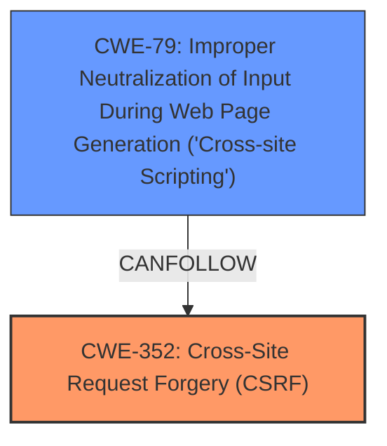

# Enhanced Analysis for CVE-2025-27355

# Summary
| CWE ID | CWE Name | Confidence | CWE Abstraction Level | CWE Vulnerability Mapping Label | CWE-Vulnerability Mapping Notes |
|---|---|---|---|---|---|
| CWE-352 | Cross-Site Request Forgery (CSRF) | 0.9 | Compound | Primary | Allowed |
| CWE-79 | Improper Neutralization of Input During Web Page Generation ('Cross-site Scripting') | 0.7 | Base | Secondary | Allowed |

## Evidence and Confidence

*   **Confidence Score:** 0.8
*   **Evidence Strength:** MEDIUM

## Relationship Analysis
The primary weakness is CWE-352 [Cross-Site Request Forgery (CSRF)], a compound weakness that describes the lack of verification of request origin. The secondary weakness is CWE-79 [Improper Neutralization of Input During Web Page Generation ('Cross-site Scripting')], which can be triggered because of the lack of CSRF protection.



## Vulnerability Chain
The vulnerability chain starts with the **lack of CSRF protection (CWE-352)**, which allows an attacker to forge requests on behalf of an authenticated user. This can then lead to stored **XSS (CWE-79)** if the forged requests modify data that is later displayed without proper sanitization.

## Summary of Analysis
The initial assessment identified CWE-352 [Cross-Site Request Forgery (CSRF)] as the primary root cause because the vulnerability description and CVE summary explicitly mention it. The presence of stored XSS indicates a secondary weakness, CWE-79 [Improper Neutralization of Input During Web Page Generation ('Cross-site Scripting')], which can be exploited due to the lack of CSRF protection.

The evidence for CWE-352 [Cross-Site Request Forgery (CSRF)] is strong, as the vulnerability description key phrases list "Cross-Site Request Forgery (CSRF)" as the rootcause. The CVE Reference Links Content Summary confirms the **root cause of the vulnerability** is a **Cross-Site Request Forgery (CSRF)**.

The evidence for CWE-79 [Improper Neutralization of Input During Web Page Generation ('Cross-site Scripting')] is based on the "XSS" weakness mentioned in the Vulnerability Description Key Phrases.

The retriever results also listed CWE-79 [Improper Neutralization of Input During Web Page Generation ('Cross-site Scripting')] and CWE-352 [Cross-Site Request Forgery (CSRF)] as the top candidates.

The final selection prioritizes CWE-352 [Cross-Site Request Forgery (CSRF)] as the root cause and CWE-79 [Improper Neutralization of Input During Web Page Generation ('Cross-site Scripting')] as a secondary weakness that can be exploited as a result of the CSRF vulnerability. These CWEs are at the optimal level of specificity (Base and Compound, respectively) and accurately represent the identified weaknesses.


## CWE Relationship Analysis

Current CWEs represent these abstraction levels: .


### Vulnerability Chain Analysis

**Chain starting from CWE-352:**
- 352 (Cross-Site Request Forgery (CSRF)) - ROOT


**Chain starting from CWE-79:**
- 79 (Improper Neutralization of Input During Web Page Generation ('Cross-site Scripting')) - ROOT


### CWE Relationship Diagram

```mermaid
graph TD
    classDef primary fill:#f96,stroke:#333,stroke-width:2px
    classDef secondary fill:#69f,stroke:#333
    classDef tertiary fill:#9e9,stroke:#333
```