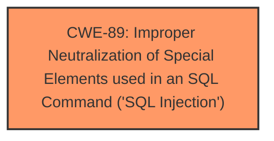

# Analysis Report for CVE-2025-2739

# Vulnerability Analysis Report: CVE-2025-2739

## Description

A vulnerability was found in PHPGurukul Old Age Home Management System 1.0. It has been rated as critical. This issue affects some unknown processing of the file /admin/manage-services.php. The manipulation of the argument sertitle leads to **sql injection**. The attack may be initiated remotely. The exploit has been disclosed to the public and may be used.

## Vulnerability Description Key Phrases

- **Weakness:** sql injection
- **Vector:** manipulation of the argument sertitle
- **Product:** PHPGurukul Old Age Home Management System
- **Version:** 1.0
- **Component:** /admin/manage-services.php

## Analysis (with Relationship Data)

# Summary
| CWE ID | CWE Name | Confidence | CWE Abstraction Level | CWE Vulnerability Mapping Label | CWE-Vulnerability Mapping Notes |
|---|---|---|---|---|---|
| CWE-89 | Improper Neutralization of Special Elements used in an SQL Command ('SQL Injection') | 1.0 | Base | Allowed | Primary CWE. The application constructs an SQL command using externally-influenced input, but it does not neutralize or incorrectly neutralizes special elements that could modify the intended SQL command. |

## Evidence and Confidence

*   **Confidence Score:** 1.0
*   **Evidence Strength:** HIGH

## Relationship Analysis
The primary identified CWE is CWE-89, which stands alone as the root cause in this scenario. There are no hierarchical, chain, or peer relationships that influence this selection as the description clearly states the presence of SQL Injection.



## Vulnerability Chain
The vulnerability chain consists of a single element:

1.  **Root Cause:** CWE-89 - Improper Neutralization of Special Elements used in an SQL Command ('SQL Injection')

This is a direct SQL Injection vulnerability due to the lack of proper input validation when constructing SQL queries. The impact is direct, where a remote attacker can manipulate the 'sertitle' argument to inject malicious SQL code.

## Summary of Analysis
The analysis is based on the vulnerability description, which clearly states that the manipulation of the argument 'sertitle' leads to **sql injection** in the `/admin/manage-services.php` file of the PHPGurukul Old Age Home Management System 1.0.

The evidence from the "Vulnerability Description Key Phrases" section confirms the presence of **sql injection**. The retriever results also list CWE-89 as the top candidate with a score of 1.0, further reinforcing this choice.

The selection of CWE-89 is at the optimal level of specificity, as it directly addresses the root cause of the vulnerability, which is the improper neutralization of special elements used in an SQL command.


## CWE Relationship Analysis

Current CWEs represent these abstraction levels: .


### Vulnerability Chain Analysis

**Chain starting from CWE-89:**
- 89 (Improper Neutralization of Special Elements used in an SQL Command ('SQL Injection')) - ROOT


### CWE Relationship Diagram

```mermaid
graph TD
    classDef primary fill:#f96,stroke:#333,stroke-width:2px
    classDef secondary fill:#69f,stroke:#333
    classDef tertiary fill:#9e9,stroke:#333
```


*Report generated on 2025-07-14 15:11:34*
