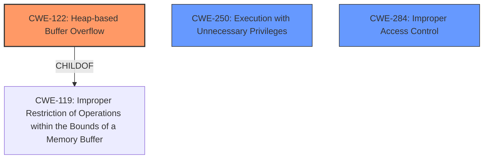

# Analysis Report for CVE-2025-27440

# Vulnerability Analysis Report: CVE-2025-27440

## Description

**Heap overflow** in some Zoom Workplace Apps may allow an authenticated user to conduct an escalation of privilege via network access.

## Vulnerability Description Key Phrases

- **Weakness:** Heap overflow
- **Product:** Zoom Workplace Apps
- **Impact:** escalation of privilege, privilege escalation
- **Attacker:** authenticated user

## Analysis (with Relationship Data)

# Summary
| CWE ID    | CWE Name                                                      | Confidence | CWE Abstraction Level | CWE Vulnerability Mapping Label | CWE-Vulnerability Mapping Notes |
| :-------- | :------------------------------------------------------------ | :--------- | :-------------------- | :------------------------------ | :------------------------------ |
| CWE-122   | Heap-based Buffer Overflow                                    | 0.9        | Variant               | Primary                         | Allowed                       |
| CWE-250   | Execution with Unnecessary Privileges                         | 0.6        | Base                  | Secondary                       | Allowed                       |
| CWE-284   | Improper Access Control                                       | 0.5        | Class                 | Secondary                       | Allowed                       |

## Evidence and Confidence

*   **Confidence Score:** 0.8
*   **Evidence Strength:** HIGH

## Relationship Analysis

The primary CWE is CWE-122, which is a variant of CWE-119 (Improper Restriction of Operations within the Bounds of a Memory Buffer). CWE-119 is a class-level CWE. The selection of CWE-122 is based on the explicit mention of a "heap overflow" in the vulnerability description, making it a more specific and appropriate choice than its parent.

CWE-250 is included as a secondary CWE due to the "escalation of privilege" impact. CWE-250 is a base-level CWE that represents the condition where code runs with higher privileges than necessary.

CWE-284 is included as a secondary CWE as the system fails to enforce restrictions on access to resources.



## Vulnerability Chain

The vulnerability chain starts with a **heap overflow** (CWE-122), which allows an attacker to overwrite memory. This leads to **privilege escalation**, which can be represented as Execution with Unnecessary Privileges (CWE-250) or Improper Access Control (CWE-284).

## Summary of Analysis

The primary weakness is a **heap overflow** (CWE-122) in Zoom Workplace Apps. The vulnerability description clearly states this **weakness**, and the CVE reference links content summary confirms it. The impact of exploiting this vulnerability is privilege escalation, which is why I have selected CWE-250 and CWE-284 as secondary CWEs.

The selection of CWE-122 is based on the explicit mention of a "heap overflow" in the vulnerability description: "**Heap overflow** in some Zoom Workplace Apps may allow an authenticated user to conduct an escalation of privilege via network access."

The relationship between CWE-122 and CWE-119 influenced the selection, as CWE-122 is a variant of CWE-119. The more specific variant was chosen because the evidence supports it.

CWE-250 was selected because of the impact of privilege escalation. It describes the scenario where code runs with higher privileges than necessary.

The assigned CWEs are at the optimal level of specificity because they accurately represent the **root cause** (CWE-122) and the potential impact (CWE-250, CWE-284) of the vulnerability.

CWEs like Integer Overflow or Wraparound (CWE-190), Incorrect Calculation of Buffer Size (CWE-131), and Off-by-one Error (CWE-193) were considered but not selected because the primary **weakness** is a **heap overflow**, not an integer error or buffer size calculation error.


## CWE Relationship Analysis

Current CWEs represent these abstraction levels: .


### Vulnerability Chain Analysis

**Chain starting from CWE-131:**
- 131 (Incorrect Calculation of Buffer Size) - ROOT


**Chain starting from CWE-193:**
- 193 (Off-by-one Error) - ROOT


### CWE Relationship Diagram

```mermaid
graph TD
    classDef primary fill:#f96,stroke:#333,stroke-width:2px
    classDef secondary fill:#69f,stroke:#333
    classDef tertiary fill:#9e9,stroke:#333
```


*Report generated on 2025-07-14 15:16:38*
