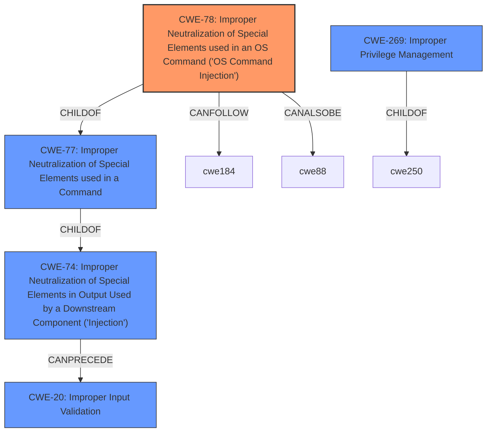

# Raw Analyzer Response for CVE-2025-27493

# Summary
| CWE ID | CWE Name | Confidence | CWE Abstraction Level | CWE Vulnerability Mapping Label | CWE-Vulnerability Mapping Notes |
|---|---|---|---|---|---|
| CWE-78 | Improper Neutralization of Special Elements used in an OS Command ('OS Command Injection') | 0.9 | Base | Allowed | Primary CWE |
| CWE-269 | Improper Privilege Management | 0.5 | Class | Discouraged | Secondary Candidate |
| CWE-20 | Improper Input Validation | 0.5 | Class | Discouraged | Secondary Candidate |

## Evidence and Confidence

*   **Confidence Score:** 0.9
*   **Evidence Strength:** HIGH

## Relationship Analysis
The primary relationship influencing the CWE selection is the hierarchical structure, with CWE-78 being a base-level CWE representing a more specific type of injection. The vulnerability also involves privilege escalation, making CWE-269 a possible consideration. However, the root cause points more directly to the **improper sanitization of user input** leading to command injection.

## Vulnerability Chain
The vulnerability chain starts with the **improper sanitization of user input** (CWE-78), which allows an attacker to inject arbitrary commands. These injected commands are then executed with root privileges, leading to privilege escalation.

## Summary of Analysis
The primary CWE selection is based on the clear evidence of **improper input sanitization** leading to command injection on the telnet command line interface. The vulnerability description explicitly states that affected devices **improperly sanitize user input**, which is a key characteristic of CWE-78. This leads to the ability to inject arbitrary commands that are executed with root privileges. The high CVSS score (8.2 v3.1, 9.3 v4.0) further supports the severity and impact of the vulnerability.

The retriever results also support this assessment, with CWE-78 being a relevant candidate. The retriever results also suggest considering CWE-20 (Improper Input Validation) which is a higher level class. While CWE-20 could be considered, CWE-78 provides a more specific and accurate representation of the vulnerability's root cause. The explicit mention of "command line interface" and "injecting arbitrary commands" strongly favors CWE-78.

CWE-269 (Improper Privilege Management) was considered due to the impact of privilege escalation, but the root cause is more directly tied to the **improper input sanitization** rather than a flaw in privilege management itself. Thus, it's a secondary consideration at best.

Relevant CWE Information:

# Enhanced Context (25 CWEs)
The following CWEs were identified as potentially relevant to this vulnerability:

## CWE-78: Improper Neutralization of Special Elements used in an OS Command ('OS Command Injection')
**Abstraction Level**: base
**Similarity Score**: 3.07
**Source**: graph

**Description**:
CWE-78: Improper Neutralization of Special Elements used in an OS Command ('OS Command Injection')

**Mapping Guidance**:
- Usage: Allowed
- Rationale: This CWE entry is at the Base level of abstraction, which is a preferred level of abstraction for mapping to the root causes of vulnerabilities.

**Relationships**:
- CANFOLLOW -> CWE-184
- CANALSOBE -> CWE-88
- CHILDOF -> CWE-77
- CHILDOF -> CWE-77
- CHILDOF -> CWE-74

## CWE-78: Improper Neutralization of Special Elements used in an OS Command ('OS Command Injection')
CWE-78 (Improper Neutralization of Special Elements used in an OS Command ('OS Command Injection')) accurately describes the **improper sanitization** issue, where special elements are not properly neutralized, enabling command injection. This aligns with the vulnerability description. The security implication is that an attacker can execute arbitrary commands on the system.

CWE-269: Improper Privilege Management
CWE-269 (Improper Privilege Management) is less applicable as the root cause isn't directly related to how privileges are managed but rather how input is handled.

CWE-20: Improper Input Validation
CWE-20 (Improper Input Validation) is a more general case, and CWE-78 is more specific.