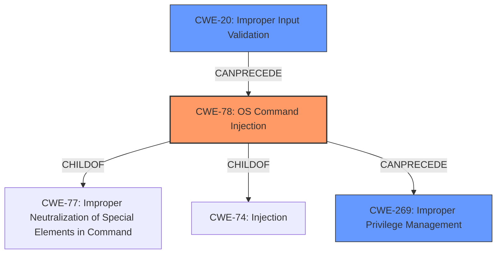

# Analysis Report for CVE-2025-27494

# Vulnerability Analysis Report: CVE-2025-27494

## Description

A vulnerability has been identified in SiPass integrated AC5102 (ACC-G2) (All versions < V6.4.9), SiPass integrated ACC-AP (All versions < V6.4.9). Affected devices **improperly sanitize input** for the pubkey endpoint of the REST API. This could allow an authenticated remote administrator to escalate privileges by injecting arbitrary commands that are executed with root privileges.

## Vulnerability Description Key Phrases

- **Component:** pubkey endpoint of the REST API
- **Rootcause:** improperly sanitize input
- **Vector:** injecting arbitrary commands
- **Product:** SiPass integrated AC5102 (ACC-G2), SiPass integrated ACC-AP
- **Impact:** escalate privileges
- **Attacker:** authenticated remote administrator
- **Version:** All versions < V6.4.9

## Analysis (with Relationship Data)

# Summary

| CWE ID  | CWE Name                                                                                                | Confidence | CWE Abstraction Level | CWE Vulnerability Mapping Label | CWE-Vulnerability Mapping Notes |
| ------- | ------------------------------------------------------------------------------------------------------- | ---------- | ----------------------- | ------------------------------- | ------------------------------- |
| CWE-78  | Improper Neutralization of Special Elements used in an OS Command ('OS Command Injection')              | 0.9        | Base                    | Primary CWE                     | Allowed                         |
| CWE-20  | Improper Input Validation                                                                                 | 0.7        | Class                   | Secondary Candidate             | Discouraged                    |
| CWE-269 | Improper Privilege Management                                                                             | 0.5        | Class                   | Secondary Candidate             | Discouraged                    |

## Evidence and Confidence

*   **Confidence Score:** 0.8
*   **Evidence Strength:** HIGH

## Relationship Analysis

The primary weakness is CWE-78, which is a base-level CWE. It is related to CWE-77 (Improper Neutralization of Special Elements in Command) as a child. It can also be a child of CWE-74 (Improper Neutralization of Special Elements in Output Used by a Downstream Component ('Injection')). CWE-20 is a class-level CWE that represents a general lack of input validation, which can lead to various other vulnerabilities. CWE-269 represents an improper management of privileges, which is a high-level class and is often misused.



## Vulnerability Chain

The vulnerability chain starts with **improper sanitization of input** (CWE-20), which leads to the ability to inject arbitrary commands (CWE-78), resulting in privilege escalation (CWE-269) and the execution of those commands with root privileges.

## Summary of Analysis

The primary CWE is CWE-78 because the **improper sanitization** directly leads to OS Command Injection, where an attacker can inject arbitrary commands due to the lack of proper neutralization of special elements. The evidence from the vulnerability description supports this: "Affected devices **improperly sanitize input** for the pubkey endpoint of the REST API. This could allow an authenticated remote administrator to escalate privileges by **injecting arbitrary commands** that are executed with root privileges." The CVE Reference Links Content Summary also confirms this: "**Root cause of vulnerability:** Improper input sanitization for the pubkey endpoint of the REST API." and "CWE-20: Improper Input Validation".

CWE-20 is a secondary candidate because it is a broader, class-level CWE that describes the general problem of improper input validation. While the description mentions **improper sanitization of input**, which falls under input validation, the specific vulnerability is the ability to inject OS commands, making CWE-78 more specific and appropriate.

CWE-269 is also a secondary candidate because the impact of the vulnerability is privilege escalation. However, CWE-269 is a high-level class and is discouraged from use. The root cause is the **improper sanitization of input**, not the privilege management itself.

The relationship graph shows that CWE-78 is a child of CWE-77 and CWE-74, and can be preceded by CWE-20. This supports the idea that the improper input validation (CWE-20) leads to the OS Command Injection (CWE-78).

The selected CWEs are at the optimal level of specificity because CWE-78 directly describes the vulnerability, while CWE-20 and CWE-269 describe more general aspects of the vulnerability.
Relevant CWE Information:

# Enhanced Context (25 CWEs)
The following CWEs were identified as potentially relevant to this vulnerability:

## CWE-668: Exposure of Resource to Wrong Sphere
**Abstraction Level**: Class
**Similarity Score**: 0.79
**Source**: dense

**Description**:
The product exposes a resource to the wrong control sphere, providing unintended actors with inappropriate access to the resource.

**Mapping Guidance**:
- Usage: Discouraged
- Rationale: CWE-668 is high-level and is often misused as a catch-all when lower-level CWE IDs might be applicable. It is sometimes used for low-information vulnerability reports [REF-1287]. It is a level-1 Class (i.e., a child of a Pillar). It is not useful for trend analysis.

*This CWE was considered but not selected because the vulnerability is more specific than simply exposing a resource to the wrong sphere.*

## CWE-267: Privilege Defined With Unsafe Actions
**Abstraction Level**: Base
**Similarity Score**: 0.79
**Source**: dense

**Description**:
A particular privilege, role, capability, or right can be used to perform unsafe actions that were not intended, even when it is assigned to the correct entity.

**Mapping Guidance**:
- Usage: Allowed
- Rationale: This CWE entry is at the Base level of abstraction, which is a preferred level of abstraction for mapping to the root causes of vulnerabilities.

*This CWE was considered but not selected because the vulnerability is about **improper sanitization of input** leading to command injection, not about privileges being defined with unsafe actions.*

## CWE-266: Incorrect Privilege Assignment
**Abstraction Level**: Base
**Similarity Score**: 0.78
**Source**: dense

**Description**:
A product incorrectly assigns a privilege to a particular actor, creating an unintended sphere of control for that actor.

**Mapping Guidance**:
- Usage: Allowed
- Rationale: This CWE entry is at the Base level of abstraction, which is a preferred level of abstraction for mapping to the root causes of vulnerabilities.

*This CWE was considered but not selected because the vulnerability isn't about assigning incorrect privileges but exploiting **improper sanitization of input**.*

## CWE-274: Improper Handling of Insufficient Privileges
**Abstraction Level**: Base
**Similarity Score**: 0.78
**Source**: dense

**Description**:
The product does not handle or incorrectly handles when it has insufficient privileges to perform an operation, leading to resultant weaknesses.

**Mapping Guidance**:
- Usage: Discouraged
- Rationale: This CWE entry could be deprecated in a future version of CWE.

*This CWE was considered but not selected because the vulnerability is about escalating privileges through command injection, not about handling insufficient privileges.*

## CWE-280: Improper Handling of Insufficient Permissions or Privileges
**Abstraction Level**: Base
**Similarity Score**: 0.78
**Source**: dense

**Description**:
The product does not handle or incorrectly handles when it has insufficient privileges to access resources or functionality as specified by their permissions. This may cause it to follow unexpected code paths that may leave the product in an invalid state.

**Mapping Guidance**:
- Usage: Allowed
- Rationale: This CWE entry is at the Base level of abstraction, which is a preferred level of abstraction for mapping to the root causes of vulnerabilities.

*This CWE was considered but not selected because the vulnerability is about escalating privileges, not about the product incorrectly handling insufficient privileges.*

## CWE-41: Improper Resolution of Path Equivalence
**Abstraction Level**: Base
**Similarity Score**: 0.78
**Source**: dense

**Description**:
The product is vulnerable to file system contents disclosure through path equivalence. Path equivalence involves the use of special characters in file and directory names. The associated manipulations are intended to generate multiple names for the same object.

**Mapping Guidance**:
- Usage: Allowed
- Rationale: This CWE entry is at the Base level of abstraction, which is a preferred level of abstraction for mapping to the root causes of vulnerabilities.

*This CWE was considered but not selected because the vulnerability is not related to path equivalence issues.*

## CWE-74: Improper Neutralization of Special Elements in Output Used by a Downstream Component ('Injection')
**Abstraction Level**: Class
**Similarity Score**: 0.77
**Source**: dense

**Description**:
The product constructs all or part of a command, data structure, or record using externally-influenced input from an upstream component, but it does not neutralize or incorrectly neutralizes special elements that could modify how it is parsed or interpreted when it is sent to a downstream component.

**Mapping Guidance**:
- Usage: Discouraged
- Rationale: CWE-74 is high-level and often misused when lower-level weaknesses are more appropriate.

*This CWE


## CWE Relationship Analysis

Current CWEs represent these abstraction levels: .


### Vulnerability Chain Analysis

**Chain starting from CWE-274:**
- 274 (Improper Handling of Insufficient Privileges) - ROOT


**Chain starting from CWE-280:**
- 280 (Improper Handling of Insufficient Permissions or Privileges ) - ROOT


### CWE Relationship Diagram

```mermaid
graph TD
    classDef primary fill:#f96,stroke:#333,stroke-width:2px
    classDef secondary fill:#69f,stroke:#333
    classDef tertiary fill:#9e9,stroke:#333
```


*Report generated on 2025-07-14 15:22:26*
