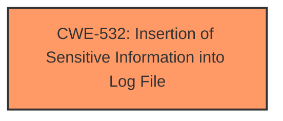

# Analysis for CVE-2025-27496

# Summary
| CWE ID | CWE Name | Confidence | CWE Abstraction Level | CWE Vulnerability Mapping Label | CWE-Vulnerability Mapping Notes |
|---|---|---|---|---|---|
| CWE-532 | Insertion of Sensitive Information into Log File | 1.0 | Base | Primary | Allowed |

## Evidence and Confidence

*   **Confidence Score:** 1.0
*   **Evidence Strength:** HIGH

## Relationship Analysis
The primary CWE selected is CWE-532, which is a Base level CWE. There are no direct parent-child relationships that strongly influence this decision, as the vulnerability is well-represented by the Base CWE itself. No chain relationships are apparent in this specific case.

## Vulnerability Chain
The vulnerability chain is straightforward:

1.  **Root Cause:** The Snowflake JDBC driver **inserted the client-side encryption master key into log files** when the logging level was set to DEBUG. (CWE-532)
2.  **Impact:** Exposure of sensitive information (the encryption key) in the logs.

## Summary of Analysis
The analysis is based on the provided evidence, which indicates that the Snowflake JDBC driver logged the client-side encryption master key in DEBUG logs. The **root cause** of the vulnerability is the **insertion of sensitive information into a log file**.

The evidence from the "CVE Reference Links Content Summary" states: "Root cause of vulnerability: The Snowflake JDBC driver logged the client-side encryption master key in DEBUG logs during GET/PUT commands. - Weaknesses/vulnerabilities present: The vulnerability is CWE-532 (Information Exposure)."

CWE-532 is at the optimal level of specificity (Base) and directly addresses the **weakness** of **inserting sensitive information into log files**. The retriever results also listed CWE-532 as the top candidate.

Relevant CWE Information:

# Enhanced Context (25 CWEs)
The following CWEs were identified as potentially relevant to this vulnerability:

## CWE-532: Insertion of Sensitive Information into Log File
**Abstraction Level**: Base
**Similarity Score**: 0.71
**Source**: dense

**Description**:
The product writes sensitive information to a log file.

**Mapping Guidance**:
- Usage: Allowed
- Rationale: This CWE entry is at the Base level of abstraction, which is a preferred level of abstraction for mapping to the root causes of vulnerabilities.