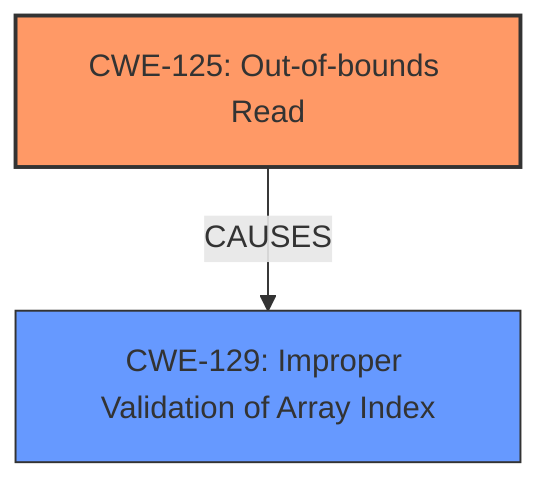

# Enhanced Analysis for CVE-2025-2751

# Summary
| CWE ID | CWE Name | Confidence | CWE Abstraction Level | CWE Vulnerability Mapping Label | CWE-Vulnerability Mapping Notes |
|---|---|---|---|---|---|
| CWE-125 | Out-of-bounds Read | 1.0 | Base | Allowed | Primary CWE. The vulnerability stems from an out-of-bounds read in the `Assimp::CSMImporter::InternReadFile` function. |
| CWE-129 | Improper Validation of Array Index | 0.7 | Variant | Allowed | Secondary candidate. The code accesses `na->mPositionKeys[0].mValue` without proper bounds checking, leading to a potential read outside the allocated memory. |

## Evidence and Confidence

*   **Confidence Score:** 0.9
*   **Evidence Strength:** HIGH

## Relationship Analysis
The primary weakness is CWE-125, Out-of-bounds Read, which occurs due to a read operation accessing memory outside the allocated buffer. CWE-129, Improper Validation of Array Index, is considered as a related weakness because the vulnerability stems from the lack of proper bounds checking before accessing the array element, which could have prevented the out-of-bounds read.



## Vulnerability Chain
1.  **Root Cause:** Lack of proper bounds checking when accessing `na->mPositionKeys[0].mValue` in `Assimp::CSMImporter::InternReadFile`.
2.  **Weakness:** CWE-125 (Out-of-bounds Read). The code reads data past the end of the intended buffer.
3.  **Impact:** Potential remote code execution (RCE) and information leakage if an attacker can trick a victim into processing a malformed CSM file.

## Summary of Analysis
The primary vulnerability is an out-of-bounds read (CWE-125) in the Assimp library when processing CSM files. The analysis is based on the provided vulnerability description and the CVE reference links content summary, which clearly indicate the **out-of-bounds read** as the root cause.

The CVE Reference Links Content Summary states: "The vulnerability stems from an **out-of-bounds read** in the `Assimp::CSMImporter::InternReadFile` function, specifically at line 272 in `code/AssetLib/CSM/CSMLoader.cpp`. The code accesses `na->mPositionKeys[0].mValue` without proper bounds checking, leading to a potential read outside the allocated memory."

The graph relationships influenced the selection by highlighting the cause-and-effect relationship between the lack of bounds checking and the resulting out-of-bounds read. CWE-125 is the optimal level of specificity as it directly describes the **out-of-bounds read** condition. While other CWEs like CWE-129 (Improper Validation of Array Index) could be related, CWE-125 accurately captures the core weakness.

CWE-787 (Out-of-bounds Write) was considered but not used because the provided information explicitly describes a read operation, not a write operation. Other CWEs like CWE-476 (NULL Pointer Dereference) and CWE-190 (Integer Overflow or Wraparound) were also considered but did not align with the specific details of this vulnerability.


## CWE Relationship Analysis

Current CWEs represent these abstraction levels: .


### Vulnerability Chain Analysis

**Chain starting from CWE-476:**
- 476 (NULL Pointer Dereference) - ROOT


**Chain starting from CWE-125:**
- 125 (Out-of-bounds Read) - ROOT


### CWE Relationship Diagram

```mermaid
graph TD
    classDef primary fill:#f96,stroke:#333,stroke-width:2px
    classDef secondary fill:#69f,stroke:#333
    classDef tertiary fill:#9e9,stroke:#333
```