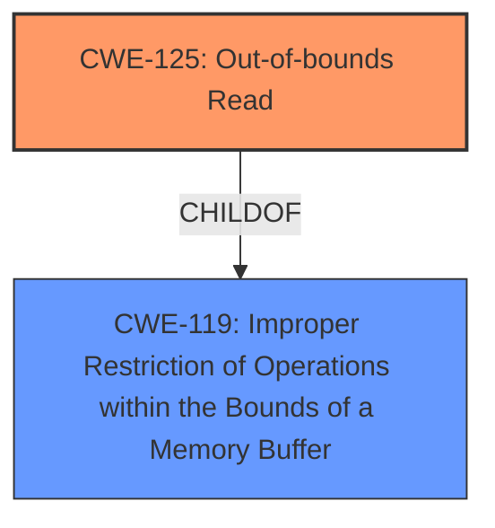

# Analysis for CVE-2025-2755

# Summary
| CWE ID | CWE Name | Confidence | CWE Abstraction Level | CWE Vulnerability Mapping Label | CWE-Vulnerability Mapping Notes |
|---|---|---|---|---|---|
| CWE-125 | Out-of-bounds Read | 1.0 | Base | Allowed | Primary CWE. The vulnerability description explicitly states an out-of-bounds read. |

## Evidence and Confidence

*   **Confidence Score:** 1.0
*   **Evidence Strength:** HIGH

## Relationship Analysis
The primary CWE is CWE-125, which is a base level CWE. There are no child CWEs that would be more specific. CWE-125 is related to CWE-119 (Improper Restriction of Operations within the Bounds of a Memory Buffer), which is a parent.

## Vulnerability Chain
The vulnerability chain starts with the **improper handling of the src.entries** argument, leading to an **out-of-bounds read (CWE-125)** of `object.vertices`. The impact is potential remote code execution if an attacker can provide a malformed AC3D file.

## Summary of Analysis
The vulnerability description clearly indicates an **out-of-bounds read**. The key phrase "*manipulation of the argument src.entries leads to out-of-bounds read*" directly supports the selection of CWE-125. The CVE Reference Links Content Summary reinforces this by stating "*Lack of validation for `src.entries` leading to an out-of-bounds read of `object.vertices`*" and "*Weaknesses/vulnerabilities present: Out-of-bounds read (CWE-125)*".
CWE-125 is at the base level of abstraction, which is appropriate.
The retriever results also list CWE-125 as the third most relevant CWE.

# Enhanced Context (25 CWEs)
The following CWEs were identified as potentially relevant to this vulnerability:

## CWE-125: Out-of-bounds Read
**Abstraction Level**: Base
**Similarity Score**: 0.74
**Source**: dense

**Description**:
The product reads data past the end, or before the beginning, of the intended buffer.

**Mapping Guidance**:
- Usage: Allowed
- Rationale: This CWE entry is at the Base level of abstraction, which is a preferred level of abstraction for mapping to the root causes of vulnerabilities.