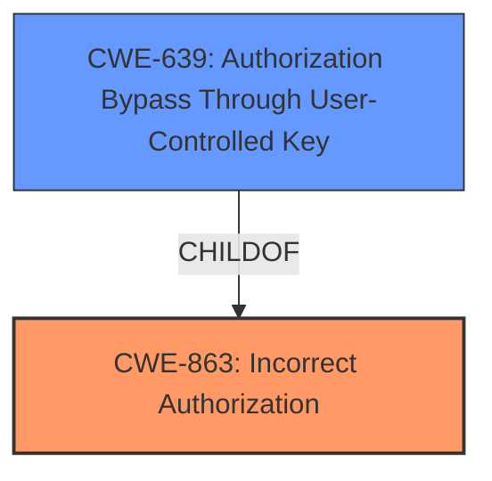

# Enhanced Analysis for CVE-2025-27602

# Summary
| CWE ID | CWE Name | Confidence | CWE Abstraction Level | CWE Vulnerability Mapping Label | CWE-Vulnerability Mapping Notes |
|---|---|---|---|---|---|
| CWE-863 | Incorrect Authorization | 0.9 | Class | Primary | Allowed-with-Review |
| CWE-639 | Authorization Bypass Through User-Controlled Key | 0.7 | Base | Secondary | Allowed |

## Evidence and Confidence

*   **Confidence Score:** 0.8
*   **Evidence Strength:** MEDIUM

## Relationship Analysis
The primary relationship influencing the CWE selection is the parent-child relationship between CWE-863 (Incorrect Authorization) and CWE-639 (Authorization Bypass Through User-Controlled Key). While CWE-639 is more specific, the provided information describes a general **incorrect authorization** scenario due to **manipulation of backoffice API URLs** by an authenticated user, making CWE-863 a more appropriate high-level classification of the **root cause**. CWE-639 could be used in addition to CWE-863 to describe the specific bypass mechanism.



## Vulnerability Chain
The vulnerability chain starts with the **incorrect authorization** mechanism in the Umbraco web backoffice, allowing an authenticated user to **manipulate backoffice API URLs**. This leads to the impact of unauthorized access to content and media, which the editor does not have access to retrieve or delete.

## Summary of Analysis
The initial analysis focused on identifying the root cause of the vulnerability, which is a form of **incorrect authorization**. The evidence from the "CVE Reference Links Content Summary" states that "a restricted editor user can delete media items or access unauthorized content" and "authenticated backoffice users can retrieve or delete content or media held within folders the editor does not have access to". The **manipulation of backoffice API URLs** is the vector used to exploit the **incorrect authorization**.

CWE-863 (Incorrect Authorization) and CWE-639 (Authorization Bypass Through User-Controlled Key) both appear as strong candidates in the Retriever Results. CWE-863 is a Class-level CWE, while CWE-639 is a Base-level CWE. While Base-level CWEs are generally preferred, the description of CWE-639 focuses on modifying key values, which is not explicitly mentioned in the vulnerability description. Therefore, CWE-863 is selected as the primary CWE, with CWE-639 as a secondary CWE to provide additional context.

The provided evidence supports the selection of CWE-863 (Incorrect Authorization) as the primary CWE, with a confidence level of 0.9. The "CVE Reference Links Content Summary" section highlights the **incorrect authorization** aspect, and the vulnerability description mentions the **manipulation of backoffice API URLs** to gain unauthorized access, supporting the secondary CWE.

Other CWEs Considered:

*   CWE-285 (Improper Authorization): This CWE is discouraged because it is high-level and lower-level CWEs can be used instead.
*   CWE-862 (Missing Authorization): While related, the vulnerability isn't a complete absence of authorization, but rather an incorrect implementation.
*   CWE-306 (Missing Authentication for Critical Function): Authentication is present, but authorization is flawed, so this CWE is not applicable.
*   CWE-918 (Server-Side Request Forgery (SSRF)): There is no evidence of server-side request forgery, so this CWE is not applicable.
*   CWE-79 (Improper Neutralization of Input During Web Page Generation ('Cross-site Scripting')): There is no evidence of cross-site scripting, so this CWE is not applicable.
*   CWE-434 (Unrestricted Upload of File with Dangerous Type): There is no evidence of unrestricted upload of files, so this CWE is not applicable.
*   CWE-209 (Generation of Error Message Containing Sensitive Information): There is no evidence of sensitive information being exposed in error messages, so this CWE is not applicable.


## CWE Relationship Analysis

Current CWEs represent these abstraction levels: .


### Vulnerability Chain Analysis

**Chain starting from CWE-863:**
- 863 (Incorrect Authorization) - ROOT


**Chain starting from CWE-862:**
- 862 (Missing Authorization) - ROOT


### CWE Relationship Diagram

```mermaid
graph TD
    classDef primary fill:#f96,stroke:#333,stroke-width:2px
    classDef secondary fill:#69f,stroke:#333
    classDef tertiary fill:#9e9,stroke:#333
```