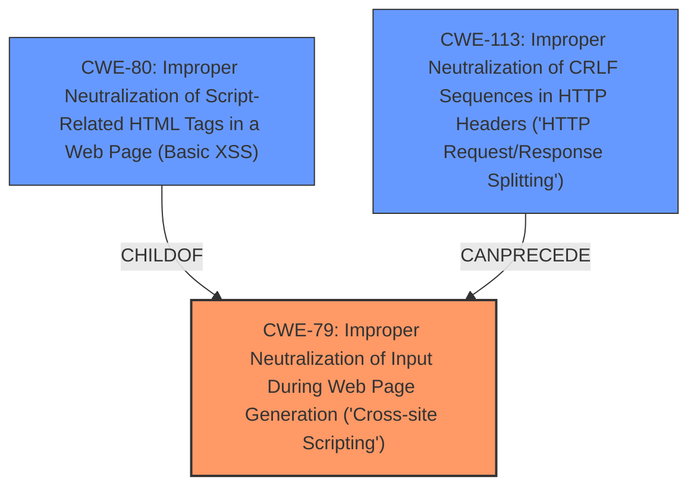

# Analysis for CVE-2025-27633

# Summary
| CWE ID | CWE Name | Confidence | CWE Abstraction Level | CWE Vulnerability Mapping Label | CWE-Vulnerability Mapping Notes |
|---|---|---|---|---|---|
| CWE-79 | Improper Neutralization of Input During Web Page Generation ('Cross-site Scripting') | 1.0 | Base | Allowed | Primary CWE |

## Evidence and Confidence

*   **Confidence Score:** 1.0
*   **Evidence Strength:** HIGH

## Relationship Analysis
The primary relationship that influenced the selection was the direct match of the vulnerability description to the CWE-79 description. While other CWEs were considered, they were either too high-level or did not precisely capture the root cause of the reflected cross-site scripting vulnerability.

## Vulnerability Chain
The vulnerability chain is straightforward:
1.  The application receives input.
2.  The application fails to properly neutralize the input during web page generation.
3.  The resulting web page contains malicious script that executes in the user's browser (Cross-site Scripting).

The root cause is the **improper neutralization**, and the impact is Cross-site Scripting.

## Summary of Analysis
The vulnerability description clearly states that the TRMTracker web application is vulnerable to reflected **Cross-site scripting** attack because the application allows client-side code injection. The key phrase "client-side code injection" is a strong indicator of XSS. The retriever results also list CWE-79 as the top candidate.

The description of CWE-79, "The product does not neutralize or incorrectly neutralizes user-controllable input before it is placed in output that is used as a web page that is served to other users," directly matches the vulnerability. The application **weakness** of **improper neutralization of input** leads to the **impact** of cross-site scripting.

Other CWEs were considered, but ultimately rejected:

*   CWE-80: Improper Neutralization of Script-Related HTML Tags in a Web Page (Basic XSS) - While related to XSS, CWE-80 is more specific to HTML tags, and the provided description doesn't limit the vulnerability to only HTML tags. Therefore, CWE-79 is a better fit.
*   CWE-113: Improper Neutralization of CRLF Sequences in HTTP Headers ('HTTP Request/Response Splitting') - This is specific to HTTP headers, which is not mentioned in the vulnerability description.
* CWE-352: Cross-Site Request Forgery (CSRF) - This is a completely different type of vulnerability.
* CWE-1004: Sensitive Cookie Without 'HttpOnly' Flag - This is related to cookie security, not XSS.
* CWE-116: Improper Encoding or Escaping of Output - While related to output handling, CWE-79 is more specific to web page generation and XSS.
* CWE-942: Permissive Cross-domain Policy with Untrusted Domains - This is related to cross-domain policies, not XSS.

The final decision is based on the evidence from the vulnerability description, the retriever results, and the direct match between the vulnerability and the CWE-79 description. The selected CWE is at the optimal level of specificity because it accurately reflects the root cause of the vulnerability.