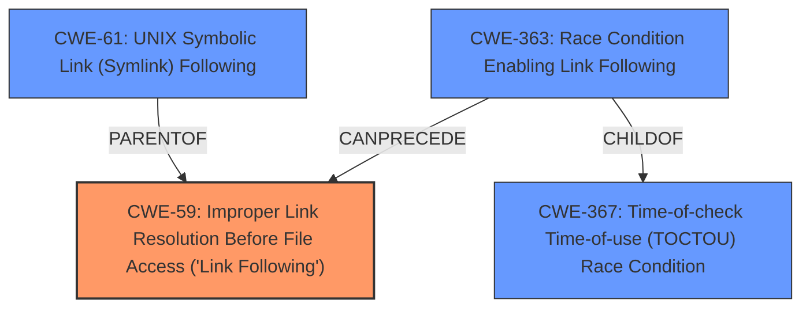

# Analysis Report for CVE-2025-27677

# Vulnerability Analysis Report: CVE-2025-27677

## Description

Vasion Print (formerly PrinterLogic) before Virtual Appliance Host 22.0.843 Application 20.0.1923 allows Symbolic Links For Unprivileged File Interaction V-2022-002.

## Vulnerability Description Key Phrases

- **Weakness:** Symlink unprivileged file interaction
- **Product:** PrinterLogic
- **Version:** before Virtual Appliance Host 22.0.843 Application 20.0.1923

## Analysis (with Relationship Data)

# Summary
| CWE ID | CWE Name | Confidence | CWE Abstraction Level | CWE Vulnerability Mapping Label | CWE-Vulnerability Mapping Notes |
|---|---|---|---|---|---|
| CWE-59 | Improper Link Resolution Before File Access ('Link Following') | 0.9 | Base | Allowed | Primary CWE. The vulnerability description explicitly mentions "Symbolic Links" and "Unprivileged File Interaction," which aligns perfectly with the description of CWE-59. |
| CWE-61 | UNIX Symbolic Link (Symlink) Following | 0.7 | Compound | Allowed | Secondary candidate. This CWE is a compound weakness specifically related to symbolic links and could be considered, but CWE-59 is more precise.|
| CWE-363 | Race Condition Enabling Link Following | 0.6 | Base | Allowed | Secondary candidate. This could be a possibility if a race condition is present. |

## Evidence and Confidence

*   **Confidence Score:** 0.9
*   **Evidence Strength:** MEDIUM

## Relationship Analysis
The primary relationship influencing the decision is the parent-child relationship between CWE-59 and CWE-61. CWE-61 is a compound weakness related to symbolic links, while CWE-59 is the base weakness of improper link resolution. CWE-363 is also a child of CWE-367 Time-of-check Time-of-use (TOCTOU) Race Condition and CANPRECEDE CWE-59. Given the explicit mention of symbolic links in the vulnerability description, CWE-59 is chosen as the primary CWE because it directly addresses the **improper link resolution** issue.



## Vulnerability Chain
The vulnerability chain starts with the **improper handling of symbolic links**, leading to **unprivileged file interaction**.

1.  **Root Cause:** CWE-59 Improper Link Resolution Before File Access ('Link Following') - The application fails to properly validate or restrict the target of symbolic links.
2.  **Impact:** Unprivileged users can interact with files they should not have access to, potentially leading to information disclosure or privilege escalation.

## Summary of Analysis
The analysis is based on the vulnerability description and the provided CWE information. The key phrase "**Symlink unprivileged file interaction**" directly points to issues related to symbolic links and file access.

The selection of CWE-59 is justified by:

*   The explicit mention of "Symbolic Links" in the vulnerability description.
*   The alignment of CWE-59's description with the vulnerability's root cause: **improper link resolution** leading to unauthorized file access.
*   CWE-59's Base level of abstraction, which is preferred for mapping root causes.
*   The "Allowed" usage designation in MITRE's mapping guidance.

CWE-61 was considered but not selected as the primary CWE because it is a compound weakness, and CWE-59 more accurately represents the fundamental flaw of improper link resolution. CWE-363 was considered as a possible condition that could lead to CWE-59 but there isn't evidence to support this.

The evidence, while limited, strongly suggests that the root cause is related to **improper handling of symbolic links**, making CWE-59 the most appropriate classification.
Relevant CWE Information:

# Enhanced Context (25 CWEs)
The following CWEs were identified as potentially relevant to this vulnerability:

## CWE-59: Improper Link Resolution Before File Access ('Link Following')
**Abstraction Level**: Base
**Similarity Score**: 0.76
**Source**: dense

**Description**:
The product attempts to access a file based on the filename, but it does not properly prevent that filename from identifying a link or shortcut that resolves to an unintended resource.

**Mapping Guidance**:
- Usage: Allowed
- Rationale: This CWE entry is at the Base level of abstraction, which is a preferred level of abstraction for mapping to the root causes of vulnerabilities.


## CWE-61: UNIX Symbolic Link (Symlink) Following
**Abstraction Level**: Compound
**Similarity Score**: 0.75
**Source**: dense

**Description**:
The product, when opening a file or directory, does not sufficiently account for when the file is a symbolic link that resolves to a target outside of the intended control sphere. This could allow an attacker to cause the product to operate on unauthorized files.

**Mapping Guidance**:
- Usage: Allowed
- Rationale: This is a well-known Composite of multiple weaknesses that must all occur simultaneously, although it is attack-oriented in nature.


## CWE-755: Improper Handling of Exceptional Conditions
**Abstraction Level**: Class
**Similarity Score**: 0.70
**Source**: dense

**Description**:
The product does not handle or incorrectly handles an exceptional condition.

**Mapping Guidance**:
- Usage: Discouraged
- Rationale: This CWE entry is a level-1 Class (i.e., a child of a Pillar). It might have lower-level children that would be more appropriate


## CWE-497: Exposure of Sensitive System Information to an Unauthorized Control Sphere
**Abstraction Level**: Base
**Similarity Score**: 0.70
**Source**: dense

**Description**:
The product does not properly prevent sensitive system-level information from being accessed by unauthorized actors who do not have the same level of access to the underlying system as the product does.

**Mapping Guidance**:
- Usage: Allowed
- Rationale: This CWE entry is at the Base level of abstraction, which is a preferred level of abstraction for mapping to the root causes of vulnerabilities.


## CWE-41: Improper Resolution of Path Equivalence
**Abstraction Level**: Base
**Similarity Score**: 0.69
**Source**: dense

**Description**:
The product is vulnerable to file system contents disclosure through path equivalence. Path equivalence involves the use of special characters in file and directory names. The associated manipulations are intended to generate multiple names for the same object.

**Mapping Guidance**:
- Usage: Allowed
- Rationale: This CWE entry is at the Base level of abstraction, which is a preferred level of abstraction for mapping to the root causes of vulnerabilities.


## CWE-23: Relative Path Traversal
**Abstraction Level**: Base
**Similarity Score**: 0.69
**Source**: dense

**Description**:
The product uses external input to construct a pathname that should be within a restricted directory, but it does not properly neutralize sequences such as ".." that can resolve to a location that is outside of that directory.

**Mapping Guidance**:
- Usage: Allowed
- Rationale: This CWE entry is at the Base level of abstraction, which is a preferred level of abstraction for mapping to the root causes of vulnerabilities.


## CWE-73: External Control of File Name or Path
**Abstraction Level**: Base
**Similarity Score**: 0.69
**Source**: dense

**Description**:
The product allows user input to control or influence paths or file names that are used in filesystem operations.

**Mapping Guidance**:
- Usage: Allowed
- Rationale: This CWE entry is at the Base level of abstraction, which is a preferred level of abstraction for mapping to the root causes of vulnerabilities.


## CWE-74: Improper Neutralization of Special Elements in Output Used by a Downstream Component ('Injection')
**Abstraction Level**: Class
**Similarity Score**: 0.69
**Source**: dense

**Description**:
The product constructs all or part of a command, data structure, or record using externally-influenced input from an upstream component, but it does not neutralize or incorrectly neutralizes special elements that could modify how it is parsed or interpreted when it is sent to a downstream component.

**Mapping Guidance**:
- Usage: Discouraged
- Rationale: CWE-74 is high-level and often misused when lower-level weaknesses are more appropriate.


## CWE-267: Privilege Defined With Unsafe Actions
**Abstraction Level**: Base
**Similarity Score**: 0.69
**Source**: dense

**Description**:
A particular privilege, role, capability, or right can be used to perform unsafe actions that were not intended, even when it is assigned to the correct entity.

**Mapping Guidance**:
- Usage: Allowed
- Rationale: This CWE entry is at the Base level of abstraction, which is a preferred level of abstraction for mapping to the root causes of vulnerabilities.


## CWE-303: Incorrect Implementation of Authentication Algorithm
**Abstraction Level**: Base
**Similarity Score**: 0.69
**Source**: dense


## CWE Relationship Analysis

Current CWEs represent these abstraction levels: .


### Vulnerability Chain Analysis

**Chain starting from CWE-59:**
- 59 (Improper Link Resolution Before File Access ('Link Following')) - ROOT


**Chain starting from CWE-73:**
- 73 (External Control of File Name or Path) - ROOT


### CWE Relationship Diagram

```mermaid
graph TD
    classDef primary fill:#f96,stroke:#333,stroke-width:2px
    classDef secondary fill:#69f,stroke:#333
    classDef tertiary fill:#9e9,stroke:#333
```


*Report generated on 2025-07-14 15:34:44*
