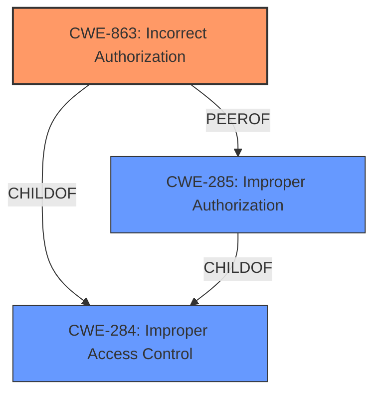

# Raw Analyzer Response for CVE-2025-27696

# Summary
| CWE ID | CWE Name | Confidence | CWE Abstraction Level | CWE Vulnerability Mapping Label | CWE-Vulnerability Mapping Notes |
|---|---|---|---|---|---|
| CWE-863 | Incorrect Authorization | 1.0 | Class | Primary | Allowed-with-Review |
| CWE-285 | Improper Authorization | 0.7 | Class | Secondary Candidate | Discouraged |
| CWE-284 | Improper Access Control | 0.5 | Pillar | Secondary Candidate | Discouraged |

## Evidence and Confidence

*   **Confidence Score:** 0.9
*   **Evidence Strength:** HIGH

## Relationship Analysis
The primary CWE is CWE-863, which is a child of CWE-284. CWE-285 is a peer of CWE-863 and a child of CWE-284. While CWE-284 is a high-level classification, the description of the vulnerability clearly points to an **Incorrect Authorization** (**rootcause**) scheme rather than a complete lack of authorization or a general access control issue. CWE-863 is preferred over CWE-285 because CWE-863 means authorization is present but flawed which is more precise.

## Vulnerability Chain
The vulnerability chain starts with **Improper Authorization** (**rootcause**) which leads to ownership takeover.
- **Improper Authorization** (CWE-863) -> Ownership Takeover (Impact)
The vulnerability starts with an authorization **weakness** that allows an authenticated user to take over resources.

## Summary of Analysis
The vulnerability description clearly states that the root cause is an **Improper Authorization** issue.
The description states: "**Improper Authorization** vulnerability in Apache Superset allows ownership takeover of dashboards, charts or datasets by authenticated users with read permissions". The CVE Reference Links Content Summary also confirms this: "**Root cause of vulnerability:** Improper Authorization vulnerability."

The retriever results also list CWE-863 as the top candidate.
The Authentication vs Authorization vs Access Control Guidance clearly states the differences. The guide also states "If you **cannot determine whether identity was checked**, assume it’s **authorization** and consider 862 or 863".

CWE-863 (Incorrect Authorization) is the most appropriate because the application performs an authorization check, but it does so incorrectly, allowing authenticated users with read permissions to take ownership of resources they should not be able to access.

CWE-285 (Improper Authorization) was considered as a secondary candidate because it is a more general class of authorization flaws. However, since the authorization check is present but flawed, CWE-863 is more specific and accurate.

CWE-284 (Improper Access Control) was also considered, but it is too general. This CWE is used when the root cause is unclear, but in this case, the root cause is explicitly identified as an authorization flaw.

All the selected CWEs are at the optimal level of specificity, with CWE-863 being a Class, but the most specific one that fits the description.

Relevant CWE Information:
*   **CWE-863 Incorrect Authorization:** The product performs an authorization check when an actor attempts to access a resource or perform an action, but it does not correctly perform the check.
*   **CWE-285 Improper Authorization:** The product does not perform or incorrectly performs an authorization check when an actor attempts to access a resource or perform an action.
*   **CWE-284 Improper Access Control:** The product does not adequately control access to resources or functionality.