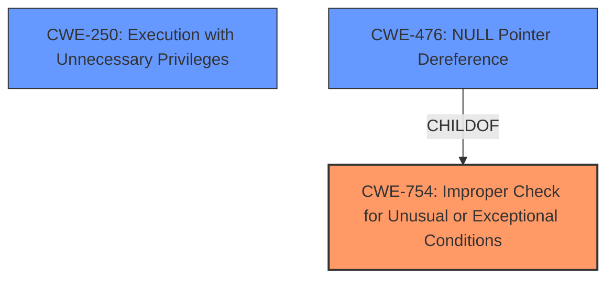

# Enhanced Analysis for CVE-2025-27700

# Summary
| CWE ID | CWE Name | Confidence | CWE Abstraction Level | CWE Vulnerability Mapping Label | CWE-Vulnerability Mapping Notes |
|---|---|---|---|---|---|
| CWE-754 | Improper Check for Unusual or Exceptional Conditions | 0.75 | Class | Allowed-with-Review | Primary CWE |
| CWE-250 | Execution with Unnecessary Privileges | 0.5 | Base | Allowed | Secondary Candidate |

## Evidence and Confidence

*   **Confidence Score:** 0.7
*   **Evidence Strength:** MEDIUM

## Relationship Analysis
The primary CWE selected, CWE-754 (Improper Check for Unusual or Exceptional Conditions), is a Class-level CWE. A related CWE, CWE-476 (NULL Pointer Dereference), is a child of CWE-754. However, the vulnerability description does not provide enough specific information to determine if a NULL pointer dereference is involved. CWE-250 is a base CWE.



## Vulnerability Chain
The vulnerability chain starts with an **unusual root cause** leading to a bypass of carrier restrictions and local escalation of privilege. The **improper check** or handling of this unusual condition is the primary weakness (CWE-754). A possible secondary weakness could be related to the program running with more privileges than it needs (CWE-250).

## Summary of Analysis
The primary assessment is based on the vulnerability description's emphasis on an **unusual root cause**, which strongly suggests a failure to anticipate or properly handle exceptional conditions. The phrase "unusual root cause" in the description is the main evidence. The guidance for "Privileges vs Permissions" also influenced the inclusion of CWE-250 as a secondary consideration, given the "local escalation of privilege" impact. The selected CWEs are at appropriate levels of specificity, given the available information. Further investigation might reveal a more specific variant of CWE-754, but the current evidence supports this higher-level classification.

Relevant CWE Information:

# Enhanced Context (25 CWEs)
The following CWEs were identified as potentially relevant to this vulnerability:

## CWE-754: Improper Check for Unusual or Exceptional Conditions
**Abstraction Level**: Class
**Similarity Score**: 0.79
**Source**: dense

**Description**:
The product does not check or incorrectly checks for unusual or exceptional conditions that are not expected to occur frequently during day to day operation of the product.

**Mapping Guidance**:
- Usage: Allowed-with-Review
- Rationale: This CWE entry is a Class and might have Base-level children that would be more appropriate

## CWE-250: Execution with Unnecessary Privileges
**Abstraction Level**: base
**Similarity Score**: 2.47
**Source**: graph

**Description**:
CWE-250: Execution with Unnecessary Privileges

**Mapping Guidance**:
- Usage: Allowed
- Rationale: This CWE entry is at the Base level of abstraction, which is a preferred level of abstraction for mapping to the root causes of vulnerabilities.

# Complete CWE Specifications

CWE-754: Improper Check for Unusual or Exceptional Conditions

CWE-250: Execution with Unnecessary Privileges

**CWE-754: Improper Check for Unusual or Exceptional Conditions**
*   **Technical Explanation:** The vulnerability description explicitly mentions an **unusual root cause**. This aligns with CWE-754, which describes a failure to properly check or handle unusual or exceptional conditions.
*   **Security Implications:** If the system fails to properly handle an unusual condition, it can lead to unexpected behavior, such as a bypass of carrier restrictions and privilege escalation.
*   **Relationship Analysis:** While CWE-754 is a Class, the limited information prevents selecting a more specific Base or Variant.
*   **Mapping Guidance:** The "Allowed-with-Review" usage is appropriate.
*   **Confidence:** 0.75

**CWE-250: Execution with Unnecessary Privileges**
*   **Technical Explanation:** Given the "local escalation of privilege", the process may be running with more privileges than it needs.
*   **Security Implications:** Allows for the attacker to gain more access than needed.
*   **Relationship Analysis:** Not a parent child.
*   **Mapping Guidance:** The "Allowed" usage is appropriate.
*   **Confidence:** 0.5

**CWEs Considered but Not Used:**

*   **CWE-862 Missing Authorization, CWE-863 Incorrect Authorization, CWE-306 Missing Authentication for Critical Function**: These are related to access control issues. However, the primary weakness described is the handling of the **unusual root cause**, rather than a direct authorization or authentication failure.
*   **CWE-266 Incorrect Privilege Assignment**: The vulnerability description says "bypass of carrier restrictions", which means the privilege assignment is not the root cause.
*   **CWE-476 NULL Pointer Dereference**: While possible, there's no direct evidence for this in the description.


## CWE Relationship Analysis

Current CWEs represent these abstraction levels: .


### Vulnerability Chain Analysis

**Chain starting from CWE-863:**
- 863 (Incorrect Authorization) - ROOT


**Chain starting from CWE-476:**
- 476 (NULL Pointer Dereference) - ROOT


### CWE Relationship Diagram

```mermaid
graph TD
    classDef primary fill:#f96,stroke:#333,stroke-width:2px
    classDef secondary fill:#69f,stroke:#333
    classDef tertiary fill:#9e9,stroke:#333
```