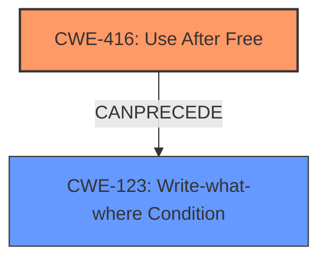

# Analysis Report for CVE-2025-27747

# Vulnerability Analysis Report: CVE-2025-27747

## Description

Use after free in Microsoft Office Word allows an unauthorized attacker to execute code locally.

## Vulnerability Description Key Phrases

- **Rootcause:** use after free
- **Impact:** execute code locally
- **Attacker:** unauthorized attacker
- **Product:** Microsoft Office Word

## Analysis (with Relationship Data)

# Summary

| CWE ID  | CWE Name                                                                                           | Confidence | CWE Abstraction Level | CWE Vulnerability Mapping Label | CWE-Vulnerability Mapping Notes |
| :-------- | :------------------------------------------------------------------------------------------------- | :---------- | :---------------------- | :------------------------------ | :-------------------------------- |
| CWE-416 | Use After Free                                                                                     | 1          | Variant                 | Primary                         | Allowed                           |

## Evidence and Confidence

*   **Confidence Score:** 1
*   **Evidence Strength:** HIGH

## Relationship Analysis

The primary relationship influencing the selection is the direct match of the vulnerability description with the CWE-416 definition. The graph relationships show potential follow-on weaknesses that could occur after a use-after-free, such as CWE-123 (Write-What-Where Condition). However, without further details, the primary focus is on the root cause.



## Vulnerability Chain

The vulnerability chain starts with the **use after free** condition (CWE-416), potentially leading to arbitrary code execution.

## Summary of Analysis

The vulnerability description explicitly states "**use after free**" as the root cause. The Retriever Results also list CWE-416 as the top candidate. The CWE-416 description aligns directly with the vulnerability: "The product reuses or references memory after it has been freed." Therefore, CWE-416 is the most appropriate mapping. The other CWEs are not selected as they represent related but distinct vulnerabilities that are not explicitly mentioned in the description.

Relevant CWE Information:

# Enhanced Context (25 CWEs)

## CWE-416: Use After Free
**Abstraction Level**: Variant
**Similarity Score**: 0.67
**Source**: dense

**Description**:
The product reuses or references memory after it has been freed. At some point afterward, the memory may be allocated again and saved in another pointer, while the original pointer references a location somewhere within the new allocation. Any operations using the original pointer are no longer valid because the memory "belongs" to the code that operates on the new pointer.

**Mapping Guidance**:
- Usage: Allowed
- Rationale: This CWE entry is at the Variant level of abstraction, which is a preferred level of abstraction for mapping to the root causes of vulnerabilities.


## CWE Relationship Analysis

Current CWEs represent these abstraction levels: .


### Vulnerability Chain Analysis

**Chain starting from CWE-123:**
- 123 (Write-what-where Condition) - ROOT


**Chain starting from CWE-416:**
- 416 (Use After Free) - ROOT


### CWE Relationship Diagram

```mermaid
graph TD
    classDef primary fill:#f96,stroke:#333,stroke-width:2px
    classDef secondary fill:#69f,stroke:#333
    classDef tertiary fill:#9e9,stroke:#333
```


*Report generated on 2025-07-14 15:39:11*
